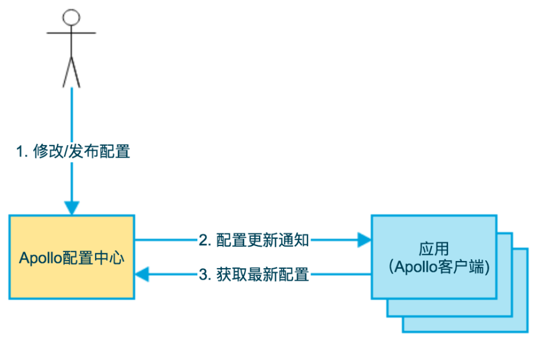
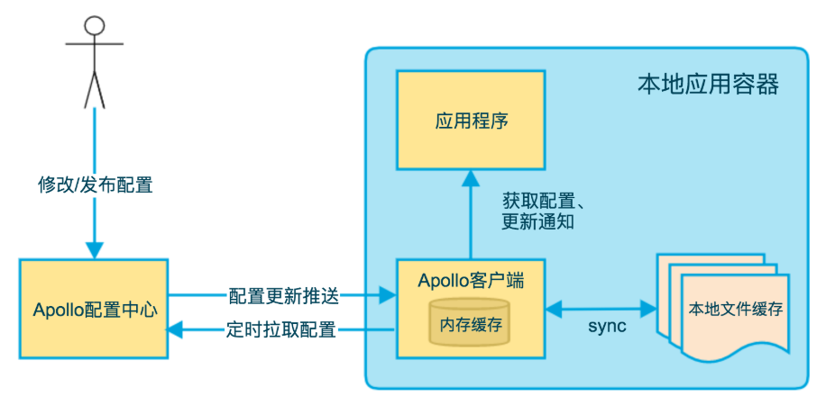
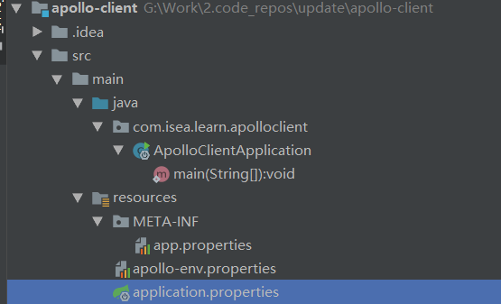
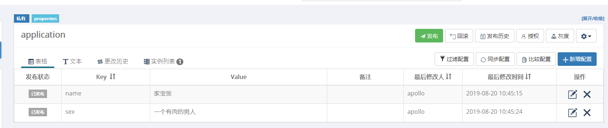
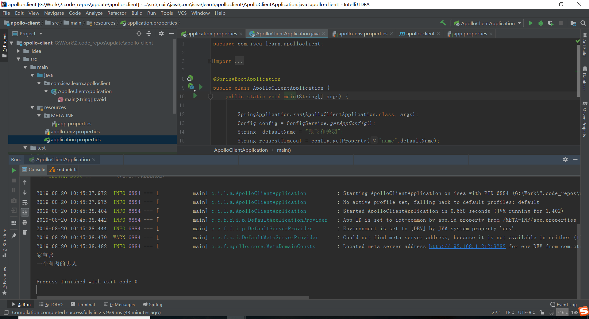

### Apollo

## 是什么？

Apollo是 一个配置管理中心，主要用来统一配置。能够集中化管理应用不同环境，不同集群的配置，配置修改之后能够实时推送到客户端，并且具备规范的权限，流程治理等特性。

Apollo支持4个维度管理Key-Value格式的配置：

1. application (应用)
2. environment (环境)
3. cluster (集群)
4. namespace (命名空间)

配置也有很多种加载方式，常见的有程序内部hard code，配置文件，环境变量，启动参数，基于数据库等

Apollo目前唯一的外部依赖是MySQL

**配置需要治理**

- 权限控制
  - 由于配置能改变程序的行为，不正确的配置甚至能引起灾难，所以对配置的修改必须有比较完善的权限控制
- 不同环境、集群配置管理
  - 同一份程序在不同的环境（开发，测试，生产）、不同的集群（如不同的数据中心）经常需要有不同的配置，所以需要有完善的环境、集群配置管理
- 框架类组件配置管理
  - 还有一类比较特殊的配置 - 框架类组件配置，比如CAT客户端的配置。
  - 虽然这类框架类组件是由其他团队开发、维护，但是运行时是在业务实际应用内的，所以本质上可以认为框架类组件也是应用的一部分。
  - 这类组件对应的配置也需要有比较完善的管理方式。

## 原理

#### 服务端



#### 客户端原理



### Hello world

现在已经有了Apollo的服务中心，建立java客户端来读取服务器的配置。建立一个boot项目

添加依赖：

~~~xml
<dependency>
    <groupId>com.ctrip.framework.apollo</groupId>
    <artifactId>apollo-client</artifactId>
    <version>1.4.0</version>
</dependency>
~~~

配置文件

~~~properties
# app.properties
app.id=iot-common

#apollo-env.properties
local.meta=http://192.168.1.212:8282
dev.meta=http://192.168.1.212:8282

#vm配置：
-Denv=DEV
~~~

配置文件的层级关系



代码逻辑

```java
@SpringBootApplication
public class ApolloClientApplication {
    public static void main(String[] args) {

        SpringApplication.run(ApolloClientApplication.class, args);
        Config config = ConfigService.getAppConfig();
        String  defaultName = "张飞和关羽";
        String requestTimeout = config.getProperty("name",defaultName);
        String sex = config.getProperty("sex","女");
        System.out.println(requestTimeout);
        System.out.println(sex );
    }
}
```

Apollo的配置：



测试通过：



