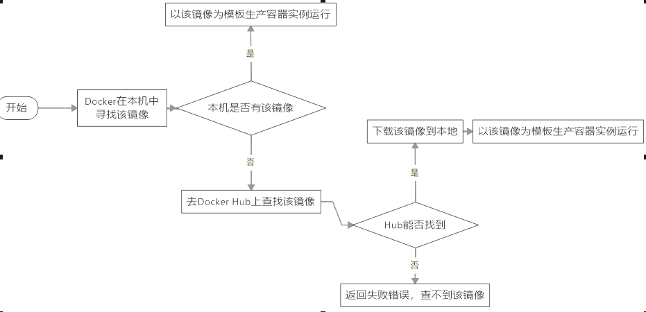
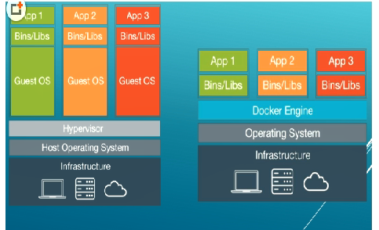

#  `Docker`基础

## 场景

`docker`技术能够解决软件开发工程师的环境下可以运行，但是运维工程是的环境下跑不通的问题，将软件所在的环境和软件本身进行打包。这样一个比喻是比较恰当的：没有`docker`之前，搬家就是搬家，有`docker`之后，就直接搬楼；作为一开发者，没有使用`docker`之前只提交代码，现在要提交整个环境。

仓库：我作为开发人员，将所有代码跑通之后，将自己代码和环境上传到`docker hub`上去，然后发个消息给运维：我整体的环境已经打包成为一个镜像，放在`docker hub`上面了，你直接下载就可以跑通了。国内基本不用了，因为国内的网站访问`docker hub`是太慢，所以出现了阿里云的公开仓库。

**`docker`的理念：一次构建，处处运行。**ship：安装的意思，build：构建的意思。

## 核心要素

仓库，镜像，容器。这就是`docker`的三要素 。

**仓库** ： 是集中存放镜像的地方

**镜像**：就是一个只读的模板，可以用来创建`Docker`容器，一个镜像可以创建很多容器。

**容器**：就是镜像的实例，容器是独立运行的一个或者一组应用。可以将容器看成是简易版的Linux环境，和运行在其中的应用程序。

##### 虚拟机技术 VS 容器虚拟

* 传统的虚拟机，虚拟出一套硬件，然后在其上运行一个完整的操作系统，而在该系统上在运行所需要的程序进程。
* 容器虚拟，容器内的进程直接运行与宿主的内核，容器内没有自己的内核，而且没有进行硬件的虚拟，而因此容器虚拟要比虚拟机更为轻便。
* 每一个容器之间相互隔离，每一个容器都有自己文件系统，容器之间不会相互影响，可以区分计算资源。

而`docker`本身是容器运行载体或者是管理引擎。

## `Docker` 的安装

安装命令：执行 `docker run hello-world` 的时候，发生的事情。

****

镜像就千层饼，一层内还有一层。

容器就是运行时环境，我们可以理解为鲸鱼身上的集装箱，`Docker`是秒级的，

`Docker engine `就可以理解成鲸鱼 ，新建一个虚拟机的时候，虚拟机软件需要加载`GuestOS`，这个过程是比较慢的。

容器虚拟技术和虚拟机的区别。鲸鱼游在蓝色的大海里面，那么大海是就可以理解Docker安装的宿主机。

蓝色的大海：宿主机

鲸鱼：`docker`

集装箱：容器实例，来自于我们镜像 。

repository ：Tag来定义不同的镜像。

镜像可以理解为千层饼。你能看到的就是最上面一层，如果你使用-a参数，你将会看到所有的。

