# `Flink`

**`Flink`是一个框架和一个分布式处理引擎，用于对无界或者有界数据流进行状态计算。**

原本是德国的项目，约在14年的时候代码捐赠给了apache基金会，`flink`在德语中有快速灵活的意思。

流式处理就是来一条数据，处理一条数据，会遇到比批处理更多的问题，并且实现：

* 低延迟
* 高吞吐
* 结果的准确性和容错性

传统的数据一本分为两大类，一类是要做事务处理，一类是要做分析处理。

**OLAP**：联机的是分析处理

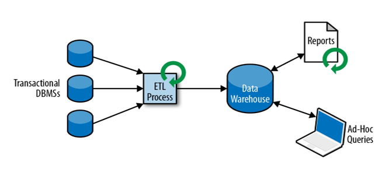

**TP**：联机的事务处理

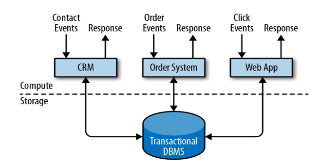

传统的两种处理数据的方式，延迟都很高，都不太满足实时性的要求，所以需要做流式处理。

**有状态的流式处理**

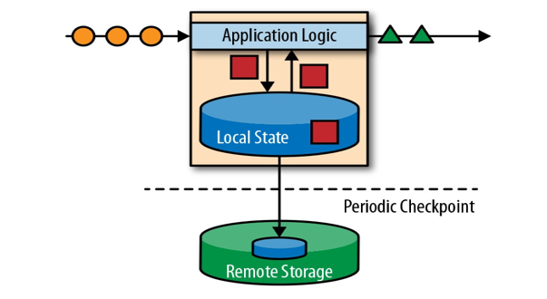

**起初的流式处理框架，为了实时性牺牲了正确性**，上图的架构表明：数据进入了`Flink`之后进行的处理逻辑，在本地的内存存储一份，还要在远程备份一份以达到数据可靠性的需求。但是在分布式系统在处理流式的数据的时候还要面对一个问题：**数据达到的先后顺序问题，举一个例子来说A事件可能先于B事件发生，但是B事件可已经处理完了，A事件还没有到达**。但是批处理的框架就不会遇到这样的问题，因为批处理过程会将连续的时间暂存起来，能够确定事件发生的先后顺序。

最早的实时处理框架是storm，这个框架不能承受高吞吐，能够保证低延迟，但是无法保证准确性。

## 流处理框架的演变

为了保证流处理框架的低延迟和准确性，出现了新的架构***Lambda*** 架构：

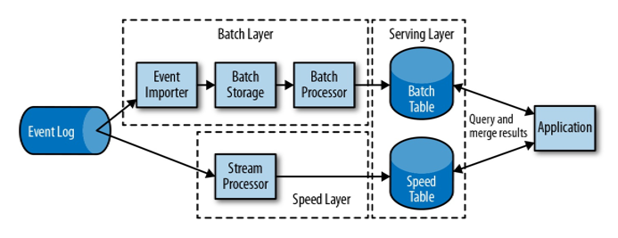

Lambda架构尽管解决了低延迟和准确性的问题，但是达到相同的功能却需要写两套API，提高了学习的成本和维护的成本，所以此时`flink`出现了。

## `Flink的优势`

* 低延迟，
* 高吞吐
* 在压力下保持正确性
* 时间正确和语义化窗口（也即乱序数据有能很好的处理）

好的，

## `Flink`的特点

### 事件驱动（event-driven）

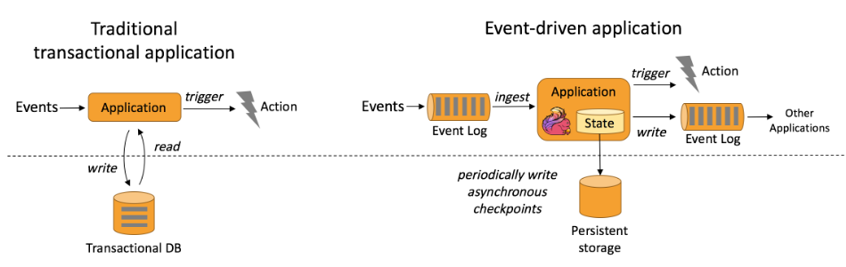

 这里可以发现，`flink`的流式处理和传统的事务处理方式做了一个对比。

### 基于流

在`Flink`的世界观中，一切都是流，离线数据是有界的流，实时数据是无界的流。

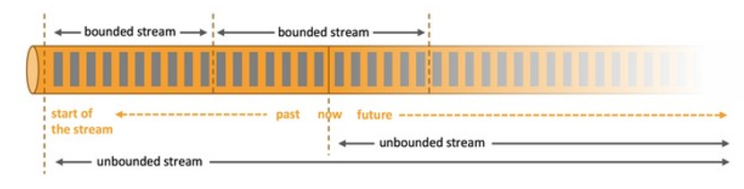

### 分层API

`Flink`的API，顶层抽象，使用方便，底层具体使用灵活。

### 其他特点：

* 支持事件时间，和处理时间
* 精确一次的状态一致性的保证
* 低延迟，美妙处理数百万事件，毫秒级延迟
* 与众多常用的存储系统连接
* 高可用，动态扩展，实现7 * 24小时全天候运行

## Spark和`Flink`的对比

### 流和批

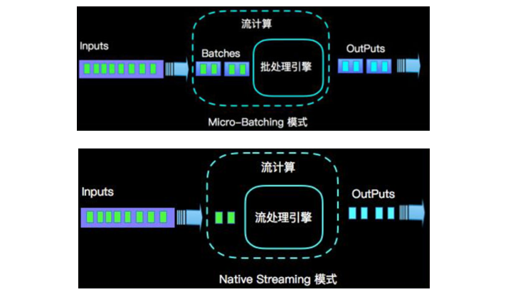

### 数据模型

* spark使用的是RDD模型，Spark streaming的DStream实际是RDD的组合
* `Flink`的数据模型就是数据流

### 运行架构

* Spark是批处理，将DAG划分为不同的stage，一个完成之后才可以计算下一个
* `Flink`是标准的流执行模式，一个事件在一个节点处理完成之后可以直接发往下一个节点进行。

### `Flink`的处理流程： 

~~~shell
enviroment -> source -> transformation -> sink
# 在程序中更多的操作就是add一个source，add一个sink。
~~~

## `Flink`-Hello-world

**对`Flink`的单词统计的实现**

### 添加依赖

~~~xml
<dependencies>
        <dependency>
            <groupId>org.apache.flink</groupId>
            <artifactId>flink-scala_2.11</artifactId>
            <version>1.7.2</version>
        </dependency>
        <!-- https://mvnrepository.com/artifact/org.apache.flink/flink-streaming-scala -->
        <dependency>
            <groupId>org.apache.flink</groupId>
            <artifactId>flink-streaming-scala_2.11</artifactId>
            <version>1.7.2</version>
        </dependency>
    </dependencies>

<build>
    <plugins>
    <!-- 该插件用于将Scala代码编译成class文件 -->
    <plugin>
        <groupId>net.alchim31.maven</groupId>
        <artifactId>scala-maven-plugin</artifactId>
        <version>3.4.6</version>
        <executions>
            <execution>
                <!-- 声明绑定到maven的compile阶段 -->
                <goals>
                    <goal>testCompile</goal>
                </goals>
            </execution>
        </executions>
    </plugin>
        <plugin>
            <groupId>org.apache.maven.plugins</groupId>
            <artifactId>maven-assembly-plugin</artifactId>
            <version>3.0.0</version>
            <configuration>
                <descriptorRefs>
                    <descriptorRef>jar-with-dependencies</descriptorRef>
                </descriptorRefs>
            </configuration>
            <executions>
                <execution>
                    <id>make-assembly</id>
                    <phase>package</phase>
                    <goals>
                        <goal>single</goal>
                    </goals>
                </execution>
            </executions>
        </plugin>
    </plugins>
</build>

~~~

### 批处理

添加`scala`包，然后在该包下编程

~~~Scala
package com.isea.helloworld

import org.apache.flink.api.scala.{DataSet, ExecutionEnvironment}

object WordCount {
  def main(args: Array[String]): Unit = {
    // 创建执行环境
    val env: ExecutionEnvironment = ExecutionEnvironment.getExecutionEnvironment

    // 从文件中读取数据
    val inPath = "G:\\scala_learn\\Flink\\Flink-Hello-World\\src\\main\\resources\\hello.txt"

    // 将文本文件转为DataSet
    val inputDS: DataSet[String] = env.readTextFile(inPath)

    // 做word count的操作，这里的方法，groupBy(0)指的是按照二元组的第一个元素进行分组，按照第二个元素进行求和

    import org.apache.flink.api.scala._
    val wordCountDS: AggregateDataSet[(String, Int)] = inputDS.flatMap(_.split(" ")).map((_, 1)).groupBy(0).sum(1)

    // 输出
    wordCountDS.print()
  }
}
~~~

如果是发现

~~~Scala
Could  not find implicit value for evidence parameter of type org.apache.flink.common.typeinfo.TypeInfomation[......]`

这表明的是需要进行隐式转换，需要做的事情就是引入即可
import org.apache.flink.api.scala._
~~~

### 流处理

~~~Scala
package com.isea.helloworld

import org.apache.flink.api.java.utils.ParameterTool
import org.apache.flink.streaming.api.scala.{DataStream, StreamExecutionEnvironment}

object StreamWordCount {
  def main(args: Array[String]): Unit = {
    // 获取配置的相关端口
    val params: ParameterTool = ParameterTool.fromArgs(args)
    val host: String = params.get("host")
    val port: Int = params.getInt("port")
    
    // 创建执行环境
    val env: StreamExecutionEnvironment = StreamExecutionEnvironment.getExecutionEnvironment

    // source ,这里使用socket的方式进行
    val socketDS: DataStream[String] = env.socketTextStream(host,port)

    import org.apache.flink.api.scala._
    // 做word count的操作，这里的方法，groupBy(0)指的是按照二元组的第一个元素进行分组，按照第二个元素进行求和
    val streamDS: DataStream[(String, Int)] = socketDS.flatMap(_.split(" "))
      .filter(_.nonEmpty).map((_,1))
      .keyBy(0)
      .sum(1)

    // 输出
    streamDS.print()

    //streamDS.print().setParallelism(1) // 这里可以指定并行度，有意思的是每一个算子都可以设置并行度
    
    // 启动executor
    env.execute("socket stream...")
  }
}

~~~

此时需要在特定的主机的某个端口开启服务，由该程序来负责监听以完成测试。

## `Flink的部署`

### Standalone模式

注意这里使用的版本是带`hadoop`的，这说明我们的这里可能需要使用到`hdfs`等，如果没有用到（比如只有`redis,kafka`等）如果运行在yarn模式下，那么你 需要下载带Hadoop的版本了。下载的地址：

~~~html
https://flink.apache.org/downloads.html
~~~

这里我使用的版本是：

~~~shell
/opt/module/flink-1.7.2
~~~

在`/opt/module/flink-1.7.2/conf/flink-conf.yaml`配置文件中可以对`flink`配置，主要配置的信息包括：

`jobmanager`等信息，还有一个配置文件：`/opt/module/flink-1.7.2/conf/slaves`中来配置具体的干活的节点。在配置信息配置好了之后，我们就可以完成启动的操作：

~~~shell
[isea@hadoop101 flink-1.7.2]$ ./bin/start-cluster.sh  #启动命令
Starting cluster.
Starting standalonesession daemon on host hadoop101. # fink运行在哪台机器上
Starting taskexecutor daemon on host hadoop101.
[isea@hadoop101 flink-1.7.2]$   jps
3969 Jps
3865 TaskManagerRunner    # 
3401 StandaloneSessionClusterEntrypoint  # 
~~~

在`flink`启动了之后，我们可以使用web页面的方式来进行管理：`hadoop101:8081`

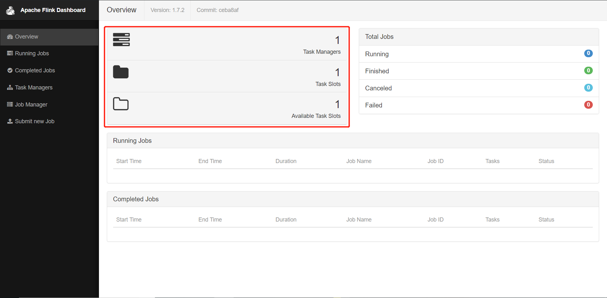

将上述程序打包之后，选择`Entry Class 和 host port参数`上传然后在监听的服host进行如下的操作：

~~~shell
nc -lk 7777  # Linux下开启特定的端口的服务
~~~

或者使用下面的方式运行`flink`程序：

~~~shell
[isea@hadoop101 flink-1.7.2]$ ./bin/flink run -c com.isea.helloworld.StreamWordCount
--host hadoop101 --port 7777

~~~

## `Flink`的原理

### `Flink架构`

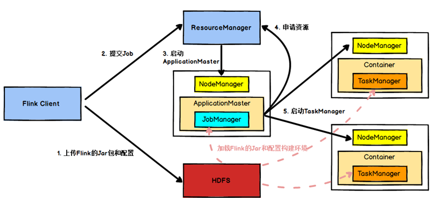

上图的架构结合**Spark**原理，很清楚，不需要再做解释。

### `Flink任务调度原理`

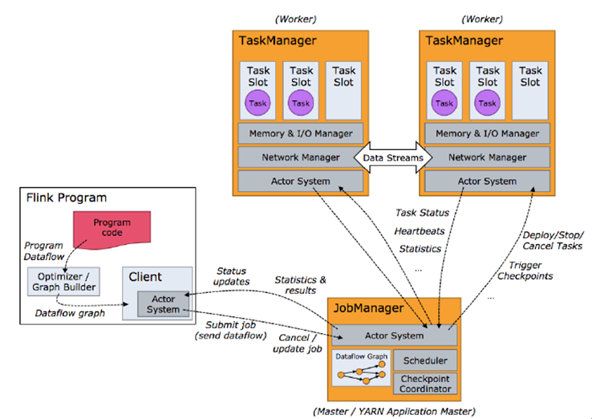

client端只是任务的预处理，并没有在`Flink`整体的运行架构之中。每一个`TaskManager`可以认为是一个JVM进程，每一个`taskManager`下面可以有多个`TaskSolt`去共同处理一个task。

### 执行图

`Flink`中的执行图有四层，`StreamGraph（由client完成）->JobGraph（JobManager完成）->ExecutionGraph（TaskManager完成）->物理执行图（并不是一种数据结构，taskManager上部署task之后形成的图）` 

* **`StreamGraph`**：是根据用户通过 Stream API 编写的代码生成的最初的图。用来表示程序的拓扑结构
* **`JobGraph`**：`StreamGraph`经过优化后生成了 `JobGraph`，提交给 `JobManager` 的数据结构。主要的优化为，将多个符合条件的节点 chain 在一起作为一个节点，这样可以减少数据在节点之间流动所需要的序列化/反序列化/传输消耗。
* **`ExecutionGraph`**：`JobManager` 根据 `JobGraph`生成`ExecutionGraph`。`ExecutionGraph`是`JobGraph`的并行化版本，是调度层最核心的数据结构。

### Worker和Slots

每一个worker(`TaskManager`)都是一个**JVM****进程**，它可能会在**独立的线程上执行一个或多个subtask。为了控制一个worker能接收多少个task，worker通过task slot来进行控制（一个worker至少有一个task slot）。每个task slot表示`TaskManager`拥有资源的**一个固定大小的子集**。假如一个`TaskManager`有三个slot，那么它会将其管理的内存分成三份给各个slot。资源slot化意味着一个subtask将不需要跟来自其他job的subtask竞争被管理的内存，取而代之的是它将拥有一定数量的内存储备。需要注意的是，这里不会涉及到CPU的隔离，slot目前仅仅用来隔离task的受管理的内存。这样就做到了避免了竞争带来的内耗。

通过调整task slot的数量，允许用户定义subtask之间如何互相隔离。如果一个`TaskManager`一个slot，那将意味着每个task group运行在独立的JVM中（该JVM可能是通过一个特定的容器启动的），而一个`TaskManager`多个slot意味着更多的subtask可以共享同一个JVM。而在同一个JVM进程中的task将共享TCP连接（基于多路复用）和心跳消息。它们也可能共享数据集和数据结构，因此这减少了每个task的负载。

**Task Slot**是静态的概念，是指`TaskManager`具有的并发执行能力，可以通过参数`taskmanager.numberOfTaskSlots`进行配置；而并行度`parallelism`是动态概念，即**`TaskManager`**运行程序时实际使用的并发能力，可以通过参数parallelism.default进行配置。

**例子**

这里有三个worker，每个worker有三个槽点，那么表示可以同时开三个进程，9个线程来进行任务的处理，例子

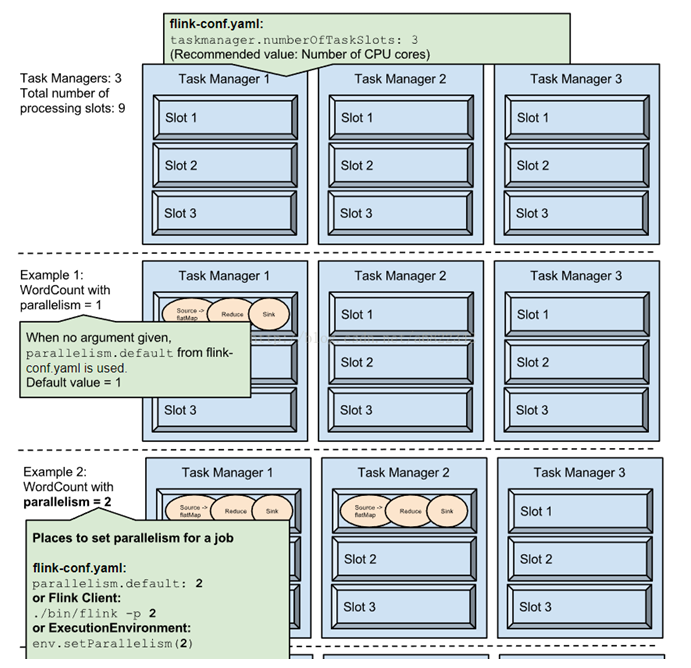

并行能力是9，并行度设置为9。最后一个算子的并行度设置为1。

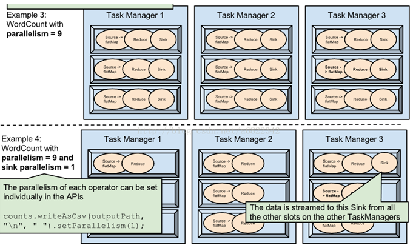

### 每个算子的并行

**一个operator的的subtask的个数被称作是算子的并行度**，所以每一个算子理论上有其自己并行度。Stream在operator之间的操作有两种形式一个是不会发生`shuffle`，另外一一个是可以发生`shuflle` ，在`Flink`中称前者为**forward（one by one）**，后者称之为redistribution（再分发），所以对于能够合成链条（**chains**）的算子，必须要满足的条件是：**one by one操作 +  并行度相同**。例如：常见的one by one的算子有：`flapmap，map`。

## `Flink`的流处理API

### 环境的获取

~~~scala
val env: StreamExecutionEnvironment = StreamExecutionEnvironment.getExecutionEnvironment
// getExecutionEnvironment 会自动获取执行的环境，不管是standalone的方式还是集群的方式去运行flink。也就是说flink能够自己判断执行的环境，然后返回当前的环境

// 如果是local的方式，并行度默认是电脑的cpu的核数，如果是集群的方式的话，读取yaml配置文件中的并行度。
~~~

### source

数据的来源可以有多种，常见的我们可以从集合中读取数据，可以从文件中读取数据，从`kafka`等消息队列中读取数据，还可以自定义消息来源。其中从集合中，从文件中读取数据相当于使用`flink`做批处理操作，更常用的应用场景是：`Flink`读取`Kafka`中的数据。这里演示一个从`Kafka`中获取数据：

**添加依赖**

~~~xml
<!-- https://mvnrepository.com/artifact/org.apache.flink/flink-connector-kafka-0.11 -->
<dependency>
    <groupId>org.apache.flink</groupId>
    <artifactId>flink-connector-kafka-0.11_2.11</artifactId>
    <version>1.7.0</version>
</dependency>
~~~

**代码**

~~~Scala
package com.isea.helloworld

import java.util.Properties

import org.apache.flink.api.common.serialization.SimpleStringSchema
import org.apache.flink.streaming.api.scala.{DataStream, StreamExecutionEnvironment}
import org.apache.flink.streaming.connectors.kafka.FlinkKafkaConsumer011
import org.apache.kafka.clients.consumer.ConsumerConfig

object KafkaFlink {
  def main(args: Array[String]): Unit = {
    val environment: StreamExecutionEnvironment = StreamExecutionEnvironment.getExecutionEnvironment

    // kafka做为配置源：
    val properties = new Properties()
    properties.setProperty(ConsumerConfig.BOOTSTRAP_SERVERS_CONFIG,"hadoop101:9092")
    import org.apache.kafka.clients.consumer.ConsumerConfig
    properties.setProperty(ConsumerConfig.KEY_DESERIALIZER_CLASS_CONFIG, "org.apache.kafka.common.serialization.StringDeserializer")
    properties.setProperty(ConsumerConfig.VALUE_DESERIALIZER_CLASS_CONFIG, "org.apache.kafka.common.serialization.StringDeserializer")
    properties.setProperty(ConsumerConfig.AUTO_OFFSET_RESET_CONFIG,"latest")

    var topic : String = "sensor"

    import org.apache.flink.api.scala._
    val streamDS: DataStream[String] = environment.addSource(new FlinkKafkaConsumer011[String](topic,new SimpleStringSchema(),properties))

    streamDS.print("flink-kafka:").setParallelism(1);
    environment.execute("API-Flink-Kafka")
  }
}
~~~

上述的代码完成的逻辑就是在`kafka`开启了之后，然后创建生产者，上述的代码能够消费生产者生产的数据做到**实时打印**。

