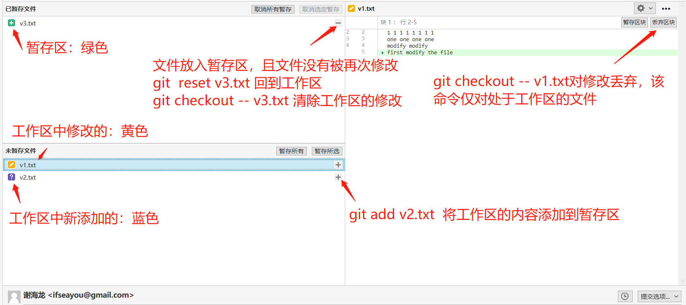
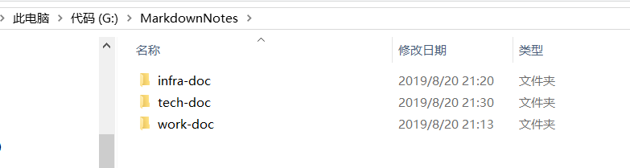
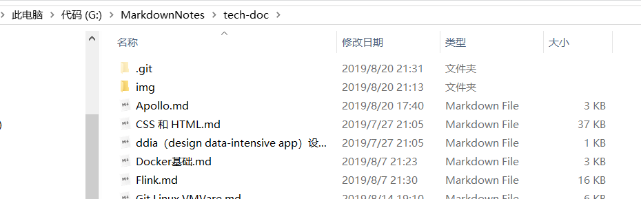

# `Git`,Linux

| Q                                                   | A                                                            |
| --------------------------------------------------- | ------------------------------------------------------------ |
| git 中有几个区域，<br>各自的目的                    | :1st_place_medal: 工作区：修改过的内容都会进入工作区<br>:2nd_place_medal: 暂存区：git add 可以将工作区的file添加到本地仓库<br>:3rd_place_medal: 本地仓库：git commit -m '**' 会将暂存区的file提交到本地仓库<br>:four: 远程仓库：`git push origin master`(分支名称) 将本地仓库推到远程仓库 |
| git status的作用                                    | 显示工作区，暂存区，本地仓库，远程仓库之间的文件状态；如：<br>Your branch is up to date with 'origin/master' 本地仓库和远程保持一致<br>nothing to commit, working tree clean  工作区空，不会有文件提交到暂存区<br>Your branch is ahead of 'origin/master' by 1 commit. 表示本地仓库早于远程仓库<br> 如此一来，我们可以使用`git push `将本地的提交发布到远程仓库<br>Changes not staged for commit: 处于工作区，但是没有添加到暂存区 |
| git stash 的作用；<br />或者使用 git stash save '*' | 将工作区和暂存区的内容都藏起来，得到一个干净的（上一次提交）的工作区；<br>可以使用`git stash apply ` 回到之前藏起来的状态 |
| git checktout --的作用                              | 可以丢弃工作区的修改                                         |
| git commit -a 的作用                                | 将工作区的所有修改，添加到暂存区，并且提交到本地仓库         |
|                                                     |                                                              |
|                                                     |                                                              |
|                                                     |                                                              |
|                                                     |                                                              |


## SourceTree




## `Git`

### 版本回退

~~~shell
# 我先后在gittest仓库下进行了两次提交，然后使用git log命令查看一下
$ git log
commit 74f261c789f1c3ad8665e3fb12f1e22b994841ee (HEAD -> master) #当前所在的版本
Author: 谢海龙 <ifseayou@gmail.com>  # 作者
Date:   Thu Aug 29 13:44:07 2019 +0800 # 提交的时间

    add something to the reset.md  # 提交的时候comment

commit b4cf0842f1ad41b2844fb0bdf6e20ffced5b1f98
Author: 谢海龙 <ifseayou@gmail.com>
Date:   Thu Aug 29 13:43:09 2019 +0800

    initial the reset.md
    
# 回退到初始的版本 ，使用以下的命令
$ git reset --hard b4cf0842f1ad41b2844fb0bdf6e20ffced5b1f98  
HEAD is now at b4cf084 initial the reset.md

# 查看当前是否回到了初始版本
$ git log
commit b4cf0842f1ad41b2844fb0bdf6e20ffced5b1f98 (HEAD -> master)
Author: 谢海龙 <ifseayou@gmail.com>
Date:   Thu Aug 29 13:43:09 2019 +0800

    initial the reset.md

# 再回到未来版本，先查看一下未来版本的版本id
$ git reflog
b4cf084 (HEAD -> master) HEAD@{0}: reset: moving to b4cf0842f1ad41b2844fb0bdf6e20ffced5b1f98
74f261c HEAD@{1}: commit: add something to the reset.md  # 未来的版本
b4cf084 (HEAD -> master) HEAD@{2}: commit (initial): initial the reset.md

# 回到未来版本
$ git reset --hard 74f261c
HEAD is now at 74f261c add something to the reset.md
~~~

### 工作区和暂存区

* 工作区就是你工作的目录，暂存区就是每次执行`git add **`文件存放的目标位置。

* 第一次修改 -> `git add` -> 第二次修改 -> `git add` -> `git commit` ，如果没有`git add`到

### 丢掉工作区的修改

~~~shell
# 对于修改的文件，也就是处于工作区，可以选择将其添加到暂存区，也可以选择丢弃修改
Changes not staged for commit:
  (use "git add <file>..." to update what will be committed)
  (use "git checkout -- <file>..." to discard changes in working directory)
~~~

命令`git checkout -- readme.txt`意思就是，把`readme.txt`文件在工作区的修改全部撤销，这里有两种情况：

* 一种是`readme.txt`自修改后还没有被放到暂存区，现在，撤销修改就回到和版本库一模一样的状态；

* 一种是`readme.txt`已经添加到暂存区后，又作了修改，现在，撤销修改就回到添加到暂存区后的状态。


### 远程仓库

`Git`是一款分布式版本控制系统，也即同一个`Git`仓库，可以分布到不同的机器上。最早，肯定只有一台机器有一个原始版本库，此后，别的机器可以“克隆”这个原始版本库，而且每台机器的版本库其实都是一样的，并没有主次之分。这里的别的机器就可以是：GitHub，这是一个非常nice的网站，可以作为你个人的远程仓库，如此一来你就能将你的代码托管到GitHub上。

#### 建立本地机器和远程仓库的连接

由于本地的仓库和远程的仓库之间的数据传输是通过shh加密的，所以需要进行一点设置，将本地家目录的ssh的```id_rsa_pub``` 公钥保存到GitHub远程仓库，这样做的目的是确保每一次提交到代码都是你本人提交，而不是别人冒充你提交的。

如果你的机器上暂时没有```.ssh``` 目录的话，表名你还没有进行过shh的秘钥生成，所以需要到家目录执行一下的命令：

~~~bash
ssh-keygen -t rsa -C "ifseayou@gmail.com"
~~~

一路回车，然后在进入```./ssh```  中复制公钥。添加到GitHub中（打开“Account settings”，“SSH Keys”页面）GitHub支持添加多个`SSHkey`，这表示你可以从多个终端向GitHub服务器提交代码。

### 提交

```shell
git init   # 初始化为本地仓库

git add . # 将该新增的文件添加到缓冲区（暂存区）

git status  # 查看文件有没有提交到缓冲区

git commit -m 'desc' # 将暂存区的文件提交到本地

git remote add origin git@github.com:*** # 将本地仓库和远端关联

git push origin master # 将暂存区的文件提交到远端
```

#### `git status`

该命令用来查看当前仓库的状态，`git status` 来显示一下是添加了新的文件，是否修改了文件，是否删除了文件，如下：

~~~shell 
$ git status
On branch master
Changes not staged for commit:
  (use "git add <file>..." to update what will be committed)
  (use "git checkout -- <file>..." to discard changes in working directory)

        modified:   MySQL.md  # 红色
# 上面表示修改了MySQL.md文件，可以将该文件通过git add 的方式将这一改变提交到缓冲区。

$ git status
On branch master
Changes to be committed:
  (use "git reset HEAD <file>..." to unstage)

        modified:   MySQL.md  # 绿色

# 我们已经将修改的文件提交到了缓冲区，两次modify的颜色是不一样的，接下来需要使用git commit提交到仓库。
~~~

如上，我们对文件进行了修改，如果此时想要看看哪里做了修改，我们可以使用

~~~shell
git diff MySQL.md # 可以查看该文件被修改的位置
~~~

### pull request

如果我们要对开源项目提交代码的话，我们可以先`fork`一下这个项目，然后clone自己的项目到本地，然后修改这个项目，最后推到远端自己的项目下，最后在自己的项目页面发起pull request。

### 克隆

~~~shell
# 首先进入某个文件目录，然后输入以下的命令：
git clone git@github.com:ifseayou/tech-doc.git 

# 如此一来，当前clone下来的项目会自己成为一个本地的仓库并且和远端关联。
~~~

### 建仓姿势

#### method one

平时建笔记的时候，只需要一个分支即可，搞那么多分支根本没有必要。我认为比较好的创建方式为：

① 先在`github`上建好项目，该项目名要想好

② 在本地的任意一个目录，clone `github`的项目，clone下来的项目自带`.git`文件。

如：

~~~shell
# 先在github建立infra-doc

# 在markdowns文件夹下clone
~~~



#### method two

如果本地已经有了项目`tech-doc`，想要备份一下，需要在`github`建立好项目名`tech-doc`

~~~shell
# 在tech-doc下执行
git init 
git remote add origin url

# 然后就可以提交代码了
~~~



### `gitignore`文件

有些时候，你必须把某些文件放到`Git`工作目录中，但又不能提交它们忽略文件的原则是：

* 忽略操作系统自动生成的文件，比如缩略图等；
* 忽略编译生成的中间文件、可执行文件等，也就是如果一个文件是通过另一个文件自动生成的，那自动生成的文件就没必要放进版本库，比如Java编译产生的`.class`文件；
* 忽略你自己的带有敏感信息的配置文件，比如存放口令的配置文件。

### 分支

~~~ shell
# 查看分支
git branch

# 创建分支
git branch dev（分支名）

# 切换分支
git checkout dev

# 创建分支并切换
git checkout -b dev

# 合并某分支到当前的分支，比如当前在dev分支，下面的命令将master分支合并到当前dev分支
git merge master

# git push

# 分支删除
git branch -d dev
~~~

### 拉取

~~~ shell 
# 拉取某分支最新代码 
git pull origin master
~~~

### 多人协作开发：`commit + pull + push`

多人协作开发来讲，基本上多数人是从远程`clone` 一个项目到本地，各自开发各自的模块，如果现在自己开发完成之后，就把自己代码提交**`commit`**到本地，然后在从远程拉取**`pull`**最新的代码（因为可能有其他的开发小伙伴提交了新的代码），此时`gitbash`会提示请求合并，填写备注信息之后，在将代同步到远程仓库**`push`**

总结起来就是：

~~~shell
git commit
git pull # 如果远程仓库有变化，会有编辑提示merge信息要填写
git push
~~~

### dev和master的协同操作

就我个人的习惯来说，我会一直在dev上进行提交，在提交之后，回到master分支，然后在master分支合并dev分支，然后在master分支上提交到远程。

## Linux

##### vi模式下常用的命令

~~~shell
shift + 4 # 定位到当前行的最后
shift + g # 定位到最后一行

:/fuck # 全文搜索fuck
:45 # 定位到四十五行

pwdx 15453 # 根据进程号查询服务所在的目录
sudo scp /etc/profile root@hadoop105:/etc/profile  # 跨机器拷贝
~~~

### 环境变量

* 修改/etc/profile文件，用来设置系统环境变量，比如$PATH，这里的环境变量是对系统内所有用户生效，使用bash命令，需要 执行  `source /etc/profile`
* 修改 `~/.bashrc`文件：针对某一个特定的用户，环境变量的设置只对该用户自己有效，使用bash命令，只要以该用户身份运行，命令行就会读取该文件

第二种方式需要将`/etc/profile`里面的环境变量追加到`~/.bashrc`目录

~~~shell
[isea@hadoop104 zkData]$ cat /etc/profile >> ~/.bashrc
[isea@hadoop105 zkData]$ cat /etc/profile >> ~/.bashrc
[isea@hadoop106 zkData]$ cat /etc/profile >> ~/.bashrc
~~~

修改集群时间的脚本，仅限于测试使用：

~~~shell
vim  dt.sh
#!/bin/bash
# 该脚本仅限用于集群的测试环境
log_date=$1

for i in hadoop104 hadoop105 hadoop106
do
	ssh -t $i "sudo date -s $log_date"
done
~~~

集群查看所有的进行的脚本

~~~shell
#! /bin/bash

for i in hadoop102 hadoop103 hadoop104
do
        echo --------- $i ----------
        ssh $i "$*"
done
~~~

flume的启动脚本

~~~shell
#!/bin/bash
case $1 in
"start"){
    for i in hadoop104 hadoop105
        do
                echo " --------启动 $i 采集flume-------"
                ssh $i "nohup /opt/module/flume-1.7.0/bin/flume-ng agent --conf-file /opt/module/flume-1.7.0/jobs/file-flume-kafka.conf --name a1 -Dflume.root.logger=INFO,LOGFILE >/dev/null 2>&1 &"
        done
};;
"stop"){
    for i in hadoop104 hadoop105
        do
                echo " --------停止 $i 采集flume-------"
                ssh $i "ps -ef | grep file-flume-kafka | grep -v grep |awk '{print \$2}' | xargs kill"
        done
};;
esac
~~~

写一个kafka的群起脚本

~~~shell
#! /bin/bash

case $1 in
"start"){
        for i in hadoop104 hadoop105 hadoop106
        do
                echo " --------启动 $i Kafka-------"
                # 用于KafkaManager监控
                ssh $i "export JMX_PORT=9988 && /opt/module/kafka_2.11-0.11.0.2/bin/kafka-server-start.sh -daemon /opt/module/kafka_2.11-0.11.0.2/config/server.properties "
        done
};;
"stop"){
        for i in hadoop104 hadoop105 hadoop106
        do
                echo " --------停止 $i Kafka-------"
                ssh $i "/opt/module/kafka_2.11-0.11.0.2/bin/kafka-server-stop.sh stop"
        done
};;
esac

# 说明：启动Kafka时要先开启JMX端口，是用于后续KafkaManager监控
~~~

写一个启动某个类的脚本

~~~shell
#!/bin/bash

	for i in hadoop104 hadoop105 
	do
		ssh $i "java -classpath /opt/module/orgasm-log-collector-1.0-SNAPSHOT-jar-with-dependencies.jar com.isea.warehouse.appclient.AppMain $1 $2 >/opt/module/test.log &"
	done

~~~

消费Kafka数据的Flume的脚本

~~~shell
#! /bin/bash

case $1 in
"start"){
        for i in hadoop106
        do
                echo " --------启动 $i 消费flume-------"
                ssh $i "nohup /opt/module/flume-1.7.0/bin/flume-ng agent --conf-file /opt/module/flume-1.7.0/jobs/kafka-flume-hdfs.conf --name a1 -Dflume.root.logger=INFO,LOGFILE >/opt/module/flume-1.7.0/log.txt   2>&1 &"
        done
};;
"stop"){
        for i in hadoop106
        do
                echo " --------停止 $i 消费flume-------"
                ssh $i "ps -ef | grep kafka-flume-hdfs | grep -v grep |awk '{print \$2}' | xargs kill"
        done

};;
esac
~~~

集群启动脚本

~~~shell
#! /bin/bash

case $1 in
"start"){
	echo " -------- 启动 集群 -------"

	echo " -------- 启动 hadoop集群 -------"
	/opt/module/hadoop-2.7.2/sbin/start-dfs.sh 
	ssh hadoop105 "/opt/module/hadoop-2.7.2/sbin/start-yarn.sh"

	#启动 Zookeeper集群
	zk.sh start

	sleep 4s;

	#启动 Flume采集集群
	flu1.sh start

	#启动 Kafka采集集群
	kfk.sh start

	sleep 6s;

	#启动 Flume消费集群
	flu2.sh start

	#启动 KafkaManager
	#km.sh start
};;
"stop"){
    echo " -------- 停止 集群 -------"

	#停止 KafkaManager
	#km.sh stop

    #停止 Flume消费集群
	flu2.sh stop

	#停止 Kafka采集集群
	kfk.sh stop

    sleep 8s;

	#停止 Flume采集集群
	flu1.sh stop

	#停止 Zookeeper集群
	zk.sh stop

	echo " -------- 停止 hadoop集群 -------"
	ssh hadoop105 "/opt/module/hadoop-2.7.2/sbin/stop-yarn.sh"
	/opt/module/hadoop-2.7.2/sbin/stop-dfs.sh 
};;
esac

~~~


### 登录式shell和非登录式shell

:one:  登录式shell就是使用了xshell工具登录某台linux服务器上之后，会自动的`source /etc/profile`文件，profile的文件里面存放了环境变量。如果不source该文件，有就不能加载到该配置文件中配置的环境变量。

:two: 非登录式的shell，指的使用ssh的方式登录shell，此时不会进行 `source /etc/profile`

shell中的标准输出 `1>/standardOutputFile  2>starnardOutFile` 1 指的是标准的输出，2表示的是标准错误，此时就不会输出到控制台了，而是被重定向到文件中了。`1>/dev/null ` 表示输出到黑洞  `2>&1 ` 表示的是输出到1输出的位置去。

### nc

也就是**ncat**在大多数 Debian 发行版中，`nc` 是默认可用的，它会在安装系统的过程中自动被安装。 但是在 CentOS 7 / RHEL 7 的最小化安装中，`nc` 并不会默认被安装。 你需要用下列命令手工安装：

~~~shell
 yum install nmap-ncat -y
~~~

`-l 选项，netcat`可以进入监听模式，使我们可以在指定端口监听入站连接，比如

~~~shell
ncat -l 8080 # 如此一来，我们就能在该端口生产消息，监听该端口的就能够收到该消息
~~~

### rz

该工具的作用是，可以直接传送文件到server，如果没有安装rz

~~~shell
[isea@hadoop110 software]$ sudo yum install lrzsz
~~~

镜像问题：

~~~:v:
/etc/resolv.conf

nameserver 8.8.8.8
nameserver 8.8.4.4
~~~

### curl

在Linux中curl是一个利用URL规则在命令行下工作的文件传输工具，可以说是一款很强大的http命令行工具，

> *curl* is a command line tool to transfer data to or from a server, using any of the supported protocols (HTTP, FTP, IMAP, POP3, SCP, SFTP, SMTP, TFTP, TELNET, LDAP or FILE).

#### example

:one: 返回请求 www.baidu.com：返回的内容

~~~shell
[root@M1 ~]# curl  http://www.baidu.com
~~~

~~~html
<!DOCTYPE html>
<!--STATUS OK--><html> <head><meta http-equiv=content-type content=text/html;charset=utf-8><meta http-equiv=X-UA-Compatible content=IE=Edge><meta content=always name=referrer><link rel=stylesheet type=text/css href=http://s1.bdstatic.com/r/www/cache/bdorz/baidu.min.css><title>百度一下，你就知道</title></head> <body link=#0000cc> <div id=wrapper> <div id=head> <div class=head_wrapper> <div class=s_form> <div class=s_form_wrapper> <div id=lg>  </div> <form id=form name=f action=//www.baidu.com/s class=fm> <input type=hidden name=bdorz_come value=1> <input type=hidden name=ie value=utf-8> <input type=hidden name=f value=8> <input type=hidden name=rsv_bp value=1> <input type=hidden name=rsv_idx value=1> <input type=hidden name=tn value=baidu><span class="bg s_ipt_wr"><input id=kw name=wd class=s_ipt value maxlength=255 autocomplete=off autofocus></span><span class="bg s_btn_wr"><input type=submit id=su value=百度一下 class="bg s_btn"></span> </form> </div> </div> <div id=u1> <a href=http://news.baidu.com name=tj_trnews class=mnav>新闻</a> <a href=http://www.hao123.com name=tj_trhao123 class=mnav>hao123</a> <a href=http://map.baidu.com name=tj_trmap class=mnav>地图</a> <a href=http://v.baidu.com name=tj_trvideo class=mnav>视频</a> <a href=http://tieba.baidu.com name=tj_trtieba class=mnav>贴吧</a> <noscript> <a href=http://www.baidu.com/bdorz/login.gif?login&amp;tpl=mn&amp;u=http%3A%2F%2Fwww.baidu.com%2f%3fbdorz_come%3d1 name=tj_login class=lb>登录</a> </noscript> <script>document.write('<a href="http://www.baidu.com/bdorz/login.gif?login&tpl=mn&u='+ encodeURIComponent(window.location.href+ (window.location.search === "" ? "?" : "&")+ "bdorz_come=1")+ '" name="tj_login" class="lb">登录</a>');</script> <a href=//www.baidu.com/more/ name=tj_briicon class=bri style="display: block;">更多产品</a> </div> </div> </div> <div id=ftCon> <div id=ftConw> <p id=lh> <a href=http://home.baidu.com>关于百度</a> <a href=http://ir.baidu.com>About Baidu</a> </p> <p id=cp>&copy;2017&nbsp;Baidu&nbsp;<a href=http://www.baidu.com/duty/>使用百度前必读</a>&nbsp; <a href=http://jianyi.baidu.com/ class=cp-feedback>意见反馈</a>&nbsp;京ICP证030173号&nbsp;  </p> </div> </div> </div> </body> </html>
~~~

:two:上述请求的内容下载到一个文件：

~~~shell
[root@M1 ~]# curl -o baidu.html  http://www.baidu.com
[root@M1 ~]# curl -o baidu.html  http://www.baidu.com
  % Total    % Received % Xferd  Average Speed   Time    Time     Time  Current
                                 Dload  Upload   Total   Spent    Left  Speed
100  2381  100  2381    0     0    278      0  0:00:08  0:00:08 --:--:--   592

[root@M1 ~]# ll
-rw-r--r--   1 root   root        2381 9月   5 16:26 baidu.html
~~~

### top

``Linux `` 环境下的任务管理器，实时显示各个进程的资源占用情况。

   该命令的详情查看： [top命令详解](https://www.cnblogs.com/taobataoma/archive/2007/12/26/1015167.html)

### 以root身份修改isea的用户名

~~~shell
passwd isea
# 连续两次输入密码即可
~~~

### 免密配置

**原理：公钥加密私钥解**

* 假设A想要远程B，在A上生成RSA密钥对，并将公钥发送到B，B机保存一份
* 如果A远程B，会询问B是否可以不要你的密码等你B，B发送一个用A的公钥加密的code
* A收到后用自己的私钥解开，证明我A是在你B上认证过的，并且我就是A本人。
* 由此，A可以远程B了

[步骤教程](<https://askubuntu.com/questions/46930/how-can-i-set-up-password-less-ssh-login>)

~~~shell
# 在A上执行：
ssh-keygen

# 在A上执行，也可以支持免密登录自己
ssh-copy-id -i id_rsa.pub root@192.168.1.31

# 在A上可以登录B
ssh 192.168.1.31
~~~

### 配置命令的随处访问

~~~shell
# 例如，root用户在/root下写了一个xcall脚本，需要在任何位置root可以执行该脚本

#方法：修改/etc/profile文件添加：
export PATH="$PATH:/root"

# 修改完成之后，
source /etc/profile
~~~

### `/etc/resolv.conf`

配置文件在server重启之后，失效的问题：原因是 /etc/sysconfig/network-scripts/ifcfg-eth0 文件中没有dns配置
在这个文件中加入:

~~~shell
DNS1=202.96.209.5　　　　　
DNS2=202.96.209.133　
~~~

这类的设置就好了.在此要强调一点的是，直接修改/etc/resolv.conf这个文件是没用的，网络服务重启以后会根据/etc/sysconfig /network-scripts/ifcfg-eth0来重载配置，如果ifcfg-eth0没有配置DNS，那么resolv.conf会被冲掉，重 新变成空值。

:a: 这里等待验证！！！  


## `VMVare`

以独占文件的方式配置文件失败，另一个正在运行的VMware进程可能正在使用配置文件：

解决的办法是：直接去任务管理器中将所有的和`VMVare`相关的进程都杀掉。