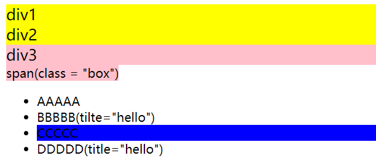
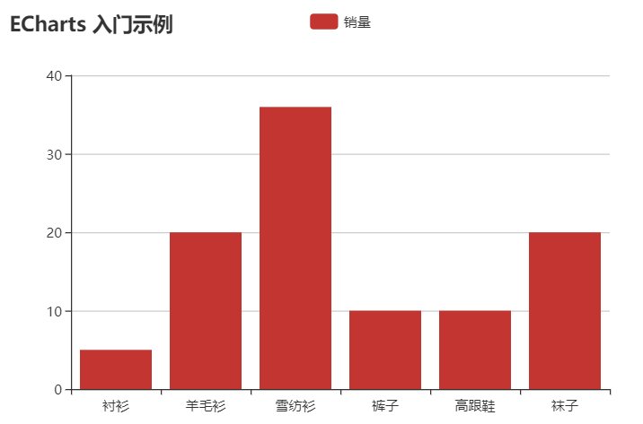
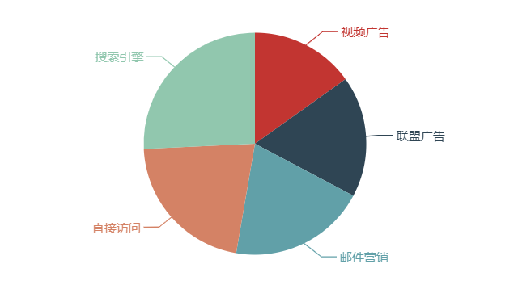
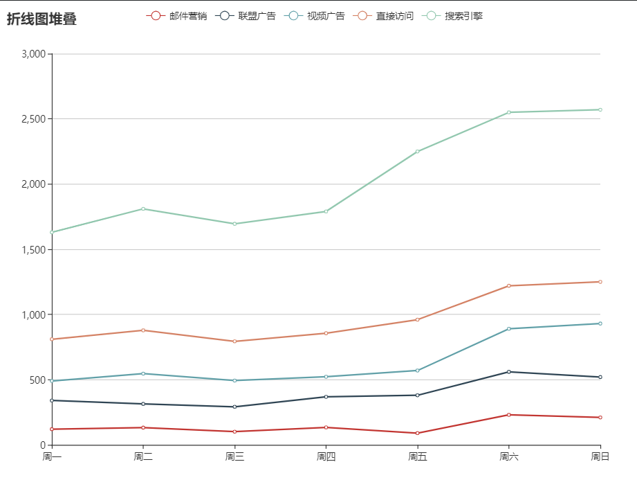

# jQuery

jQuery是JS的一个函数库，装了***dom、bom***，Js 查询。

区别两种js库库文件：

* 开发版本、测试版本
* 生产版本（压缩版）

核心的概念

* **jQuery核心函数： ` jQuery 、 $`**

  ~~~javascript
  console.log($) // 返回的是一个函数
  console.log(typeof $) // function
  ~~~

* **jQuery对象：执行$()返回的对象**

  ~~~javascript
  var  $jQvar =$();// 有特别的变量命名规则
  console.log($() instanceof Object);
  ~~~

**例子：**

~~~html
<!DOCTYPE html>
<html lang="en">
<head>
    <meta http-equiv="Content-Type" content="text/html; charset=UTF-8">
    <title>jQuery学习</title>
     <!-- 使用原生的dom -->
    
    
     <!-- 使用jQuery,在此之前需要引入js库 -->
    <!--  -->
    
    
    
</head>

<body>
    <input type="text" id="username">
    <button id="but1">原生</button>
    <button id="but2">jQuery</button>
</body>
</html>
~~~

## $

* 作为函数使用：**$(param)**

  * 参数为函数：当DOM加载完成之后，执行此函数
  * 参数为选择器字符串：查找所有匹配的标签，并将他们封装为jQuery对象
  * 参数为DOM对象：将DOM对象封装为jQuery对象
  * 参数为HTML标签：创建标签对象，并封装为jQuery对象

  包装成***jQuery***对象的好处是可以使用jQuery对象的一些方法

* 作为对象使用：**$.xx()** 

  * $.each() 隐式遍历数组
  * $.trim() 去除两端的空格

**例子：**

~~~HTML

    <button id="but1">测试</button> 
    <input type="text" name="m1" id="t1"> 
    <input type="text" name="m2" id="t2"> 

~~~

~~~JavaScript

~~~

## jQuery 核心对象

jQuery核心对象：也就是 

* 执行jQuery核心函数返回的对象，
* jQuery对象内部包含的是dom元素对象的伪数组（可能只有一个）
* jQuery对象拥有很多的属性和方法，程序员可以方便的操作DOM

**例子：**

~~~JavaScript
<button >test1</button>
<button >test2</button>
<button id="bit3">test3</button>
<button >test4</button>

</body>
~~~

 

### 层级选择器

~~~html
<body>
    <ul>
        <li>AAAAA</li>
        <li class="box">CCCCC</li>
        <li title="hello">BBBBB</li>
        <li title="hello">DDDDD</li>
        EEEEE
    </ul>
 
</body>
~~~

## AJAX

AJAX的实际意义是，不发生页面跳转、异步载入内容并改写页面内容的技术。简单的理解为通过JS向服务器发送请求

**同步**

JAX出现之前，我们访问互联网时一般都是同步请求，也就是当我们通过一个页面向服务器发送一个请求时，在服务器响应结束之前，我们的整个页面是不能操作的，也就是直观上来看他是卡主不动的

**异步**

通过AJAX向服务器发送请求，发送请求的过程中我们浏览网页的行为并不会收到任何影响，甚至主观上感知不到在向服务器发送请求。

**HTTP请求**

| 请求首行 |
| -------- |
| 请求头   |
| 空行     |
| 请求体   |

这是一个请求报文的格式，那我们如果手动的创建这么一个报文格式来发送给服务器想必是非常麻烦呢，于是浏览器为我们提供了一个`XMLHttpRequest`对象， XMLHttpRequest对象用来封装请求报文，我们向服务器发送的请求信息全部都需要封装到该对象中。

### Java中操作Json

在Java中可以从文件中读取JSON字符串，也可以是客户端发送的JSON字符串。 首先解析JSON字符串我们需要导入第三方的工具，目前主流的解析JSON的工具大概有三种json-lib、jackson、gson，三种解析工具相比较json-lib的使用复杂，且效率较差。而Jackson和gson解析效率较高。使用简单，这里我们以**gson**为例讲解。

n  Gson是Google公司出品的解析JSON工具，使用简单，解析性能好。

Gson

中解析

JSON

的核心是

Gson

的类，解析操作都是通过该类实例进行。

**将Json转为对象**

~~~java
String json = "{\"name\":\"张三\",\"age\":18}";
Gson gson = new Gson();
//转换为集合
Map<String,Object> stuMap = gson.fromJson(json, Map.class);
//如果编写了相应的类也可以转换为指定对象
Student fromJson = gson.fromJson(json, Student.class);
~~~

**将对象转为json**

~~~java
Student stu = new Student("李四", 23);
Gson gson = new Gson();
String json = gson.toJson(stu);//{"name":"李四","age":23}
		
Map<String , Object> map = new HashMap<String, Object>();
map.put("name", "孙悟空");
map.put("age", 30);
String json2 = gson.toJson(map);//{"age":30,"name":"孙悟空"}
		
List<Student> list = new ArrayList<Student>();
list.add(new Student("八戒", 18));
list.add(new Student("沙僧", 28));
list.add(new Student("唐僧", 38));
//[{"name":"八戒","age":18},{"name":"沙僧","age":28},{"name":"唐僧","age":38}]
String json3 = gson.toJson(list);	

~~~

​	

## Echart表格的结合

### 入门例子1：

~~~HTML
<!DOCTYPE html>
<html lang="en">
<head>
    <meta http-equiv="Content-Type" content="text/html; charset=UTF-8">
    <title>Echart</title>
</head>
<body>
    

      <!-- 为 ECharts 准备一个具备大小（宽高）的 DOM -->
    

    

    

</body>
</html>
~~~

### 入门例子2：

~~~html
<!DOCTYPE html>
<html lang="en">
<head>
    <meta http-equiv="Content-Type" content="text/html; charset=UTF-8">
    <title>Echart</title>
</head>
<body>
    

      <!-- 为 ECharts 准备一个具备大小（宽高）的 DOM -->
    

    

    

</body>
</html>
~~~

### 入门例子4--条形图堆叠

~~~HTML
<!DOCTYPE html>
<html lang="en">
<head>
    <meta http-equiv="Content-Type" content="text/html; charset=UTF-8">
    <title>Echart</title>
</head>
<body>

    <!-- 为 ECharts 准备一个具备大小（宽高）的 DOM -->
    

</body>
</html>
~~~

如图：

#### 桑甚图

node，link

地址：https://echarts.apache.org/zh/option.html#series-sankey>

