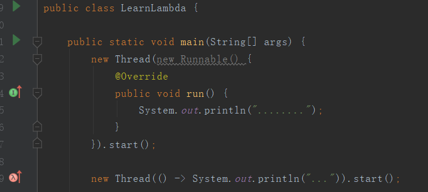
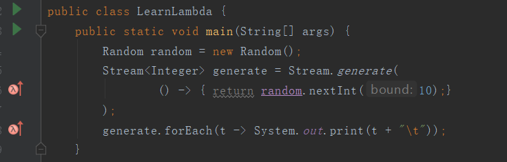
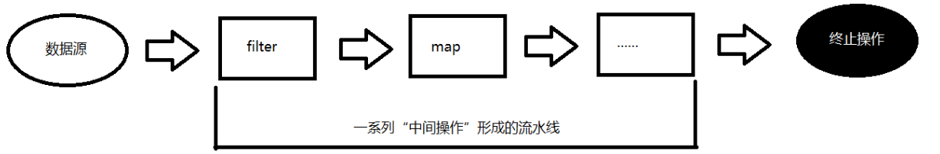
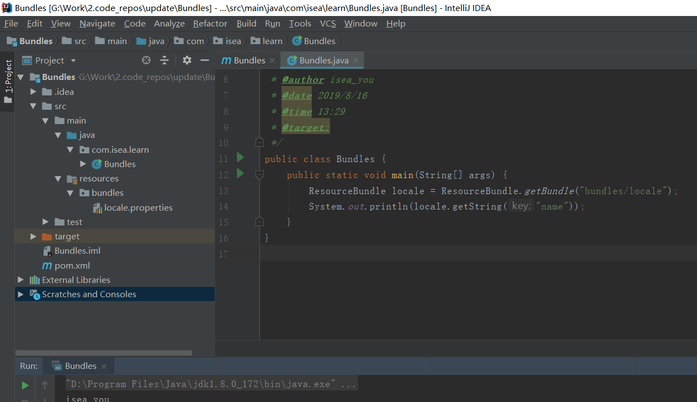
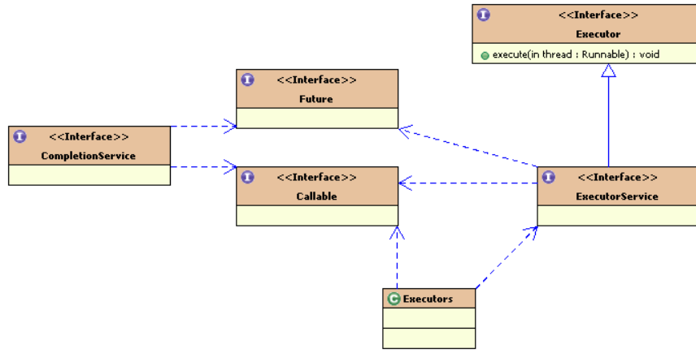

# Java规范

# Java

本文更多的简述Java8的相关知识，因为Java 8 于2014年3月14号发布以来，可以看成是自Java 5 以来最具革命性的版本。Java 8为Java语言、编译器、类库、开发工具与JVM带来了大量新特性。

* 速度更快

* 代码更少(增加了新的语法：Lambda 表达式)

* 强大的 Stream API

* 便于并行

* 最大化减少空指针异常：Optional

## Lambda表达式

<https://blog.csdn.net/qq_31807385/article/details/82670505>该博文，说的还算清楚。


### 使用逻辑

从**I** 入口进入，是对接口的实现；从**lambda**进入，是对函数式接口的实现，**所谓函数式接口就是一个接口，只有一个抽象方法**，该接口在在作为另外一个方法（可能是构造方法，也可能是其他方法）的参数，的时候，（比如这里在做为Thread类的构造函数的参数）就可以使用**lambda**表达式来。逻辑应该是这样的：

* Thread类的构造可以传入Runnable接口的实现类，
* Runnable接口是一个函数式接口，
* 所以Thread类的构造函数中使用Lambda表达式来实现

在来看看新的例子：

~~~java
public class LearnLambda {
    public static void main(String[] args) {
        List<String> list = new ArrayList<>();
        list.add("one");
        list.add("two");
        list.add("three");
        list.add("four");
        list.forEach(w -> System.out.println(w));
    }
}
/*  one
    two
    three
    four
 */
~~~

这里的逻辑是：

* forEach方法的的参数是**Consumer**接口
* 该接口是一个函数式接口
* 所以直接在forEach方法中使用Lambda表达式来实现

在来一个例子：



这里的逻辑是：

* generate()方法参数是**Supplier** 接口
* 该接口是一个函数式接口
* 所以直接在generate()方法中直接使用Lambda表达式

这里，必须要有返回值，

~~~java 
public class LearnLambda {
    public static void main(String[] args) {
        Random random = new Random();
        Stream<Integer> generate = Stream.generate(
                () ->  random.nextInt(10)
        );
        generate.forEach(t -> System.out.print(t + "\t"));
    }
}
~~~

还有一处逻辑，这里不再举例，

* 某某方法的参数是**Function**接口
* 该接口是一个函数式接口，要求有返回值，有参数
* 所以在某某方法内可以使用lambda表达式

在java.util.function包下还有很多函数式接口可供使用。也即，如果某个方法中传入的参数是`function`包下的函数式接口，那么就可以直接使用Lambda表达式。

### 方法引用

**当Lambda表达式满足某种条件的时候，使用方法引用，可以再次简化代码**

## Stream流

> the Stream API is used to process collections of objects.

`Stream API ( java.util.stream) `把真正的函数式编程风格引入到Java中。这是目前为止对Java类库最好的补充，因为Stream API可以极大提高Java程序员的生产力，让程序员写出高效率、干净、简洁的代码。

Stream 是 Java8 中处理集合的关键抽象概念，它可以指定你希望对集合进行的操作，可以执行非常复杂的查找、过滤和映射数据等操作。 使用Stream API 对集合数据进行操作，就类似于使用 SQL 执行的数据库查询。也可以使用 Stream API 来并行执行操作。简言之，Stream API 提供了一种高效且易于使用的处理数据的方式。

### Stream是什么？

**是数据渠道，用于操作数据源（集合、数组等）所生成的元素序列。**“集合讲的是数据，Stream流讲的是计算！”

* Stream 自己不会存储元素。

* Stream 不会改变源对象。相反，他们会返回一个持有结果的新Stream。

* Stream 操作是延迟执行的。这意味着他们会等到需要结果的时候才执行。

### Stream怎么玩？

* 创建 Stream，一个数据源（如：集合、数组），获取一个流

* 中间操作，一个中间操作链，对数据源的数据进行处理

* 终止操作(终端操作)，一旦执行终止操作，就执行中间操作链，并产生结果




**代码例子：**

~~~java
public class LearnStream {
    public static void main(String[] args) {
        List<Integer> numbers = Arrays.asList(1, 2, 3, 4, 5, 6);

        // demonstration of map method
        List<Integer> queue = numbers.stream().map(x -> x * x).collect(Collectors.toList());
        System.out.println(queue); // [1, 4, 9, 16, 25, 36]

        // create a list of String
        List<String> names = Arrays.asList("Reflection", "Collection", "Stream");
        // demonstration of filter method
        List<String> result = names.stream().filter(s -> s.startsWith("S")).collect(Collectors.toList());
        System.out.println(result); // [Stream]

        List<String> show = names.stream().sorted().collect(Collectors.toList());
        System.out.println(show); // [Collection, Reflection, Stream]

        // collect method returns a set
        Set<Integer> toSet = numbers.stream().map(x -> x * x).collect(Collectors.toSet());
        System.out.println(toSet); // [16, 1, 4, 36, 9, 25]

        // demonstration of forEach method
        numbers.stream().map(x -> x * 2).forEach(t -> System.out.print(t + "\t")); //  2	4	6	8	10	12

        System.out.println();
        // demonstration of reduce method
        Integer reduce = numbers.stream().filter(x -> x % 2 == 0).reduce(1, (initial, b) -> initial + b);
        System.out.println(reduce); // 13 ,第一个参数为0的时候，结果为12
    }
}
~~~


## 基础知识

### 枚举

 某些类的对象只有确定的有限个的时候，可以将这样的类声明为枚举类。

- 星期：Monday(星期一)......Sunday(星期天)

- 性别：Man(男)、Woman(女)

**JDK1.5**之前：

- 私有化类的构造方法，保证类的外部不能不能创建对象
- 在类的内部创建对象，声明为`public static final`

```java
package com.isea.others;

public class JDK5Enum {
    public static void main(String[] args) {
        System.out.println(Season.SPRING);
    }
}

class Season{
    public static final Season SPRING = new Season();
    public static final Season SUMMER = new Season();
    public static final Season AUTUMN = new Season();
    public static final Season WINTER = new Season();
    private Season(){}

    @Override
    public String toString(){
        if(this == SPRING){
            return "SPRING";
        }else if(this == SUMMER){
            return "SUMMER";
        }else if(this == AUTUMN){
            return "AUTUMN";
        }else{
            return "WINTER";
        }
    }
}
```

**JDK1.8**之后：

- 使用`enum`定义了枚举类，默认继承了` java.lang.Enum`类，因此不能继承其他的类

- 形式如下：

  ```java
  [修饰符] enum 枚举类{
      常量对象列表
      其他成员
  }
  ```

- 枚举类的所有构造器都只能使用`private`关键字

- 枚举类的所有实例都必须在首行列出，以','分隔

- jdk1.5之后，可以使用枚举作为`swich`后面的表达式

```java
package com.isea.others;

public class JDK8Enum {
    public static void main(String[] args) {
        Period p = Period.SPRING;
        switch(p){
            case SPRING:
                System.out.println("春暖花开");break;
            case SUMMER:
                System.out.println("夏日炎炎");break;
            case AUTUMN:
                System.out.println("秋高气爽");break;
            case WINTER:
                System.out.println("白雪皑皑");break;
        }
    }
}
enum Period{
    SPRING,SUMMER,AUTUMN,WINTER;
}
```

### 泛型

使用泛型的目的，不说了，举个例子：

`ArrayList<String> ` 表示的就是在动态数组中只能存放String类型的元素。

#### 泛型类和泛型接口

拿一个类来说，我们希望该类的成员的类型在创建的时候在指定，我们可以定义一个泛型类，如下：

~~~java
public class Student<T>{
    private String name;
    privete T score; // 这里就可以声明为泛型，在创建Student的对象的时候，在指定score的类型，可见，泛型能够体现出代码的重用性。T 可以是任意的类型，也可以是自定义类型
}

// 创建的时候
Student stu = new Student<Integer>();

// 泛型接口
public interface List<E> extends Collection<E>{
//***
}

ArrayList<? extends Person>  //使用泛型类或接口作为形参时，此处指定为Person或其子类
    
ArrayList<? super Son>     //使用泛型类或接口作为形参时，此处指定为Son或其父类  
~~~

#### 泛型方法

* 如果某个类不是泛型类，而某个方法需要使用泛型
* 如果某个类是泛型类，但是需要在静态方法上使用泛型

~~~java
public class Student{
    public static <T> method(E e){ // 参数E不能变为<E> 
        // 要求传入的类型为E，返回的类型为T
    }
    
    public <E> method(){
        // 要求返回的类型为E
    }
}

public <E> method(){
    // 
}
~~~

## java.sql.

### Connection

都听过JDBC，这个JDBC中的C就是Connection，这个Connection是一个接口，是Sun公司定义的规范，标准化了Java连接MySQL的方式

~~~java
/**
 * <P>A connection (session) with a specific
 * database. SQL statements are executed and results are returned
 * within the context of a connection.
 */
public interface Connection  extends Wrapper, AutoCloseable {
~~~

### Statement

~~~java
/**
 * The object used for executing a static SQL statement
 * and returning the results it produces.
 */
public interface Statement extends Wrapper, AutoCloseable {
~~~

## java.util.concurrent.

Java中创建线程的三个方式：

- Callable
- Runnable
- Thread

### Callable

~~~java
/**
 * A task that returns a result and may throw an exception.
 * Implementors define a single method with no arguments called
 * {@code call}.
 *
 * <p>The {@code Callable} interface is similar to {@link
 * java.lang.Runnable}, in that both are designed for classes whose
 * instances are potentially executed by another thread.  A
 * {@code Runnable}, however, does not return a result and cannot
 * throw a checked exception.
 */

// 这里说明了callable和Runnable的区别，前者有返回值，后者没有返回值。
~~~

一个例子：

~~~java
package com.isea.learn.apolloclient;

import java.util.concurrent.Callable;
import java.util.concurrent.ExecutionException;
import java.util.concurrent.FutureTask;

public class Test {
    public static void main(String[] args) throws ExecutionException, InterruptedException {
        FutureTask<Integer> futureTask01 = new FutureTask(new MyCallable01());
        FutureTask<Integer> futureTask02 = new FutureTask(new MyCallable02());
        FutureTask<Integer> futureTask03 = new FutureTask(new MyCallable03());
        new Thread(futureTask01).start();
        new Thread(futureTask02).start();
        new Thread(futureTask03).start();

        // 只要调用了这个get方法，当前的线程就会阻塞，这里的调用者是main线程，所以主线程会阻塞。
        System.out.println("计算结果 " + (futureTask01.get() + futureTask02.get() + futureTask03.get()));

    }
}

class MyCallable01 implements Callable<Integer>{

    @Override
    public Integer call() throws Exception {
        int sum = 0;
        for (int i = 0; i < 100; i++) {
            sum += i;
        }
        System.out.println("计算结果为：" + sum);

        return sum;
    }
}
class MyCallable02 implements Callable<Integer>{

    @Override
    public Integer call() throws Exception {
        int sum = 0;
        for (int i = 0; i < 1000; i++) {
            sum += i;
        }
        System.out.println("计算结果为：" + sum);

        return sum;
    }
}
class MyCallable03 implements Callable<Integer>{

    @Override
    public Integer call() throws Exception {
        int sum = 0;
        for (int i = 0; i < 10000; i++) {
            sum += i;
        }
        System.out.println("计算结果为：" + sum);
        return sum;
    }
}
~~~


## 类库

### Class

~~~java
package com.isea.jvm;

import java.lang.reflect.Method;

/**
 *  Instances of the class {@code Class} represent classes and
 *  interfaces in a running Java application.  An enum is a kind of
 *  class and an annotation is a kind of interface.
 */
public class LearnJVM {

    public static void main(String[] args) {
        Student student = new Student();
        Class<? extends Student> stuClass = student.getClass();
        System.out.println(stuClass); // class com.isea.jvm.Student
        System.out.println(Student.class); // class com.isea.jvm.Student
        Method[] declaredMethods = stuClass.getDeclaredMethods();
        for (Method method : declaredMethods) {
            System.out.println(method.getName());
        }
        /*
            getName
            setName
            setAge
            getAge
         */
        ClassLoader classLoader = Student.class.getClassLoader();
        System.out.println(classLoader);  // sun.misc.Launcher$AppClassLoader@18b4aac2
    }
}

class  Student{
    private String name;
    private int age;

    public Student(String name, int age) {
        this.name = name;
        this.age = age;
    }

    public Student() {}

    public String getName() {
        return name;
    }

    public void setName(String name) {
        this.name = name;
    }

    public int getAge() {
        return age;
    }

    public void setAge(int age) {
        this.age = age;
    }
}
~~~


### Runnable

~~~java
/**
 * The <code>Runnable</code> interface should be implemented by any
 * class whose instances are intended to be executed by a thread. The
 * class must define a method of no arguments called <code>run</code>.
 * <p>
 */
~~~

该接口应该被实现，被谁实现呢？被所有想要被执行的线程实现。


### Regex

~~~java
package com.isea.springboot;
import java.util.regex.Pattern;
/**
 * @author isea_you
 * @date 2019/8/21
 * @time 21:06
 * @target:
 */
public class HelloRegex {
    public static void main(String[] args) {
                // \s 表示的是匹配1个以上的空格，matches()接收两个参数
        System.out.println(Pattern.matches("this\\s+is\\s+text", "this is text")); // true
        System.out.println(Pattern.matches("this\\s+is\\s+text", "this     is     text"));  // true
        System.out.println(Pattern.matches("this\\s+is\\s+text", "thisistext")); // false

        // \d匹配一个或者多个数字，^以某某开头，该表达式的意思是以任意的数字开头，？设置括号的选项是可选的\.匹配"."
        System.out.println(Pattern.matches("^\\d+(\\.\\d+)?", "2.21")); // true
        System.out.println(Pattern.matches("^\\d+(\\.\\d+)?", "5")); // true

        // 匹配 + ，- ，* ， /
        System.out.println(Pattern.matches("\\+|-|\\*|/", "-")); // true
        System.out.println(Pattern.matches("\\+|-|\\*|/", "+")); // true
        System.out.println(Pattern.matches("\\+|-|\\*|/", "*")); // true
        System.out.println(Pattern.matches("\\+|-|\\*|/", "/")); // true
        System.out.println(Pattern.matches("\\+|-|\\*|/", "/")); // true
    }
}

~~~


### Properties

~~~java
/**
 * The {@code Properties} class represents a persistent set of
 * properties. The {@code Properties} can be saved to a stream
 * or loaded from a stream. Each key and its corresponding value in
 * the property list is a string.
 */ 

// 该类代表着持久的属性集，为什么叫做持久，持久化，就是本地化。
~~~

Properties 继承于 Hashtable.表示一个持久的属性集.属性列表中每个键及其对应值都是一个字符串。

| **序号** | **方法描述**                                                 |
| -------- | ------------------------------------------------------------ |
| 1        | **String getProperty(String key)**  用指定的键在此属性列表中搜索属性。 |
| 2        | **String getProperty(String key, String defaultProperty)** 用指定的键在属性列表中搜索属性。 |
| 3        | **void list(PrintStream streamOut)**  将属性列表输出到指定的输出流。 |
| 4        | **void list(PrintWriter streamOut)** 将属性列表输出到指定的输出流。 |
| 5        | **void load(InputStream streamIn) throws IOException**  从输入流中读取属性列表（键和元素对）。 |
| 6        | **Enumeration propertyNames( )** 按简单的面向行的格式从输入字符流中读取属性列表（键和元素对）。 |
| 7        | **Object setProperty(String key, String value)**  调用 Hashtable 的方法 put。 |
| 8        | **void store(OutputStream streamOut, String description)**  以适合使用  load(InputStream)方法加载到 Properties 表中的格式，将此 Properties 表中的属性列表（键和元素对）写入输出流。 |


### ResourceBundle

~~~java
/**
 * Resource bundles contain locale-specific objects.  When your program needs a
 * locale-specific resource, a <code>String</code> for example, your program can
 * load it from the resource bundle that is appropriate for the current user's
 * locale. In this way, you can write program code that is largely independent
 * of the user's locale isolating most, if not all, of the locale-specific
 * information in resource bundles.
*/

public class Bundles {
    public static void main(String[] args) {
        ResourceBundle locale = ResourceBundle.getBundle("bundles/locale");
        System.out.println(locale.getString("name"));
    }
}
~~~




### `Runtime`类

> ```java
> /* Every Java application has a single instance of class
> * <code>Runtime</code> that allows the application to interface with
> * the environment in which the application is running. The current
> * runtime can be obtained from the <code>getRuntime</code> method.
> /
> ```

> 每一个Java的应用都有自己对应着的一个Runtime实例，利用这个实例，该应用可以访问到自己运行的JVM情况，并进行相关的操作，比如利用此类操作本地的一些程序。

这么说可能有点抽象，举个例子：

~~~java
package com.isea.others;

public class LearnRunTime {
    public static void main(String[] args) {
        Runtime run = Runtime.getRuntime();
        System.out.println("JVM最大内存量：" + run.maxMemory()) ;	
        // 观察最大的内存，根据机器的不同，环境也会有所不同
        System.out.println("JVM空闲内存量：" + run.freeMemory()) ;  
        // 取得程序运行的空闲内存
        run.gc() ;		// 进行垃圾收集，释放空间 ,不建议这样做

        Process p = null ;	// 定义进程变量
        try{
            p = run.exec("notepad.exe") ;	// 调用本机程序，此方法需要异常处理
        }catch(Exception e){
            e.printStackTrace() ;	// 打印异常信息
            // System.out.println(e) ;
        }
        try{
            Thread.sleep(5000) ;	// 让此线程存活5秒
        }catch(Exception e){
        }
        p.destroy() ;	// 结束此进程
    }
}
~~~

### `optional`类

`option`类相当于是一个容器，里面可以放东西，也可以是空，好处是在也不用担心空的问题。

~~~java
package com.isea;

import java.util.Optional;

public class Java8Tester {
    public static void main(String args[]){

        Java8Tester java8Tester = new Java8Tester();
        Integer value1 = null;
        Integer value2 = new Integer(10);

        // Optional.ofNullable - 允许传递为 null 参数
        Optional<Integer> a = Optional.ofNullable(value1);
        System.out.println(a); // Optional.empty

        // Optional.of - 如果传递的参数是 null，抛出异常 NullPointerException
        Optional<Integer> b = Optional.of(value2);
        System.out.println(b); // Optional[10]
        System.out.println(java8Tester.sum(a,b));  // 10
    }

    public Integer sum(Optional<Integer> a, Optional<Integer> b){

        // Optional.isPresent - 判断值是否存在
        System.out.println("第一个参数值存在: " + a.isPresent()); // 第一个参数值存在: false
        System.out.println("第二个参数值存在: " + b.isPresent()); //第二个参数值存在: true

        // Optional.orElse - 如果值存在，返回它，否则返回默认值
        Integer value1 = a.orElse(new Integer(0));

        //Optional.get - 获取值，值需要存在
        Integer value2 = b.get();
        return value1 + value2;
    }
}
~~~

### `ExecutorService `

`ExecutorService `是java中线程池的实现。

**`Executor`框架简介**      

 Java从1.5版本开始，为简化多线程并发编程，引入全新的并发编程包:`java.util.concurrent`及其并发编程框架（Executor框架）。 Executor框架是指java 5中引入的一系列并发库中与executor相关的一些功能类，其中包括线程池，`Executor，Executors，ExecutorService，CompletionService，Future，Callable`等。他们的关系为  

在Executor框架中，使用执行器(Executor)来管理Thread对象，从而简化了并发编程。

**二、认识Executor（执行器）**

* 并发编程的一种编程方式是把任务拆分为一系列的小任务，即Runnable，然后将这些任务提交给一个Executor执行，**`Executor.execute(Runnalbe)`** 。Executor在执行时使用其内部的线程池来完成操作。Executor的子接口有：`ExecutorService,ScheduledExecutorService,`已知实现类：`AbstractExecutorService,ScheduledThreadPoolExecutor,ThreadPoolExecutor`。 
* Executor属于public类型的接口。可以用于提交，管理或者执行Runnable任务。实现Executor接口的class还可以控制Runnable任务执行线程的具体细节。包括线程使用的**细节、调度**等。一般来说，Runnable任务开辟在新线程中的使用方法为：`new Thread(new RunnableTask())).start()`
* 在Executor中，可以使用Executor而不用显示地创建线程。例如，可以使用以下方法创建线程，而不是像第2点中为一种任务中的每个任务都调用new Thread(...)的方法。

~~~java
Exectuor executor = anExecutor();  
executor.execute(new RunnableTask()); // 异步执行  
executor.execute(new RunnableTask()); 
~~~

**三、Executors类： 主要用于提供线程池相关的操作**

Executors类，提供了一系列工厂方法用于创建线程池，返回的线程池都实现了`ExecutorService`接口。

* `public static ExecutorService newFiexedThreadPool(int Threads) `创建固定数目线程的线程池。

* `public static ExecutorService newCachedThreadPool()：`创建一个可缓存的线程池，调用execute 将重用以前构造的线程（如果线程可用）。如果没有可用的线程，则创建一个新线程并添加到池中。终止并从缓存中移除那些已有 60 秒钟未被使用的线程。
* `public static ExecutorService newSingleThreadExecutor()：`创建一个单线程化的Executor
* `public static ScheduledExecutorService newScheduledThreadPool(int corePoolSize)`创建一个支持定时及周期性的任务执行的线程池，多数情况下可用来替代Timer类。

**四、ExecutorService与生命周期**

 **`ExecutorService`可以理解为程序员提供了一堆操作Executor的API**

*  `ExecutorService`扩展了Executor并添加了一些生命周期管理的方法。一个Executor的生命周期有三种状态**运行、关闭和终止。**Executor创建时处于运行状态。当调用`ExecutorService.shutdown()`后，处于关闭状态，`isShutdown()`方法返回true。这时，不应该再向Executor中添加任务，所有已添加的任务执行完毕后，Executor处于终止状态，`isTerminated()`返回true。如果Executor处于关闭状态，往Executor提交任务会抛出`unchecked exception RejectedExecutionException。`
* 本质，接口`ExecutorService `表述了异步执行的机制，并且可以让任务在后台执行。一个`ExecutorService `实例因此特别像一个线程池。事实上，在 `java.util.concurrent` 包中的 `ExecutorService `的实现就是一个线程池的实现。

~~~java
/**
Executor : 
an object that executes submitted {@link Runnable} tasks


Executors:
Factory and utility methods for {@link Executor}, {@link
 * ExecutorService}, {@link ScheduledExecutorService}, {@link
 * ThreadFactory}, and {@link Callable} classes defined in this
 * package.
/
~~~

查考：<https://josh-persistence.iteye.com/blog/2145120>；

## 使用`DecimalFormat`的方式对数字进行格式化

~~~java
package com.isea.dw;

import java.text.DecimalFormat;

public class Test {
    public static void main(String[] args) {
        double p = 453.1415927;

        //获所有的整数
        System.out.println(new DecimalFormat("0").format(p));//453

        //取所有整数部分
        System.out.println(new DecimalFormat("#").format(p));// 453

        //获取整数部分和两位小数
        System.out.println(new DecimalFormat("0.00").format(p));//453.14

        //取四位整数和三位小数，整数不足部分以0填补。
        System.out.println(new DecimalFormat("0000.000").format(p));// 0453.142

        
        // 以百分比方式计数，并取两位小数
        System.out.println(new DecimalFormat("#.##%").format(0.09));//9%

        long c = 299792458;//光速

        //显示为科学计数法，并取五位小数
        System.out.println(new DecimalFormat("#.#####E0").format(c));//2.99792E8

        //显示为两位整数的科学计数法，并取四位小数
        System.out.println(new DecimalFormat("00.####E0").format(c));//29.9792E7

        //每三位以逗号进行分隔。
        System.out.println(new DecimalFormat(",###").format(c));//299,792,458

        // 将格式嵌入文本
        System.out.println(new DecimalFormat("光速大小为每秒,###米。").format(c));
    }
}
~~~


## 数字类型和Sting的转化

~~~java
// 将数字转为字符串
obj.toString()
    
// 将可以转为数字的字符串转为数字的方法
Double.valueOf(obj) // 这里演示的是将某类型转为 Double类型
~~~


## servlet

**Servlet**（Server Applet），全称**Java Servlet**，未有中文译文。是用[Java](https://zh.wikipedia.org/wiki/Java)编写的[服务器](https://zh.wikipedia.org/wiki/%E6%9C%8D%E5%8A%A1%E5%99%A8)端[程序](https://zh.wikipedia.org/wiki/%E7%A8%8B%E5%BA%8F)。其主要功能在于交互式地浏览和修改数据，生成动态[Web](https://zh.wikipedia.org/wiki/Web)内容。狭义的Servlet是指Java语言实现的一个[接口](https://zh.wikipedia.org/wiki/%E6%8E%A5%E5%8F%A3)，广义的Servlet是指任何实现了这个Servlet接口的[类](https://zh.wikipedia.org/wiki/%E7%B1%BB_(%E8%AE%A1%E7%AE%97%E6%9C%BA%E7%A7%91%E5%AD%A6))，一般情况下，人们将Servlet理解为后者。

Servlet运行于支持Java的[应用服务器](https://zh.wikipedia.org/wiki/%E5%BA%94%E7%94%A8%E6%9C%8D%E5%8A%A1%E5%99%A8)中。从实现上讲，Servlet可以响应任何类型的请求，但绝大多数情况下Servlet只用来扩展基于[HTTP](https://zh.wikipedia.org/wiki/HTTP)[协议](https://zh.wikipedia.org/wiki/%E5%8D%8F%E8%AE%AE)的[Web服务器](https://zh.wikipedia.org/wiki/Web%E6%9C%8D%E5%8A%A1%E5%99%A8)。

### HttpServlet

javax.servlet.http.HttpServlet实现了专门用于响应[HTTP](https://zh.wikipedia.org/wiki/HTTP)请求的Servlet，提供了响应对应HTTP标准请求的doGet()、doPost()等方法。

### 生命周期

当servlet被部署在应用服务器中（应用服务器中用于管理Java组件的部分被抽象成为[容器](https://zh.wikipedia.org/wiki/%E5%AE%B9%E5%99%A8_(%E8%AE%A1%E7%AE%97%E6%9C%BA%E7%A7%91%E5%AD%A6))）以后，由容器控制servlet的生命周期。除非特殊指定，否则在容器启动的时候，servlet是不会被加载的，servlet只会在第一次请求的时候被加载和实例化。servlet一旦被加载，一般不会从容器中删除，直至应用服务器关闭或重新启动。但当容器做内存回收动作时，servlet有可能被删除。也正是因为这个原因，第一次访问servlet所用的时间要大大多于以后访问所用的时间。

servlet在服务器的运行生命周期为，在第一次请求（或其实体被内存垃圾回收后再被访问）时被加载并执行一次初始化方法，跟着执行正式运行方法，之后会被常驻并每次被请求时直接执行正式运行方法，直到服务器关闭或被清理时执行一次销毁方法后实体销毁。

**Tomcat**是由Apache软件基金会属下[Jakarta项目](https://zh.wikipedia.org/wiki/Jakarta%E9%A1%B9%E7%9B%AE)开发的[Servlet](https://zh.wikipedia.org/wiki/Servlet)容器，实现了对[Servlet](https://zh.wikipedia.org/wiki/Servlet)和[JavaServer Page](https://zh.wikipedia.org/wiki/JavaServer_Page)（[JSP](https://zh.wikipedia.org/wiki/JSP)）的支持，并提供了作为Web服务器的一些特有功能，如Tomcat管理和控制平台、安全局管理和Tomcat阀等。