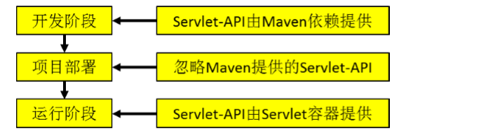

# 在Maven

[关于Jar 包冲突的解决](<https://blog.csdn.net/noaman_wgs/article/details/81137893>)

## 关于Maven的Q

### Packaging

打包方式有三种，分别是：

* pom是maven依赖文件 
* jar是java普通项目打包 
* war是java web项目打包 

他们三者的区别在下面的表中列出：

| 打包方式 | 作用                                                         |
| -------- | ------------------------------------------------------------ |
| pom      | 打出来可以作为其他项目的maven依赖，在工程A中添加工程B的pom，<br>A就可以使用B中的类。**用在父级工程或聚合工程中。用来做jar包的版本控制。** |
| jar      | 通常是开发时要引用通用类，打成jar包便于存放管理。**当你使用某些功能时就需要这些jar包的支持，需要导入jar包**。默认的打包方式。 |
| war      | 是做好一个web网站后，打成war包部署到服务器。目的是节省资源，提供效率。 |

~~~xml
<packaging>jar</packaging>
<packaging>pom</packaging>

<!--打包的方式会影响到静态的绑定。-->
~~~

### Maven的镜像

也即`setting.xml`文件，

~~~xml
    <mirror>
        <id>aliyunmaven</id>
        <mirrorOf>*</mirrorOf>
        <name>阿里云公共仓库</name>
        <url>https://maven.aliyun.com/repository/public</url>
    </mirror>
<!--寻找依赖的时候，会按照镜像的配置顺序进行寻找-->
~~~

### Maven项目多模块打包的问题

最近公司使用springboot开发项目，使用的构建工具是maven,项目分了很多模块，并且模块之间还存在一定的依赖，比如说一个项目common是提供各项目通用的工具类，公共的类等

例子：项目root,有module common,front,mall等其中front 和mall都依赖于common，将来需要上线部署的也是front和mall项目,所以两个项目是要进行打包，也就是这个打包操作，让我浪费了好多时间，这里都是我亲身经历的血泪史。。

当使用Maven对front项目直接进行package时，提示依赖于common的jar包找不到。因为直接对front打包，common并没有被打包，依赖关系无法保持。这时你要做的就是，首先对项目common进行install。

注意！注意！这里有一个巨坑，我已经义无反顾的跳进去一次了，大家一定不要再往里面跳了：Common打包出来的应该是不可执行的jar包，所以不要在Common的pom中定义spring-boot-maven-plugin插件，因为这个SpringBoot插件会在Maven的package后进行二次打包，目的为了生成可执行jar包，如果C中定义了这个插件，会报错提示没有找到main函数。这时你就可以去打包front项目了，当然打包的时候可能还是不行，这里还有一个小坑，如果还是不能进行打包的话，那么就install一下root项目，也就是总目录下的pom文件对应的install操作，这样再打包front项目基本上就没有问题了，老铁，都是经验呀，希望对你们有帮助

[帮助地址](<https://blog.csdn.net/lizhongfu2013/article/details/79656972>)

### 依赖jar包和不带依赖的jar包

~~~xml
<!--编译打包插件-->
<build>
    <plugins>
        <plugin>
            <artifactId>maven-compiler-plugin</artifactId>
            <version>2.3.2</version>
            <configuration>
                <source>1.8</source>
                <target>1.8</target>
            </configuration>
        </plugin>
        <plugin>
            <artifactId>maven-assembly-plugin </artifactId>
            <configuration>
                <descriptorRefs>
                    <descriptorRef>jar-with-dependencies</descriptorRef>
                </descriptorRefs>
                <archive>
                    <manifest>
                        <mainClass>com.isea.warehouse.appclient.AppMain</mainClass>
                    </manifest>
                </archive>
            </configuration>
            <executions>
                <execution>
                    <id>make-assembly</id>
                    <phase>package</phase>
                    <goals>
                        <goal>single</goal>
                    </goals>
                </execution>
            </executions>
        </plugin>
    </plugins>
</build>
~~~

比如写flume拦截器，我们在写的时候需要引入相关的依赖，写完了之后，打包之后需要上传到flume节点所在的节点的lib目录下，此时我们打包要选择不带依赖的jar包，因为此时依赖的jar包 已经在flume的lib目录里面了。 上面的打包插件，可以打出带有依赖和不带有依赖的jar包：

## Maven中的标签

# profile

用maven管理项目有一个好处是就是可以针对不同的环境使用不同的编译打包设置，方便了多环境下的打包部署，一般我们开发项目都会有至少**开发环境和正式环境**两个，针对这两个环境的配置信息也会有所不同，比如数据库的配置等。我们可以使用maven的profile定义来进行区分，比如我们在项目的pom文件中定义如下片段：

~~~xml
<project>
    <modelVersion>4.0.0</modelVersion>
    <groupId>cc.mzone</groupId>
    <artifactId>myjar</artifactId>
    <version>0.1</version>
    <packaging>jar</packaging>
    <build>
        <resources>
            <resource>
                <directory>src/main/resources</directory>
                <includes>
                    <include>*.*</include>
                </includes>
                <filtering>true</filtering>
            </resource>
        </resources>
    </build>

    <properties>
        <jdbc.url>jdbc:mysql://localhost:3306/abc</jdbc.url>
        <jdbc.username>root</jdbc.username>
        <jdbc.password>root</jdbc.password>
    </properties>

    <profiles>
        <profile>
            <id>product</id>
            <properties>
                <jdbc.url>jdbc:mysql://localhost:3306/abc123</jdbc.url>
                <jdbc.username>rootuser</jdbc.username>
                <jdbc.password>rootpwd</jdbc.password>
            </properties>
        </profile>
    </profiles>
</project>
~~~

这里我们在pom文件中定义了数据库的相关配置，同时定义了一个profile，其id为product，同时在这个profile中也定义了数据库的相关配置。这样我们使用**mvn package**命令时就可以使用默认的jdbc设置，当我们使用**mvn package -P product**时maven就会自动使用id为product的profile中的数据库配置，这个是maven读取属性配置文件的覆盖。

## Maven的安装

下面的这个教程很好

~~~html
https://wiki.jikexueyuan.com/project/maven/environment-setup.html 
~~~

关于在Maven 的官网下载那个版本的问题：

~~~html
https://blog.csdn.net/myBarbara/article/details/84186201
~~~

* bin代表二进制class文件(由java文件编译而成)，src代表源码（java源码），源码source比binary大一些，一般正常使用下载bin类型即可，如果要学习源码下载src类型。

* .tar.gz是linux的压缩包，.zip是windows的压缩包

因此：

bin.tar.gz是适用于linux、MacOsX系统的二进制文件

bin.zip是适用于windows的二进制文件

src.tar.gz是linux下的源码

src.zip是windows的源码

只需在windows正常使用maven时，下载第二个：bin.zip

## Maven是什么？

Maven 是 Apache 软件基金会组织维护的一款自动化构建工具，专注服务于 Java 平台的项目构建和 依赖管理。maven的意思是行家，专家的意思。


**Web工程的部署**：如果我们想要实现通过浏览器访问我们编写的Java程序，就必须将Web工程编译的结果放置到服务器的目录上，这个放的过程，可以称之为部署。


**构建**：构建就是以我们编写的 Java 代码、框架配置文件、国际化等其他资源文件、JSP 页 面和图片等静态资源作为“原材料”，去“生产”出一个可以运行的项目的过程。

### 构建的几个过程

①清理：删除以前的编译结果，为重新编译做好准备。 

②编译：将 Java 源程序编译为字节码文件。 

③测试：针对项目中的关键点进行测试，确保项目在迭代开发过程中关键点的正确性。 

④报告：在每一次测试后以标准的格式记录和展示测试结果。 

⑤打包：将一个包含诸多文件的工程封装为一个压缩文件用于安装或部署。Java 工程对应 jar 包，Web 工程对应 war 包。 

⑥安装：在 Maven 环境下特指将打包的结果——jar 包或 war 包安装到本地仓库中。 

⑦部署：将打包的结果部署到远程仓库或将 war 包部署到服务器上运行。 

### 自动构建

一个程序员在没有进行自动化构建的时候，是下面的流程：


的很大一部分时间花在了“编译、打包、部署、测试”这些程式化的工作上 面，而真正需要由“人”的智慧实现的分析问题和编码却只占了很少一部分


这就是Maven需要做的事情，Maven能够做到自动化构建和他内部的原理分不开，约定的目录结构就是其必不可少的一环，就拿自动编译来说，Maven 必须 能找到 Java 源文件，下一步才能编译，而编译之后也必须有一个准确的位置保持编译得到的字节码文件。 我们在开发中如果需要让第三方工具或框架知道我们自己创建的资源在哪，那么基本上就是两种方式：

* ①通过配置的形式明确告诉它 

* ②基于第三方工具或框架的约定 

Maven 对工程目录结构的要求就属于后面的一种：现在 JavaEE 开发领域普遍认同一个观点：约定>配置>编码。意思就是能用配置解决的问题就不编码， 能基于约定的就不进行配置。

## Maven怎么用

### Maven约定的目录结构


### POM

Project Object Model：项目对象模型。将 Java 工程的相关信息封装为对象作为便于操作和管理的模型。 Maven 工程的核心配置。

### 坐标

~~~xml
<groupId>com.isea.iot</groupId>
<artifactId>design-pattern</artifactId>
<version>1.0-SNAPSHOT</version>
~~~

如何通过POM到仓库中查找到Jar包？将三者连接起来：

~~~xml
com/isea/iot/design-pattern/1.0-SNAPSHOT/design-pattern-1.0-SNAPSHOT.jar
~~~

我们自己的 Maven 工程必须执行安装操作才会进入仓库。安装的命令是：`mvn install `

### 依赖

Maven 中最关键的部分，我们使用 Maven 最主要的就是使用它的依赖管理功能。要理解和掌握 Maven 的依赖管理，我们只需要解决一下几个问题： 

* ①依赖的目的是什么 当 A jar 包用到了 B jar 包中的某些类时，A 就对 B 产生了依赖，这是概念上的描述。那么如何在项目 中以依赖的方式引入一个我们需要的 jar 包呢？ 答案非常简单，就是使用 dependency 标签指定被依赖 jar 包的坐标就可以了。 **A 依赖了B，B依赖的C，等等，以前这些我们都要操心，但是现在有了Maven，我们只需要操心B就行了，至于B依赖了C，C依赖了其他的Jar包，和我们没有直接的关系。**

~~~xml
 <dependency>
	<groupId>com.isea.iot</groupId>
	<artifactId>design-pattern</artifactId>
	<version>1.0-SNAPSHOT</version>
     <scope>compile</scope> 
</dependency>
~~~

* ②依赖的范围 大家注意到上面的依赖信息中除了目标 jar 包的坐标还有一个 scope 设置，这是依赖的范围。依赖的范 围有几个可选值，我们用得到的是：compile、test、provided 三个





* 传递的依赖性：A 依赖 B，B 依赖 C，A 能否使用 C 呢？那要看 B 依赖 C 的范围是不是 compile，如果是则可用，否则不 可用。


* 依赖排除：如果我们在当前工程中引入了一个依赖是 A，而 A 又依赖了 B，那么 Maven 会自动将 A 依赖的 B 引入当 前工程，但是个别情况下 B 有可能是一个不稳定版，或对当前工程有不良影响。这时我们可以在引入 A 的时 候将 B 排除。例子


* 统一管理jar包所依赖的版本，对同一个框架的一组 jar 包最好使用相同的版本。为了方便升级框架，可以将 jar 包的版本信息统一提 取出来。对于写在`<dependencyManagement>`标签中的包并不会实际的下载，只是一个声明，并不会实际的从网上下载这些包，这就好像是对于一个类的声明，并没有产生实际的对象。在`<dependencyManagement> `标签下有一个版本子标签，凡是继承了该pom文件对应的项目的项目的pom文件，只要前面的groupId和artifact一致，它会读取下面的这个版本标签，那么就意味着在子工程中不用在定义版本号了。

~~~xml
<properties>     
    <isea.spring.version>4.1.1.RELEASE</isea.spring.version> 
</properties>
<!--这里的isea.spring.version是自定义标签，下面是引用前面声明的版本号-->

<dependencies>
    <dependency>
        <groupId>org.springframework</groupId>
        <artifactId>spring-core</artifactId>
        <version>${isea.spring.version}</version>
    </dependency>
</dependencies>
~~~

* ⑥依赖的原则：解决 jar 包冲突 


### 仓库


### 生命周期

Maven 生命周期定义了各个构建环节的执行顺序，有 了这个清单，Maven 就可以自动化的执行构建命令了。Maven 有三套相互独立的生命周期，分别是：  

* ①Clean Lifecycle 在进行真正的构建之前进行一些清理工作。 
* ②Default Lifecycle 构建的核心部分，编译，测试，打包，安装，部署等等。 
* ③Site Lifecycle 生成项目报告，站点，发布站点。 

它们是相互独立的，你可以仅仅调用 clean 来清理工作目录，仅仅调用 site 来生成站点。当然你也可以 直接运行 `mvn clean install site `运行所有这三套生命周期

每套生命周期都由一组阶段(Phase)组成，我们平时在命令行输入的命令总会对应于一个特定的阶段。比 如，运行 mvn clean，这个 clean 是 Clean 生命周期的一个阶段。有 Clean 生命周期，也有 clean 阶段。 

#### Clean 生命周期 

Clean 生命周期一共包含了三个阶段： 

* ①pre-clean 执行一些需要在 clean 之前完成的工作  
* ②clean 移除所有上一次构建生成的文件  
* ③post-clean 执行一些需要在 clean 之后立刻完成的工作 

####  Site 生命周期

*  ①pre-site 执行一些需要在生成站点文档之前完成的工作 
* ②site 生成项目的站点文档
*  ③post-site 执行一些需要在生成站点文档之后完成的工作，并且为部署做准备
*  ④site-deploy 将生成的站点文档部署到特定的服务器上 

这里经常用到的是 site 阶段和 site-deploy 阶段，用以生成和发布 Maven 站点，这可是 Maven 相当强大的功能，Manager 比较喜欢，文档及统计数据自动生成，很好看。 

#### Default 生命周期 

Default 生命周期是 Maven 生命周期中最重要的一个，绝大部分工作都发生在这个生命周期中。这里， 只解释一些比较重要和常用的阶段： 

~~~xshell
validate generate-sources process-sources 
generate-resources process-resources 复制并处理资源文件，至目标目录，准备打包。
compile 编译项目的源代码。 
process-classes 
generate-test-sources 
process-test-sources 
generate-test-resources 
process-test-resources 复制并处理资源文件，至目标测试目录。 
test-compile 编译测试源代码。 
process-test-classes test 使用合适的单元测试框架运行测试。这些测试代码不会被打包或部署。
prepare-package package 接受编译好的代码，打包成可发布的格式，如 JAR。 
pre-integration-test 
integration-test 
post-integration-test 
verify install 将包安装至本地仓库，以让其它项目依赖。 
deploy 将最终的包复制到远程的仓库，以让其它开发人员与项目共享或部署到服务器上运行。
~~~

运行任何一个阶段的时候，它前面的所有阶段都会被运行，例如我们运行 mvn install 的时候，代码会 被编译，测试，打包。这就是 Maven 为什么能够自动执行构建过程的各个环节的原因。此外，Maven 的插 件机制是完全依赖 Maven 的生命周期的，因此理解生命周期至关重。

### Maven插件

* Maven 的核心仅仅定义了抽象的生命周期，具体的任务都是交由插件完成的。 
* 每个插件都能实现多个功能，每个功能就是一个插件目标。 
* Maven 的生命周期与插件目标相互绑定，以完成某个具体的构建任务。

例如：compile 就是插件 maven-compiler-plugin 的一个目标；pre-clean 是插件 maven-clean-plugin 的一个目标。

### 继承

为什么需要继承机制？ 由于非 compile 范围的依赖信息是不能在“依赖链”中传递的，所以有需要的工程只能单独配置。比如

**Hello**

~~~xml
<!--Friend-->
<dependency>
    <groupId>junit</groupId>
    <artifactId>junit</artifactId>
    <version>4.0</version>
    <scope>test</scope>
</dependency>

<!--HelloFriend-->
<dependency>
    <groupId>junit</groupId>
    <artifactId>junit</artifactId>
    <version>4.0</version>
    <scope>test</scope>
</dependency>


<!--MakeFriend-->
<dependency>
    <groupId>junit</groupId>
    <artifactId>junit</artifactId>
    <version>4.0</version>
    <scope>test</scope>
</dependency>
~~~

此时如果项目需要将各个模块的junit版本统一为4.9，那么到各个工程中手动修改无疑是非常不可取的。 使用继承机制就可以将这样的依赖信息统一提取到父工程模块中进行统一管理。

* 在子工程中引用父工程 

```xml
<parent>
    <groupId>com.isea.maven</groupId>
    <artifactId>Parent</artifactId>
    <version>0.0.1-SNAPSHOT</version>   
    <!-- 指定从当前子工程的pom.xml文件出发，查找父工程的pom.xml的路径
 	此时如果子工程的 groupId 和 version 如果和父工程重复则可以删除。 -->
    <relativePath>../Parent/pom.xml</relativePath>
</parent>
```

* 将 Parent 项目中的 dependencies 标签，用 dependencyManagement 标签括起来 

~~~xml
<dependencyManagement>
    <dependencies>
        <dependency>
            <groupId>junit</groupId>
            <artifactId>junit</artifactId>
            <version>4.9</version>
            <scope>test</scope>
        </dependency>
    </dependencies>
</dependencyManagement>
~~~

* 在子项目中重新指定需要的依赖，删除范围和版本号 

```XML
<dependencies>
    <dependency>
        <groupId>junit</groupId>
        <artifactId>junit</artifactId>
    </dependency>
</dependencies>
```

### 聚合

* 为什么要使用聚合？ 将多个工程拆分为模块后，需要手动逐个安装到仓库后依赖才能够生效。修改源码后也需要逐个手动进 行 clean 操作。而使用了聚合之后就可以批量进行 Maven 工程的安装、清理工作。 

*  如何配置聚合？ 在总的聚合工程中使用 modules/module 标签组合，指定模块工程的相对路径即可 

~~~xml
<modules>
    <module>../Hello</module>
    <module>../HelloFriend</module>
    <module>../MakeFriends</module>
</modules>
<!--一般的，idea都能做到自动提示-->
~~~

只有一个root，只要该父模块打包了，该模块下面的所有模块都会打包


### 版本

~~~xml
<version>${project.version}</version>
~~~

project.version 就是当前pom文件对应的项目中定义的坐标的版本号，如果当前项目没有定义版本的话，默认使用当前项目的的parent的项目的版本号。


## 库站

我们可以到 http://mvnrepository.com/搜索需要的 jar 包的依赖信息。

