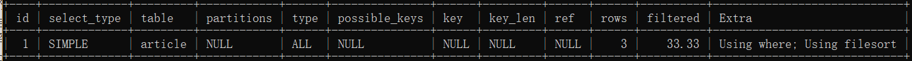
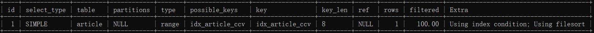
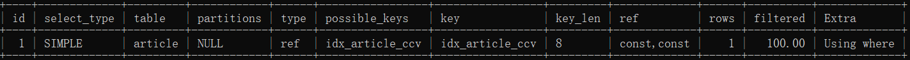
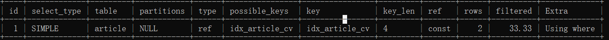
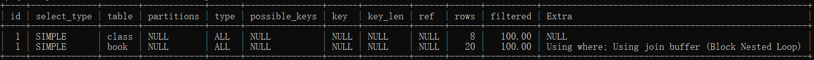
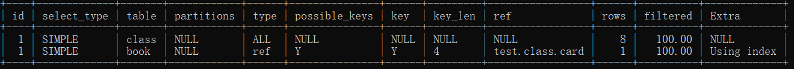

# MySQL

| Q                                                         | A               |
| --------------------------------------------------------- | --------------- |
| Database charset  （字符集）                              | utf8            |
| database collation（字符序）（collation本身是校对的含义） | utf8_general_ci |
|                                                           |                 |
|                                                           |                 |
|                                                           |                 |
|                                                           |                 |
|                                                           |                 |
|                                                           |                 |
|                                                           |                 |

> **`Sql`**上手容易，精通难

### 以下内容来自MySQL必知必会

distinct 应用于所有列而不仅仅是前置它的列；
limit 1，2 检索出来的是第二、三行 等价于 limit 2 offset 1

模糊匹配使用哪个关键字？**like**

最大值和最小值的获取方法：使用max 和 min函数，order by 配合使用 limit
正则表达式：这一点上机实操练习。

```sql
-- 所有prod_name中包含有1000的
mysql> select prod_name from products where prod_name regexp '1000';
+--------------+
| prod_name    |
+--------------+
| JetPack 1000 |
+--------------+
1 row in set (0.00 sec)

-- 正则表达式中 . 的作用：匹配任意一个字符
mysql> select prod_name from products where prod_name like '%000';
+--------------+
| prod_name    |
+--------------+
| JetPack 1000 |
| JetPack 2000 |
+--------------+
2 rows in set (0.00 sec)

mysql> select prod_name from products where prod_name like '_000';
Empty set (0.01 sec)

mysql> select prod_name from products where prod_name regexp '.000';
+--------------+
| prod_name    |
+--------------+
| JetPack 1000 |
| JetPack 2000 |
+--------------+
2 rows in set (0.00 sec)

-- 下面展示like和regexp的区别：
mysql> select prod_name from products where prod_name like '1000';
Empty set (0.00 sec)

mysql> select prod_name from products where prod_name regexp '1000';
+--------------+
| prod_name    |
+--------------+
| JetPack 1000 |
+--------------+
1 row in set (0.00 sec)

mysql> select prod_name from products where prod_name like '%1000';
+--------------+
| prod_name    |
+--------------+
| JetPack 1000 |
+--------------+
1 row in set (0.00 sec)

--LIKE匹配整个列。如果被匹配的文本在列值 中出现，LIKE将不会找到它，相应的行也不被返回（除非使用 通配符）。而REGEXP在列值内进行匹配，如果被匹配的文本在 列值中出现，REGEXP将会找到它，相应的行将被返回。这是一 个非常重要的差别。

-- | 的作用
mysql> select prod_name from products where prod_name regexp '1000|2000';
+--------------+
| prod_name    |
+--------------+
| JetPack 1000 |
| JetPack 2000 |
+--------------+
2 rows in set (0.00 sec)


--[]  用来匹配[]中的字符之一：
mysql> select prod_name from products where prod_name regexp '[123] ton';
+-------------+
| prod_name   |
+-------------+
| 1 ton anvil |
| 2 ton anvil |
+-------------+
2 rows in set (0.00 sec)

mysql> select prod_name from products where prod_name regexp '[1|2|3] ton';
+-------------+
| prod_name   |
+-------------+
| 1 ton anvil |
| 2 ton anvil |
+-------------+
2 rows in set (0.00 sec)

mysql> select prod_name from products where prod_name regexp '[1-3] ton';
+-------------+
| prod_name   |
+-------------+
| 1 ton anvil |
| 2 ton anvil |
+-------------+
2 rows in set (0.00 sec)

mysql> select prod_name from products where prod_name regexp '1|2|3 ton';
+---------------+
| prod_name     |
+---------------+
| 1 ton anvil   |
| 2 ton anvil   |
| JetPack 1000  |
| JetPack 2000  |
| TNT (1 stick) |
+---------------+
5 rows in set (0.00 sec)
```

以上都是匹配单词出现，下面是正则表达式的**重复元字符**：


```sql
-- \\匹配特殊字符
mysql> select prod_name from products where prod_name regexp '\\([1-9] sticks?\\)';
+----------------+
| prod_name      |
+----------------+
| TNT (1 stick)  |
| TNT (5 sticks) |
+----------------+
2 rows in set (0.00 sec)

--匹配连续出现在一起四次的
mysql> select prod_name from products where prod_name regexp '[0-9]{4}';
+--------------+
| prod_name    |
+--------------+
| JetPack 1000 |
| JetPack 2000 |
+--------------+
2 rows in set (0.00 sec)
```


```sql 
--以一个数（包括以小数点开始的数）开始的所 有产品
mysql> select prod_name from products where prod_name regexp '^[0-9\\.]';
+--------------+
| prod_name    |
+--------------+
| .5 ton anvil |
| 1 ton anvil  |
| 2 ton anvil  |
+--------------+
3 rows in set (0.00 sec)	
```

[^123] 表示匹配除了1，2，3以外的东西。

```sql 
-- 测试正则表达式
mysql> select 'hello' regexp '[1-2]';
+------------------------+
| 'hello' regexp '[1-2]' |
+------------------------+
|                      0 |
+------------------------+
1 row in set (0.00 sec)

mysql> select 'hello' regexp '^h';
+---------------------+
| 'hello' regexp '^h' |
+---------------------+
|                   1 |
+---------------------+
1 row in set (0.00 sec)
```

为新产生的列起了一个新的名字，也叫做导出列。

count(*) 和 count(column) 的区别在于

* 使用COUNT(*)对表中行的数目进行计数，不管表列中包含的是空 值（NULL）还是非空值。 

* 使用COUNT(column)对特定列中具有值的行进行计数，忽略 NULL值

##### 相关子查询

```sql 
-- 显示customers 表中每个客户的订单总数
mysql> select cust_id,cust_name,(select count(*) from orders o where o.cust_id = c.cust_id) amount from customers c;
+---------+----------------+--------+
| cust_id | cust_name      | amount |
+---------+----------------+--------+
|   10001 | Coyote Inc.    |      2 |
|   10002 | Mouse House    |      0 |
|   10003 | Wascals        |      1 |
|   10004 | Yosemite Place |      1 |
|   10005 | E Fudd         |      1 |
+---------+----------------+--------+
5 rows in set (0.07 sec)

mysql> select c.cust_id ,count(o.cust_id) from customers c left join orders o on c.cust_id = o.cust_id group by c.cust_id;
+---------+------------------+
| cust_id | count(o.cust_id) |
+---------+------------------+
|   10001 |                2 |
|   10002 |                0 |
|   10003 |                1 |
|   10004 |                1 |
|   10005 |                1 |
+---------+------------------+
5 rows in set (0.00 sec)

```

#### 组合查询

* 在单个查询中从不同的表返回类似结构的数据； 
*  对单个表执行多个查询，按单个查询返回数据。 

`union ` 和 `union all` 的区别之处在于，前者是能够去重，后者包含所有的数据。

#### 全文本搜索

两个最常使用的引擎为`MyISAM`和`InnoDB`， 前者支持全文本搜索，而后者不支持

## 范式理论

完全函数依赖：通过AB能够得出C，单独A或B得不出C，那么C完全依赖于AB；部分函数依赖：通过AB推出C，A或B其中一个就能得出C，那么C部分依赖于AB；传递函数依赖：通过A得到B，B得到C，但是C得不到A，C传递依赖于A。第二范式：不存在部分函数依赖，也即不存在A推出C， B 也可以推出C的情况；第三范式：不存在，传递函数依赖。
**OLAP：联机分析处理；OLTP：联机事务处理**

**雪花模型**：接近于3NF，事实表周围有多层维度表；**星型模型**：事实表周围就一层维度表；只要有多个事实表，就是**星座模型**

## 安装

这里我的服务器是阿里云的ECS：

1. 使用`root`用户登录，可以确认是否处于最新状态（可以不更新）

   ```bash
   yum -y update
   ```

2. 检查之前是否安装过`mysql` ，如果没有任何显示表名没有安装

   ```bash
   rmp -qa | grep mysql  # query all
   ```

3. 下载MySQL安装包

   ```bash
   rpm -ivh http://dev.mysql.com/get/mysql57-community-release-el7-8.noarch.rpm
   ```

4. 安装MySQL

   ```bash
   yum -y install mysql-server  # 提示Complete！表示安装完成
   ```

5. 设置MySQL开启自启动，并检查是否设置成功

   ```bash
   systemctl enable mysqld.service
   
   systemctl list-unit-files | grep mysqld  # 有如下显示
   mysqld.service                                enabled
   ```

6. 启动MySQL

   ```bash
   systemctl start mysqld.service
   ```

7. 查看MySQL默认密码

   ```bash
   grep 'temporary password' /var/log/mysqld.log
   
   #LA7y#0lxup,?
   ```

8. 登录MySQL，并且修改当前用户的密码

   ```bash
   mysql -u root -pLA7y#0lxup,?
   
   SET PASSWORD = PASSWORD('Abc123!_'); #这个密码有点复杂
   ```

9. 开启远程登录

   ```bash
   GRANT ALL PRIVILEGES ON *.* TO 'root'@'%' IDENTIFIED BY 'a123456!' WITH GRANT OPTION;
   
   # 该命令表示root用户可以在任意ip下被访问，a123456! 是新密码。
   ```

10. 授权立即生效

    ```bash
    flush privileges;
    ```

**Linux环境下MySQL默认安装的位置：**

```bash
/var/lib/mysql # 在MySQL下新建的数据库会存在这个文件夹里面

/etc/my.cnf   # my.cnf 配置文件在etc目录下，MySQL5。7
```

### 修改MySQL密码

有时候忘了密码真难受：

```shell
#修改配置文件
vim /etc/my.cnf

# 添加：
skip-grant-tables

#重启MySQL
systemctl restart mysqld.service

#连接MySQL
mysql -u root -p
#此步不需要密码就可以直接登录

#修改密码
update mysql.user set authentication_string=password('isea') where user='root' and Host = 'localhost';

#刷新权限
flush privilege

#退出
exit

# 修改配置文件，删除添加的
vim /etc/my.cnf
#注释掉skip-grant-tables

# 重启mysql，然后使用新的密码登录即可。
```


## 相关的配置

### 配置任何主机使用root都能登录mysql

~~~shell
# 使用mysql数据库
mysql>use mysql;

# 展示user表的结构
mysql>desc user;

# 查询user表
mysql>select User, Host, Password from user;

#修改user表，把Host表内容修改为%
mysql>update user set host='%' where host='localhost';

# 删除root用户的其他host
mysql>delete from user where Host='hadoop102';
mysql>delete from user where Host='127.0.0.1';
mysql>delete from user where Host='::1';

# 刷新
mysql>flush privileges;
~~~


### 修改字符集

修改字符集使得其支持中文，刚开始安装好的MySQL插入中文数据，或不能插入，或不可读：

```shell
mysql> insert into user values(2,'李四');
ERROR 1366 (HY000): Incorrect string value: '\xE6\x9D\x8E\xE5\x9B\x9B' for column 'name' at row 1

#查看数据库的编码格式，可以发现是拉丁
mysql> show variables like '%char%';
+--------------------------------------+----------------------------+
| Variable_name                        | Value                      |
+--------------------------------------+----------------------------+
| character_set_client                 | utf8                       |
| character_set_connection             | utf8                       |
| character_set_database               | latin1                     |
| character_set_filesystem             | binary                     |
| character_set_results                | utf8                       |
| character_set_server                 | latin1                     |
| character_set_system                 | utf8                       |
| character_sets_dir                   | /usr/share/mysql/charsets/ |
| validate_password_special_char_count | 1                          |
+--------------------------------------+----------------------------+
9 rows in set (0.01 sec)
```

所以要修改字符集，我们退出MySQL客户端，去修改配置文件 `/usr/my.cnf` ，MySQL5.7版本只需要在配置文件`[mysqld]`中添加：

```shell
[mysqld]
character_set_server=utf8
[client]
default-character-set=utf8
```

添加之后，重启MySQL服务然后登陆，重新创建新的数据库**这里原来创建的数据库，依然不能支持中文**，可以发现添加中文数据：

```shell
mysql> select * from user;
+----+--------+
| id | name   |
+----+--------+
|  1 | 张三   |
+----+--------+
```

## MySQL的配置文件

**主要配置文件**：

- 二进制文件log-bin：主要用于主从复制
- 错误日志log-error：默认关闭，记录严重的警告和错误信息，每次启动和关闭的详细信息
- 查询日志：默认关闭，可以用来分析SQL执行的快慢
- **数据文件**
  - fm文件：存放表结构
  - myd文件：存放表数据
  - myi文件：存放表索引

> mysql 加载是从哪里开始的呢？从**from**开始


### MySQL的分层架构

参见：我的word文档。

要点：**插件式引擎存储架构**

- 几个部分
- 可拔插引擎

主要分为以下几个层：

- 连接层
- 服务层 （）
- 引擎层
- 存储层

#### MySQL的存储引擎

```shell
#查看MySQL支持哪些引擎
show engines; 

#或者
show variables like "%storage_engine%";
```

**InnoDB相对于MyISAM来说：**

- 支持外键，
- 行锁，操作时只锁住某一个行，不对其他行有影响，相对于MYIASM的表锁来说，更适合高并发
- 缓存索引和真实的数据，而MyISAM只缓存索引
- 关注事务，而MyISAM关注性能 

## SQL查询

### Union 组合查询

UNION操作符将多条SELECT语句组合成一个结果集，有两种基本情况，需要使用到组合查询：

*  在单个查询中从不同的表返回类似结构的数据；
*  对单个表执行多个查询，按单个查询返回数据。

多数情况下，组合相同表的两个 查询完成的工作与具有多个WHERE子句条件的单条查询完成的 工作相同。换句话说，任何具有多个WHERE子句的SELECT语句 都可以作为一个组合查询给出。

#### 对于单个表执行多个查询

**查询要求：**假如需要价格小于等于5的所有物品的一个列表，而且 还想包括供应商1001和1002生产的所有物品（不考虑价格）

~~~shell
# 价格小于5的
select vend_id,prod_id,prod_price from products where prod_price <= 5; 
# 返回4行结果

# 供应商1001和1002的所有物品
select vend_id,prod_id,prod_price from products where vend_id in ('1001','1002');
# 返回5行结果

# 使用union关键字
select vend_id,prod_id,prod_price from products where prod_price <= 5 
union
select vend_id,prod_id,prod_price from products where vend_id in ('1001','1002');
# 返回8行结果

# 使用where
select vend_id,prod_id,prod_price from products
where prod_price <= 5 or
where vend_id in ('1001','1002');
# 返回8行结果
~~~

所以发现，对于单个表的操作，如果使用**union**的话显的有点不划算。**union** 在应对多个表查询组合结果的时候显的更有优势。

#### 使用Union的规则

* union 中的**每个查询都必须包含相同的列，表达式，或者是聚集函数**（不过各个列不需要以相同的次序列出）
* 列数据类型必须兼容，类型不必完全相同，但必须是DBMS可以隐式转换的类型（如不同的数值类型和日期）
* union自动去重，如果不去重的话，使用**union all**

**Union 和 order by**

SELECT语句的输出用ORDER BY子句排序。在用UNION组合查询时，只 能使用一条ORDER BY子句，它必须出现在最后一条SELECT语句之后。对 于结果集，不存在用一种方式排序一部分，而又用另一种方式排序另一 部分的情况，因此不允许使用多条ORDER BY子句。虽 然ORDER BY子句似乎只是最后一条SELECT语句的组成部分，但 实际上MySQL将用它来排序所有SELECT语句返回的所有结果。

~~~shell
select vend_id,prod_id,prod_price from products where prod_price <= 5 
union
select vend_id,prod_id,prod_price from products where vend_id in ('1001','1002') ORDER BY vend_id;

1001	ANV01	5.99
1001	ANV02	9.99
1001	ANV03	14.99
1002	OL1	8.99
1002	FU1	3.42
1003	FC	2.5
1003	SLING	4.49
1003	TNT1	2.5
~~~

## 优化分析

在执行一条SQL的时候，主要会发生两种情况：

* 执行时间长
* 等待时间长

可能的原因是：

* 查询语句写的烂
* 索引失效（你建立的索引，但是实际没有使用上）
* 关联查询太多（设计缺陷或者是不得已的需求）
* 服务器调优和各个参数（缓冲，线程数）

**单值索引**

| id   | name | email | weixinId |
| ---- | ---- | ----- | -------- |
|      |      |       |          |

~~~shell
# 在没有建立索引之前，按照where的name进行查询
select * from  user where name = '';

# 建立索引，建立索引就相当于是进行了一个排序，再执行上述的SQL语句的时候就会变的快了
crete index idx_user_name on user(name);

# 对于经常查询的字段，我们可以建立索引，这样查询的时候就会很快
select * from user where name = '' and email = '';
create index idx_user_nameEmail on user(name,email);
~~~

**sql** 的机读顺序：

~~~shell
from
on  <left|right>join
where
group by
having 
select
distinct
order by
limit
~~~


### SQL Join

[link](<https://justcode.ikeepstudying.com/2016/08/mysql-%E5%9B%BE%E8%A7%A3-inner-join%E3%80%81left-join%E3%80%81right-join%E3%80%81full-outer-join%E3%80%81union%E3%80%81union-all%E7%9A%84%E5%8C%BA%E5%88%AB/>)

~~~shell
# 内连接 （只是连接非空的行）
select * from  A inner join B on A.a = B.b;

# 左外连接（A表字段没有匹配上，也显示出来，没有匹配的B部分用null来填充）
select * from A left join B on A.a = B.b;

# 右外连接（B表字段没有匹配上，也显示出来，没有匹配的A部分用null填充）
select * from A right join B on A.a = B.b;

# 只要A的独有
select * from A left join B on A.a = B.b where B.b is null;

# 只要B的独有
selelct * from A right join B on A.a = B.b where A.a is null;

# 全连接，(即便是空的也会连接) 但是在mysql中不支持全连接
select * from A full outer join B on A.a = B.b;
# 以上的SQL可以使用union来替代，union的作用是：合并查询结果，并且可以去重
select * from A left join B on A.a = B.b
union
select * from A right join B on A.a = B.b;

# A的独有，和B的独有
select * from A left join B on A.a = B.b where B.b is null;
union
selelct * from A right join B on A.a = B.b where A.a is null;
~~~


> 今天你多学一门使用的技术，明天少说一句求人的话。


## 索引

Git里面，index是暂存区

 ### 索引是什么

在MySQL的官方定义中，索引是帮助MySQL高效获取数据的数据结构。

**排好序的快速查找数据结构**。假如没有排好序，查找“mysql”这个字符串，得从遍历所有的的字符串的，验证是否第一个字符为'm',然后验证所有的字符串的第二个字符是否为'y'，以此类推；如果已经排好了序，那么可以花费O（lgN）时间复杂度来定位到MySQL，其中使用的是**B+树**。简单来说：**索引的功能是排序+快速查找，快速查找是目的，排序是方法**，索引会影响到SQL语句的where和order by。

> 一般删除都是设置标志位，这样做的目的是：为了浏览保存，为了索引能够继续留下来

为什么`update`操作会比较慢？因为不仅仅修改的是数据，还需要修改索引、

一般来说，索引本身也很大，不可能完全存储在内存中，因此索引往往以文件的形式存储在磁盘上。

### 索引的优势和劣势

**优势：** 

* 提高的数据的检索效率，降低数据的***IO***成本；
* 通过索引对数据排序，降低数据排序的成本，降低了CPU的消耗

**劣势**

* 占用磁盘空间，实际上索引也是一张表，该表保存了主键和索引字段，并且执向了实体表，索引会占空间
* 提高查询速度的同时，降低更新表的速度。需要针对针对索引进行不断的优化，才能到达良好的查询效率

### 索引的分类

**一般而言：** 复合索引优于单值索引；一张表最多的索引个数，最好不要超过五个

* 单值索引：一个索引只包含单个列，一个表可以有多个单值索引
* 唯一索引：索引列的值必须唯一，但允许有空值
* 复合索引：一个索引包含了多个列

**索引的基本语法**

~~~SQL
-- 创建
create [unique] index idx_tableName_columName on table_name(column_name(length));

-- 修改
alter table_name add [unique] index [index_name] on (columnname(length));

-- 删除
drop index [index_name] on table_name

-- 查看
show index from table_name;
~~~

***主键也是一种索引，unique是唯一索引***

### B+ 树

首先是B+树的结构：磁盘块，数据项，指针，每一个节点有两个值A和B，三个指针，将带查找的数据分为小于A的，在A和B之间的，大于B的。非叶子节点并不存储数据，在叶子节点才存储数据，并且叶子节点的数据组成链表的形式，以此来方便范围的查询。其中每次路过一个节点都是依次磁盘IO。所以时间复杂度是O（logN）的时间复杂度，而不是进行全文的检索。正常情况来说，三层的B+树可以表示上百万的数据。

### 哪些情况可以建立索引

* 主键自动创建唯一索引
* 频繁作为查询条件的字段，应该创建索引
* 查询中和其他表关联的字段，外键关系建立索引
* 频繁更新的字段不适合创建索引 ，
* where条件里用不到的字段，最好不要创建索引
* 单键索引和组合复合索引的选择问题？选择复合索引
* 查询中排序的字段，排序字段若通过索引去访问，将会大大提高排序速度。（比如按照name，email建立复合索引 ，那么order by的时候最好按照这样的规则来排）
* 查询中统计或者是分组的字段（分组之前必定排序，所以分组和索引息息相关）

### 哪些情况不要建立索引

* 表的记录太少的时候，不用建立索引
* 经常更新的表不要建立索引（提高了查询的速度，但是降低了更新表的速度，因为在更新数据的时候，索引也需要重新维护更新）
*  数据重复而且分布平均的表字段，建立索引没有什么效果，比如性别，不是男就是女，也就是数据值的重复，差异化不大，这样字段不需要建立索引

## 性能分析

### MySQL常见瓶颈

* CPU：CPU在饱和的时候一般发生在数据装入内存或者从磁盘上读取数据的时候
* IO 磁盘I/O瓶颈发生在装入数据远大于内存容量的时候
* 服务器硬件的性能瓶颈，`top,free,iostat,vmstat`

如果以上都没有问题，我们需要看看***MySQL*** 是如何进行查询解析计划的，需要使用`explain` 

### explain 

叫做***执行计划***，使用该关键词可以模拟优化器执行SQL查询语句，从而知道MySQL是如何处理你的SQL语句的，继而达到你的查询语句和表结构的性能瓶颈。

> 15k 左右的，只能搞定功能；20K之上的还能解决性能。你自己不强，认识比你强的人，没有用啊

#### 如何使用

`explain + sql语句 ` 

#### 能干嘛

* 表的读取顺序
* 数据读取操作的操作类型
* 哪些索引可以使用
* 哪些索引被实际使用
* 表之间的引用
* 每张表有多少行被优化器查询

#### 执行计划包含的信息

~~~SQL
id(*)  select_type table type(*) possible_keys key(*) key_len ref rows(*) extra(*)
~~~

#### 名词字段的解释

##### id  

**select** 查询的序列号，包含一组数字，表示查询中执行select子句或者操作表的顺序。其值有三种：

* id相同，执行顺序由上至下
* id不同，如果是子查询，id的序号会递增，id值越大优先级越高，越先被执行。
* id相同不同，同时存在：id如果相同，可以认为是一组，从上往下顺序执行，在所有数组中，id值越大，优先级越高，越先被执行。**derived** 衍生

> **相同，顺序走，不同看谁大**

小表永远驱动大表，这句话为什么这样说呢？不清楚，但是有个比如，比如部门表驱动员工表。

##### select_type

常见的值：**simple，primary，subquery，derived，union，unionresult**

* simple：简单的select查询，不包含嵌套查询或者union
* primary：查询中若包含任何复杂的子部分，最外层的查询则被称作是primary，***也是最后加载的表***
* subquery：子查询
* derived：在from列表中包含的子查询被标记为derived（衍生）Mysql会递归执行这些子查询，把结果放在临时表中
* 若第二个select出现在union之后，则被标记为union，若union包含在from子句的子查询中，外层select标记为derived
* union result：union结果的合并

##### type

有如下几个值，从好到坏的顺序是：

~~~Sql
system > const > eq_ref > ref > range > index > all   scerria
~~~

**一般要达到range，最好是ref级别**

* **system** ：***表只有 一行记录***，这是const类型的特例，平时不会出现，可以忽略

* **const** ：表示通过索引一次就找到了，const用于比较primary key 或者 unique 索引，因为只匹配一行数据，所以很快，如将主键置于where列表中，MySQL 就能将该查询转化为一个常量

  ~~~SQL
  explain select * from (select * from t1 where id = 1) d1;
  1	derived2	system
  2	t1			const
  -- 解释：对t1的查询只有id主键在where中，为const，对d1的查询只查询一条数据 
  ~~~

* **eq_ref** 唯一性索引扫描，对于每个索引键，表中只有一条记录与之匹配

  ~~~SQL 
  select * from emp,dept where emp.deptId = dept.id;
  1	simple		dept	all
  1	simple		emp		eq_ref
  -- emp中只有一条记录与之匹配的时候，是eq_ref，比如公司的CEO，也应该有一个部门，但是这个部门下只有一个人。
  ~~~

* **ref**：非唯一性索引扫描，返回匹配某个单独值的所有行，本质上也是一种索引访问，它返回所有匹配某个单独值的行，然而他可能会找到多个符合条件的行，所以他可以认为是属于查找和扫描的混合

* **range** ：只检索给定范围的行，使用一个索引来选择行，key列显示使用了哪个索引列，一般就是在where语句中出现`>,< ,<=,>=,between,in`等，这种带范围的扫描 要优于全表扫描

* **index** 全索引扫描，index和all的区别在于index类型只是遍历索引树，这通常比all快速，因为索引文件比数据文件小 

  ~~~SQL
  select id from emp; -- 这里的id是主键，而主键就是唯一索引
  ~~~

* **All** 全表扫描

##### possible_key 和 key

**possible_key** 表示可能用到的索引，一个或者多个，查询的字段上若存在索引，则该索引将会被列出，但是不一定会被使用 ，**key** 是实际使用的索引（可能是没有建立索引，也有可能是建立之后没有用到）若查询中使用了覆盖索引，则该索引仅出现在key列表中，

~~~SQL 
--覆盖索引，查询的column1 column2和建立索引的顺序和个数刚好吻合,可从索引上取数据，而不用对表进行全表扫描 ，理论上MySQL认为可能用到的索引为null，但是实际上使用到了索引。
select column1，column2 from tab_name;
id	select_type		table		type	possible_key	key
1	simple			tab_name	index	null 			idx_column1_column2;		
~~~

##### key_length

表示索引使用的字节数，该列表示查询中使用的索引的实际的长度，理论上在不损失精度的前提下越短越好。显示的值是索引字段最大可能的长度，并非实际使用的时间。

##### ref 

显示索引的哪些列被使用了，如果可能的话是一个常数，  

##### rows

根据表统计信息和索引引用的情况，大致估算出找到所需要的记录所需要读取的行数。 

##### extra

包含不适合在其他列显示，十分重要的额外信息，该部分内容独立作为一个稍大的项目来讲解

#### extra

* Using filesort 说明**MySQL** 会对数据使用一个外部的索引排序，而不是按照表内的索引顺序进行读取，MySQL中无法利用索引完成的排序称作是“文件排序”。也就是说你自己建立了一个索引，MySQL原本想按照你建立的索引进行查找，但是由于某种原因，MySQL没有用到，只能另建索引，此时在extra中就会显示***using filesort*** 文件内排序。

  ~~~SQL
  -- 在t1表上有col1，col2，col3三个字段建立的索引（一楼，二楼，三楼）
  
  explain select col1 from t1 where col1 = 'ac' order by col3;
  -- extra：using where；using index；using filesort
  
  explain select col1 from t1 where col1 = 'ac' order by col2,col3;--一楼二楼三楼连上了
  -- extra：using where； using index
  
  --解释：索引会影响查找和排序，这里的t1的索引是按照col1，col2，col3建立的，但是第一个查询出现了断层，MySQL只能按照col3进行排序，而第二个查询刚好衔接上了，所以能够直接按照索引来进行排序
  ~~~

* **Using temporary** 使用临时表保存中间结果，MySQL对查询结果排序时使用临时表，常见的order by 和group by。也就是说如果你**经常使用order by和 group by的话，会拖慢MySQL的执行速度。**

  ~~~SQL
  -- 下表在col1和col2上建立索引
  explain select col1 from t1 where col1 in ('ac','ab','aa') group by col2;
  -- extra : using where ;using index;using temporary; using filesort
  
  explain select col1 from t1 where col1 in ('ac','ab') group by col1,col2;
  --extra : using where ;using index for group-by
  
  -- 第一个查询直接是二楼，第二个查询是一楼到二楼
  ~~~

  ***每次建立的索引最好和group的顺序和个数保持一致***

* **using index** ：表示相应的select操作中使用了覆盖索引（Covering index），避免	访问表的数据行，效率不错。如果同时出现了using where，表名索引被用来执行索引健值的查找。如果没有同时出现using where ，表明索引用来读取数据而非执行查找动作。

  ~~~SQL
  -- 索引是col1和col2两个字段。
  
  explain select col2 from t1 where col1 = 'ab'
  --extra : using where ; using index
  
  如果同时出现using where 表名索引被用来执行索引键值的查找
  
  explain select col1,col2 from t1;
  --extra：using index
  没有出现using where，表名索引用来读取数据而非查找动作
  ~~~

  ***覆盖索引*** 索引建立x个字段，而查询的时候也是X个字段。就是select 的数据列只用从索引中能够获取，不必读取数据行，MySQL可以利用索引返回selectlie列表中的字段，而不必根据索引再次读取数据文件，换句话说查询列要被所建的索引覆盖。

* using where：使用了where过滤

* using join buffer 使用了连接缓存，如果你的join很多的话，就可以使用缓存

* impossible where ： where子句总是false，不能用来获取任何元组

  ~~~SQL 
  select * from emp where name = 'z3' and name = 'l4'; -- 此时会出现 impossible where
  ~~~

* select tables optimized away : 没有group by子句的情况下，基于索引优化min、max操作或者对于MyISAM存储引擎优化Count（*）操作。

* distinct ： 优化distinct操作，在找到第一匹配的元组后即停止找同样值的动作。

### 索引优化的案例

#### 单表：

~~~SQL
-- 建表语句等如下：
create table if not EXISTS article(
id INT(10) UNSIGNED NOT NULL PRIMARY KEY AUTO_INCREMENT,
author_id INT(10) UNSIGNED NOT NULL,
category_id INT(10) UNSIGNED NOT NULL,
views INT(10) UNSIGNED NOT NULL,
comments INT(10) UNSIGNED NOT NULL,
title VARCHAR(255) NOT NULL,
content text NOT NULL
);


INSERT INTO test.article(author_id,category_id,views,comments,title,content) VALUES
(1,1,1,1,'1','1'),
(2,2,2,2,'2','2'),
(1,1,3,3,'3','3');


SELECT * from article;
+----+-----------+-------------+-------+----------+-------+---------+
| id | author_id | category_id | views | comments | title | content |
+----+-----------+-------------+-------+----------+-------+---------+
|  1 |         1 |           1 |     1 |        1 | 1     | 1       |
|  2 |         2 |           2 |     2 |        2 | 2     | 2       |
|  3 |         1 |           1 |     3 |        3 | 3     | 3       |
+----+-----------+-------------+-------+----------+-------+---------+
~~~

**分析**

~~~SQL
-- 查询category_id为1 且comments大于1的情况下，views最多的article_id
SELECT * FROM article WHERE category_id = 1 AND comments > 1 ORDER BY views DESC LIMIT 1;
+----+-----------+-------------+-------+----------+-------+---------+
| id | author_id | category_id | views | comments | title | content |
+----+-----------+-------------+-------+----------+-------+---------+
|  3 |         1 |           1 |     3 |        3 | 3     | 3       |
+----+-----------+-------------+-------+----------+-------+---------+

-- 查看MySQL的执行过程：
EXPLAIN SELECT * FROM article WHERE category_id = 1 AND comments > 1 ORDER BY views DESC LIMIT 1;
~~~



~~~SQL
--可以发现这里有ALL和Using filesort，所以此时，我们考虑索引优化。
CREATE INDEX idx_article_ccv ON article(category_id,comments,views);
~~~



~~~SQL
-- 可以发现索引类型为range，但是出现了文件内排序。需要进行进一步优化。如果我们修改SQL语句如下：

EXPLAIN SELECT * FROM article WHERE category_id = 1 AND comments = 1 ORDER BY views DESC LIMIT 1;
--可以发现索引类型为ref，而且没有消除了文件内排序。
~~~



**范围之后的索引，会导致索引失效** ，也即这里，到第二个索引的时候断掉了，不能继续按照第三个索引排序了，所以只能文件内排序来解决了。

> 按照B树的工作原理，先排序category_id，如果遇到相同的category_id，则在排序comments，如果遇到相同的comments则在排序views，当comments字段在联合索引里处于中间位置时，因comments>1条件是一个范围（也即range）MySQL无法利用索引再对后面的views部分进行检索，即range类型查询字段后面的索引无效。

所以我们这里需要重新建立索引：

~~~SQL
CREATE INDEX idx_article_cv ON article(category_id,views);
 
EXPLAIN SELECT * FROM article WHERE category_id = 1 AND comments > 1 ORDER BY views DESC LIMIT 1;
~~~



#### 多表

~~~SQL
CREATE TABLE IF NOT EXISTS class(
id INT(10) UNSIGNED NOT NULL AUTO_INCREMENT,
card INT(10) UNSIGNED NOT NULL,
PRIMARY KEY(id)
);

CREATE TABLE IF NOT EXISTS book(
bookid INT(10) UNSIGNED NOT NULL AUTO_INCREMENT,
card INT(10) UNSIGNED NOT NULL,
PRIMARY KEY(bookid)
);

INSERT INTO class(card) VALUES(FLOOR(1 + (RAND() * 20)));
INSERT INTO class(card) VALUES(FLOOR(1 + (RAND() * 20)));
INSERT INTO class(card) VALUES(FLOOR(1 + (RAND() * 20)));
INSERT INTO class(card) VALUES(FLOOR(1 + (RAND() * 20)));
INSERT INTO class(card) VALUES(FLOOR(1 + (RAND() * 20)));
INSERT INTO class(card) VALUES(FLOOR(1 + (RAND() * 20)));
INSERT INTO class(card) VALUES(FLOOR(1 + (RAND() * 20)));
INSERT INTO class(card) VALUES(FLOOR(1 + (RAND() * 20)));

INSERT INTO book(card) VALUES(FLOOR(1 + (RAND() * 20)));
INSERT INTO book(card) VALUES(FLOOR(1 + (RAND() * 20)));
INSERT INTO book(card) VALUES(FLOOR(1 + (RAND() * 20)));
INSERT INTO book(card) VALUES(FLOOR(1 + (RAND() * 20)));
INSERT INTO book(card) VALUES(FLOOR(1 + (RAND() * 20)));


INSERT INTO book(card) VALUES(FLOOR(1 + (RAND() * 20)));
INSERT INTO book(card) VALUES(FLOOR(1 + (RAND() * 20)));
INSERT INTO book(card) VALUES(FLOOR(1 + (RAND() * 20)));
INSERT INTO book(card) VALUES(FLOOR(1 + (RAND() * 20)));
INSERT INTO book(card) VALUES(FLOOR(1 + (RAND() * 20)));


INSERT INTO book(card) VALUES(FLOOR(1 + (RAND() * 20)));
INSERT INTO book(card) VALUES(FLOOR(1 + (RAND() * 20)));
INSERT INTO book(card) VALUES(FLOOR(1 + (RAND() * 20)));
INSERT INTO book(card) VALUES(FLOOR(1 + (RAND() * 20)));
INSERT INTO book(card) VALUES(FLOOR(1 + (RAND() * 20)));

INSERT INTO book(card) VALUES(FLOOR(1 + (RAND() * 20)));
INSERT INTO book(card) VALUES(FLOOR(1 + (RAND() * 20)));
INSERT INTO book(card) VALUES(FLOOR(1 + (RAND() * 20)));
INSERT INTO book(card) VALUES(FLOOR(1 + (RAND() * 20)));
INSERT INTO book(card) VALUES(FLOOR(1 + (RAND() * 20)));

~~~

~~~SQL

~~~



**left join 用于确定如何从右边搜索行，左边一定都有，所以右表是我们的关键点，一定要建立索引；right join 的时候要在左边建立索引**

~~~sql 
ALTER TABLE book ADD INDEX Y(card);
~~~




## 函数

### over函数

over函数不能单独使用，要和分析函数：**rank(),dense_rank(),row_number()**等一起使用。其参数：**over（partition by column1 order by column2）**

:one:  rank()：跳跃排序；如果两个值相同，那么他们拥有相同的排名，下一个值跳过去了，比如两个同学99分并列第一，两者的rank都是1，那么98分的同学的rank是3

:two:  dense_rank()：连续排序；两个同学99分rank都是1,98分的同学rank是2

row_number()：没有重复值的排序（记录相等也是不重复的），可以进行分页使用。即便是相同的值，也是不同的序号。


### 获取年份和月份的函数

```sql
SELECT DATE_FORMAT('1999-01-02', '%X %m');
# 1999 01
```

- ```sql
  SELECT DATE_FORMAT(DATE, '%X-%m') ym, SUM(ZM) sum FROM tb_em_elec_amt_day GROUP BY ym HAVING ym <= '2019-05' and ym >= '2018-01' ORDER by ym;
  ```

