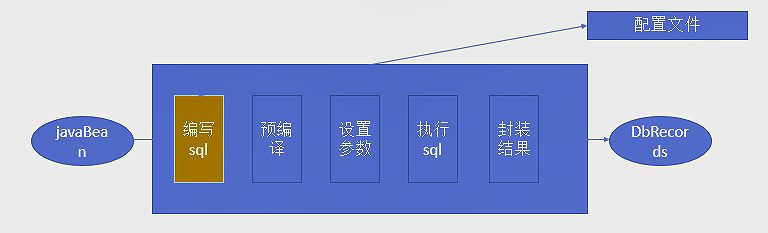
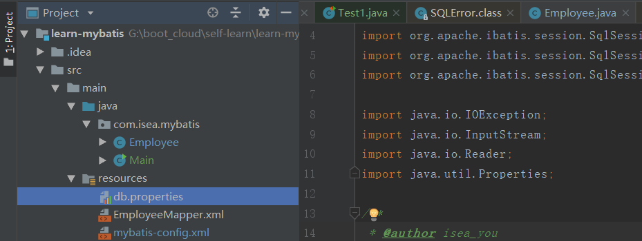

#  ``Mybatis``

**``Mybatis``** ：是一个持久化框架，也即和数据库进行数据交互的框架，相对于之前使用的**``jdbc、jdbcTemplate``**，这些都只能称作是工具，而框架是一套整体的解决方案，前者和后者的关系相当于是搓衣板和洗衣机的区别。持久化框架需要考虑到，查询缓存、事务控制等。 

***```Mybatis```教程：[权威教程](https://www.tutorialspoint.com/mybatis/mybatis_quick_guide.htm)***

## JDBC和``Hibernate``

``Hibernate`` 是过冬的意思。 

正常的操作是：



这样做的弊端是：我们将SQL语句写在了java代码里面，耦合度非常高，如果我们的项目打包部署了，我们想要修改SQL语句的话，修改之后还需要再次打包，部署等，非常的麻烦。还有一个优秀的持久化框架：**Hibernate**，该框架是一个全自动映射ORM（Object Relation Mapping）框架，能够消除SQL，该框架将**JavaBean对象和数据库中的表记录做了一个映射**，将上述的编写SQL，预编译等步骤做了一个黑箱操作，程序员不需要写SQL。这样做的弊端是无法定制SQL，``Mybatis``就出现了。

**``Mybatis``的原理如下：**


## 入门例子

1. 在MySQL数据库中创建建表并添加数据：

   ~~~sql
   create table tab_employee(
     id INT(11) PRIMARY KEY auto_increment,
     last_name VARCHAR(255),
     gender CHAR(1),
     email VARCHAR(255)
   );
   ~~~

2. 创建``maven`` 项目，添加``mybatis、MySQL驱动`` 的依赖：

   ~~~xml
   		<dependency>
               <groupId>org.mybatis</groupId>
               <artifactId>mybatis</artifactId>
               <version>3.4.6</version>
           </dependency>
   
           <dependency>
               <groupId>mysql</groupId>
               <artifactId>mysql-connector-java</artifactId>
               <version>5.1.44</version>
           </dependency>
   ~~~

3. 创建JavaBean类

   ~~~java
   package com.isea.mybatis;
   
   public class Employee {
       private Integer id;
       private String lastName;
       private String email;
       private String gender;
   
       public Integer getId() {
           return id;
       }
   
       public void setId(Integer id) {
           this.id = id;
       }
   
       public String getLastName() {
           return lastName;
       }
   
       public void setLastName(String lastName) {
           this.lastName = lastName;
       }
   
       public String getEmail() {
           return email;
       }
   
       public void setEmail(String email) {
           this.email = email;
       }
   
       public String getGender() {
           return gender;
       }
   
       public void setGender(String gender) {
           this.gender = gender;
       }
   
       @Override
       public String toString() {
           return "Employee{" +
                   "id=" + id +
                   ", lastName='" + lastName + '\'' +
                   ", email='" + email + '\'' +
                   ", gender='" + gender + '\'' +
                   '}';
       }
   }
   ~~~

4. 创建全局``mybatis`` 配置文件

   ~~~xml
   <?xml version = "1.0" encoding = "UTF-8"?>
   <!DOCTYPE configuration PUBLIC "-//mybatis.org//DTD Config 3.0//EN" "http://mybatis.org/dtd/mybatis-3-config.dtd">
   <!--配置-->
   <configuration>
       <!--环境模式，development开发模式，work工作模式-->
       <environments default = "development">
           <!--环境变量-->
           <environment id = "development">
               <!--事务管理器-->
               <transactionManager type = "JDBC"/>
               <!--数据源-->
               <dataSource type = "POOLED">
                   <property name = "driver" value = "com.mysql.jdbc.Driver"/>
                   <property name = "url" value = "jdbc:mysql://localhost:3306/test"/>
                   <property name = "username" value = "root"/>
                   <property name = "password" value = "hailong1996"/>
               </dataSource>
   
           </environment>
       </environments>
   
       <!--映射器-->
       <mappers>
           <!--因为resource就是在类路径下，在maven项目中，java下面的包都是类路径-->
           <mapper resource = "EmployeeMapper.xml"/>
       </mappers>
   
       <!--需要注意的是配置项的顺序不能颠倒，如果颠倒了它们的顺序，在MyBatis的自启动阶段会发生异常，导致程序无法运行-->
   </configuration>
   ~~~

5. 创建SQL映射文件

   ~~~xml
   <?xml version = "1.0" encoding = "UTF-8"?>
   <!DOCTYPE mapper PUBLIC "-//mybatis.org//DTD Mapper 3.0//EN"  "http://mybatis.org/dtd/mybatis-3-mapper.dtd">
   <mapper namespace = "com.isea.mybatis.EmployeeMapper">
       <!--
           namespace 是名称空间
           id 唯一标识
           resultType 返回值类型
           #{id} 从参数中传递过来的id值
       -->
       <select id="selectEmp" resultType = "com.isea.mybatis.Employee">
         select id,last_name lastName,email,gender from tab_employee where id = #{id};
       </select>
   </mapper>
   ~~~

6. 测试，执行

   ~~~java
   package com.isea.mybatis.test;
   /**省略包的引入***/
   
   public class MybatisTest {
   
       /**
        * 1，全局xml配置文件，sqlSession实例
        * 2，SQL映射文件，配置每一个SQL，和SQL封装的规则
        * 3，将SQL映射文件注册到全局配置文件中
        */
   
       @Test
       public void test() throws IOException {
           Reader reader = Resources.getResourceAsReader("mybatis-config.xml");
   
           // 创建sqlSession工厂
           SqlSessionFactory sqlSessionFactory = new SqlSessionFactoryBuilder().build(reader);
           // 获取一个sqlSession的实例，能够执行已经映射的sql语句
           SqlSession session = sqlSessionFactory.openSession();
   
           try {
               Employee employee = session.selectOne("selectEmp", 1);
               System.out.println(employee);
           } finally {
               session.close();
           }
       }
   }
   ~~~

   打印结果：```Employee{id=1, lastName='z3', email='ifseayou@gmail.com', gender='0'}```

更换一种写法：

~~~xml
<?xml version = "1.0" encoding = "UTF-8"?>
<!DOCTYPE configuration PUBLIC "-//mybatis.org//DTD Config 3.0//EN" "http://mybatis.org/dtd/mybatis-3-config.dtd">
<!--配置-->
<configuration>
    <!--配置-->
    <properties resource="db.properties"></properties>

    <!--环境模式，development开发模式，work工作模式-->
    <environments default = "development">
        <!--环境变量-->
        <environment id = "development">
            <!--事务管理器-->
            <transactionManager type = "JDBC"/>
            <!--数据源-->
            <dataSource type = "POOLED">
                <property name = "driver" value = "${db.driver}"/>
                <property name = "url" value = "${db.url}"/>
                <property name = "username" value = "${db.username}"/>
                <property name = "password" value = "${db.pwd}"/>
            </dataSource>
        </environment>
    </environments>

    <!--映射器-->
    <mappers>
        <!--因为resource就是在类路径下，在maven项目中，java下面的包都是类路径-->
        <mapper resource = "EmployeeMapper.xml"/>
    </mappers>

    <!--需要注意的是配置项的顺序不能颠倒，如果颠倒了它们的顺序，在MyBatis的自启动阶段会发生异常，导致程序无法运行-->
</configuration>
~~~

~~~properties
db.driver=com.mysql.jdbc.Driver
db.url=jdbc:mysql://localhost:3306/test
db.username=root
db.pwd=hailong1996
~~~

~~~java
public class Main {
    public static void main(String[] args) throws IOException {
        Reader resourceAsReader = Resources.getResourceAsReader("mybatis-config.xml");
        InputStream resourceAsStream = Resources.getResourceAsStream("db.properties");
        Properties properties = new Properties();

        properties.load(resourceAsStream);
        System.out.println(properties);

        SqlSessionFactory sqlSessionFactory = new SqlSessionFactoryBuilder().build(resourceAsReader,properties);
        SqlSession sqlSession = sqlSessionFactory.openSession();
        try {
            Employee employee = sqlSession.selectOne("selectEmp", 1);
            System.out.println(employee);
        } finally {
            sqlSession.close();
        }
    }
}
~~~




