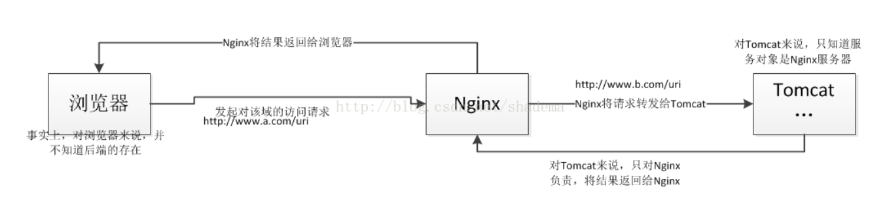
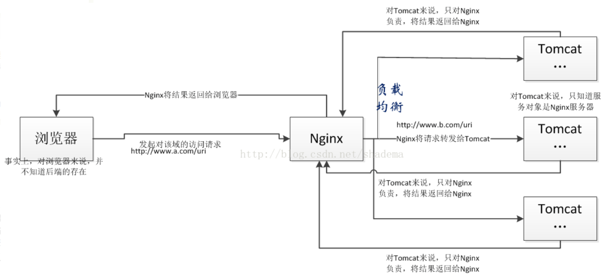
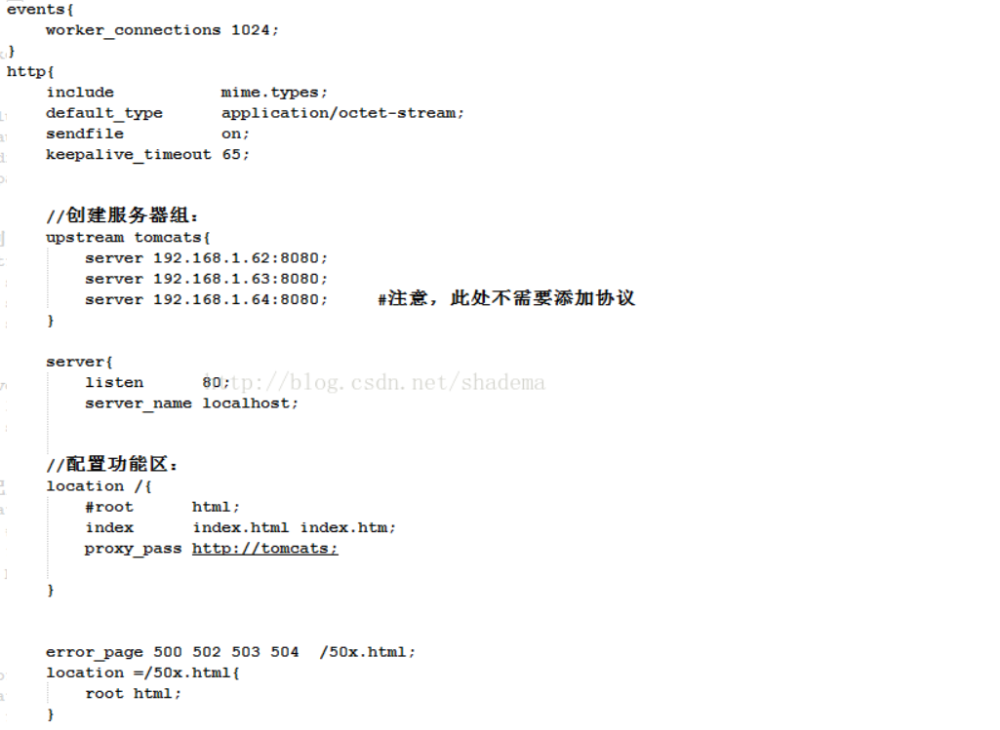

# Nginx

[正向代理]([https://zh.wikipedia.org/wiki/代理服务器](https://zh.wikipedia.org/wiki/%E4%BB%A3%E7%90%86%E6%9C%8D%E5%8A%A1%E5%99%A8))：代理服务器的基本行为就是接收客户端发送的请求后转发给其他服务器。代理不改变请求[URI]，会直接发送给前方持有资源的目标服务器。

[反向代理]([https://zh.wikipedia.org/wiki/反向代理](https://zh.wikipedia.org/wiki/%E5%8F%8D%E5%90%91%E4%BB%A3%E7%90%86)) ：客户端只会得知反向代理的IP地址，而不知道在代理服务器后面的服务器集群的存在。反向代理服务器会改变客户端请求的URI。

### 负载均衡

[参考链接](<https://blog.csdn.net/shadema/article/details/75949797>)

负载均衡是做反向代理的目的之一。没太大区别，要说区别就是后端是1台了叫反向代理，有多台了就实现了负载均衡。



从图中，我们可以知道，对于浏览器来说，他会发一个$http://www.a.com/uri$请求到Nginx服务器，对于他来说，他认为数据就是从$http://www.a.com/uri$域中返回的，事实上，当$http://www.a.com/uri$到达Nginx服务器后，Nginx服务器会将其转发给$http://www.b.com/uri,$从$http://www.b.com/uri$域中取得数据并将其返回给浏览器，这个步骤浏览器是不知道的，也就是说，浏览器并不知道$http://www.b.com/uri$该域的存在，同理，$http://www.b.com/uri$所在的域（图中的Tomcat）也并不知道浏览器的存在，他也只对Nginx负责。Nginx的这么一个过程便称为反向代理。

Nginx服务器是如何实现这一步的呢，事实上也很简单，只需要在location中做一下简单的配置即可，命令大概如下图所示：（配置完命令记得reload重新加载才能生效）


重点在于location处，这样的配置代表的是，所有来自浏览器的请求，在Nginx收到之后，都会代理到$http://192.168.1.62:8080$所在的地方。比如，我浏览器上发起$http://192.168.1.61/a/index.html$；Nginx收到之后，将会发出$http:// 192.168.1.62:8080/a/index.html$这么一个请求到所连接的服务器上，如上图的Tomcat。

接下来我们做这样一个假设，假如后端连接着几台。几十台服务器呢，这个时候Nginx也是做同样的代理吗，答案是肯定的。图示如下：那么，在这么多台服务器上，Nginx的转发又是基于怎样的策略呢？这个时候就涉及在负载均衡了，说白了就是，应该怎样的分发，才能做到资源的最大限度的利用？



那么如何做负载均衡的策略？我们这里假设三台服务器的IP地址分别为

~~~shell
http:// 192.168.1.62:8080
http:// 192.168.1.63:8080
http:// 192.168.1.64:8080
~~~

负载均衡有多种实现的方式，下面仅仅介绍一种平均轮询的方式，配置如下：




##### 部分的配置含义

~~~conf
worker_processes  1;  # 工作进程：数目。根据硬件调整，通常等于CPU数量或者2倍于CPU。

# 错误日志：存放路径。
error_log  logs/error.log  debug;

#pid        logs/nginx.pid;  # pid（进程标识符）：存放路径。

events {
    worker_connections  1024;
	# 每个工作进程的最大连接数量，表示Nginx服务来同时响应个转发请求。
}

####设定http服务器，利用它的反向代理功能提供负载均衡支持#################
http {
    include       mime.types; # 设定mime类型,类型由mime.type文件定义
    default_type  application/octet-stream;

~~~

## mime.types 文件

早期的电子邮件只支持ASCII字符集，为了在邮件中添加更多的内容，产生了MIME——Multipurpose Internet Mail Extension（多用途因特网邮件扩展）HTTP服务器在发送一份报文主体时，在HTTP报文头部插入解释自身数据类型的MIME头部信息（`Content-Type`）。客户端接收到这部分有关数据类型的信息，就能调用相应的程序处理数据。

Nginx的mime.types文件有如下的内容：

~~~xml
types {
    text/html                             html htm shtml;
    text/css                              css;
    text/xml                              xml;
    image/gif                             gif;
.....
~~~

打开OSC的一个页面，看到一个PNG格式的图片的时候，Nginx是这样发送格式信息的：

1.  服务器上有enter_narrow.png这个文件，后缀名是png；
2.  根据mime.types，这个文件的数据类型应该是image/png；
3.  将`Content-Type`的值设置为image/png，然后发送给客户端。


Nginx通过服务器端文件的后缀名来判断这个文件属于什么类型，再将该数据类型写入HTTP头部的`Content-Type`字段中，发送给客户端。


### 暂时学到这里，继续学习，参见：

[Nginx 配置文件学习](https://segmentfault.com/a/1190000002797601)

[Nginx相关介绍](https://www.cnblogs.com/wcwnina/p/8728391.html)

[关于proxy_pass 的解释](https://blog.csdn.net/zhongzh86/article/details/70173174)


### proxy_pass

在 ```nginx``` 中配置```proxy_pass```代理转发的配置规则，

* 如果在proxy_pass后面的```url```加 ```/```，表示绝对路径；
* 如果没有/，表示相对路径，把匹配的路径部分也给代理走。

假设下面四种情况分别用***``` http://192.168.1.1/proxy/test.html ```***进行访问。

~~~conf
location /proxy/ 
    proxy_pass http://127.0.0.1/;
} #代理到URL：http://127.0.0.1/test.html
~~~

~~~conf
location /proxy/ {
	 proxy_pass http://127.0.0.1;
} # 代理到URL：http://127.0.0.1/proxy/test.html
~~~

~~~conf
location /proxy/ {
	 proxy_pass http://127.0.0.1/aaa/;
} # 代理到URL：http://127.0.0.1/aaa/test.html
~~~

~~~conf
location /proxy/ {
	proxy_pass http://127.0.0.1/aaa;
} # 代理到URL：http://127.0.0.1/aaatest.html
~~~

## 命令

~~~shell
# 启动 后台启动
./nginx &

# 重启
./nginx -s reload

# 关闭
./nginx -s stop

# Windows下批量杀死 Nginx
taskkill /fi "imagename eq nginx.EXE" /f
~~~

#### 数据库

~~~shell
找到日志的位置：/mnt/zhbr/pyd/f1-microservice/pyd-monitor-start/logs
 tail -f pyd-monitor.2019-10-28.0.log
~~~


