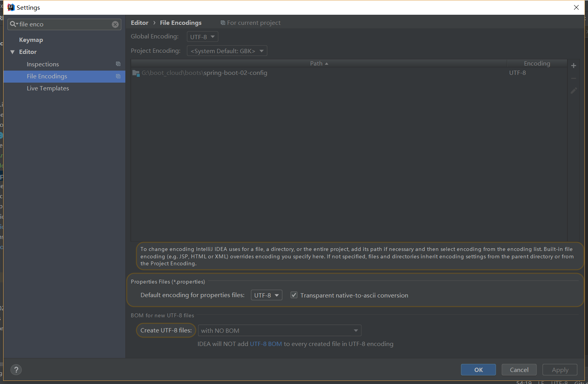
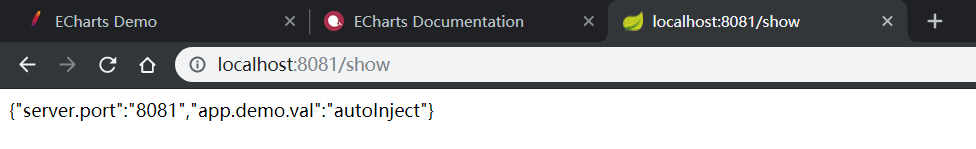
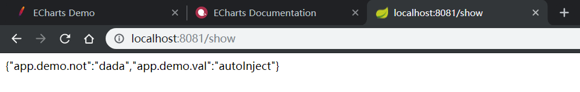
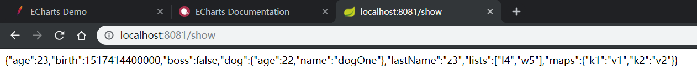
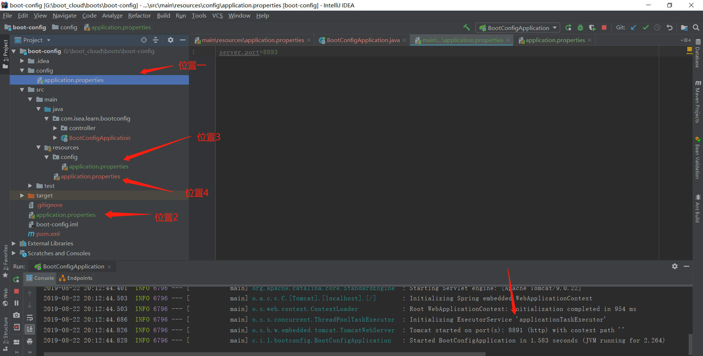
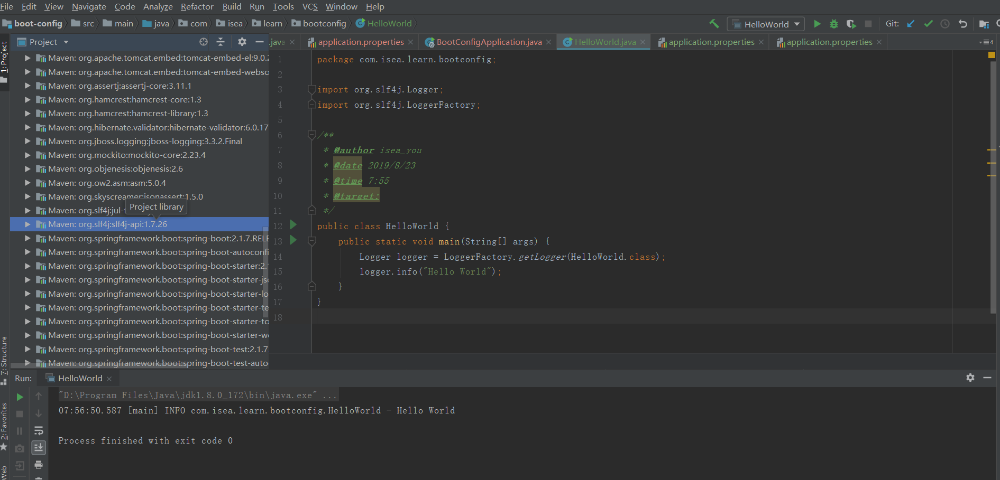
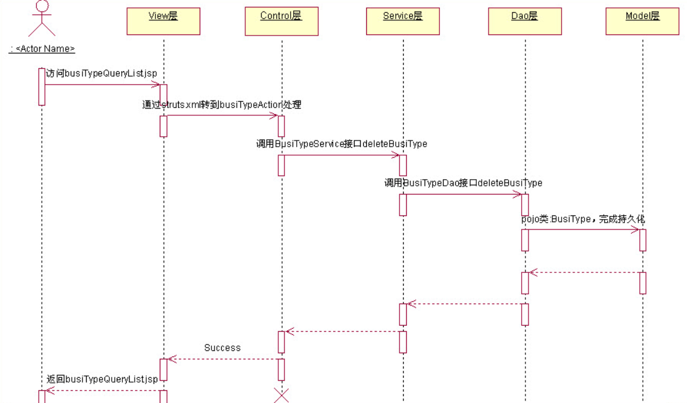
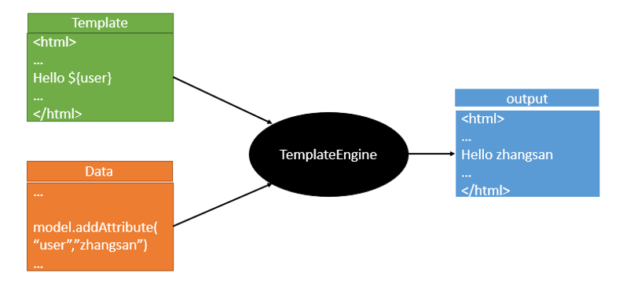

# Spring Boot

## Boot简介

2014年，Spring4.0 时候，伴随开发出：简化Spring 应用开发的一个框架，整个spring技术栈的大整合，javaee开发的一站式解决方案。 

### Boot的优点：

* 快速创建独立运行的Spring项目以及与主流的框架集成
* 使用嵌入式的Servlet容器，应用无需打成war包（打成war包之后，部署到服务器的时候，需要服务器有Tomcat的环境）直接打成jar包，使用java -jar直接来运行，因为Boot直接集成了Tomcat。
* Boot中有很多的starters，也即启动器，作用是帮我们进行自动的依赖管理和版本控制。如果我们想要用某一块的功能，就会有对应的启动器。比如我们要使用web功能，我们导入web启动器，那么web功能里面要带的其他的jar包，包括每一个jar包的版本，Boot都会将我们控制好，如果我们想要用jdbc相关的功能，直接导入JDBC相关的staters，使用redis相关的功能，就导入redis相关的starters 
* 大量的自动配置，也可以修改默认配置。  
* 准生产环境的运行时应用监控，和云计算的天然集成。

### Boot缺点：

* 入门容易，精通难。

## Boot与微服务

### All in one 的单体应用：

一个project打成一个War包，然后部署到服务器的Tomcat里面。这样做的好处是：

* 开发简单，测试简单，只有一个应用

* 部署简单，只需要部署一次就OK了，不会给运维带来困难
* 扩展，容易，当我们的应用的负载能力不行的时候，直接水平扩展，将应用复制多份， 放置于多个服务器中，以这样的方式来提高并发能力。  

缺点：

* 牵一发而动全身；

 而微服务，，每一个功能，都可以作为一个独立的模块，运行在独立的进程中，作为一个服务对外提供。服务之前的通信使用HTTP RESTful 

## 环境准备

学习Spring boot之前，应该首选掌握内容：

1） Spring框架的使用经验

2） Maven进行项目构建和依赖管理

3） 熟练使用IDEA和Eclipse

**JDK1.8/ maven 3.x / IDEA2017 / Boot1.5.9Release**

需要将Maven的配置文件setting.xml的profiles标签添加：

~~~xml
 <profile>  
  	     <id>jdk‐1.8</id>  
 	<activation>   
 		 <activeByDefault>true</activeByDefault>    
	 <jdk>1.8</jdk> 
  	</activation>  
 	<properties>    
    	 <maven.compiler.source>1.8</maven.compiler.source>    
 		 <maven.compiler.target>1.8</maven.compiler.target>     
		 <maven.compiler.compilerVersion>1.8</maven.compiler.compilerVersion> 
  </properties> 
</profile>

~~~

这部分就是IDEA和Maven的整合，如果不进行设置，IDEA默认使用的是自己的Maven，

## Boot的 Hello world

浏览器发送hello请求，服务器接收请求并处理，响应Hello boot 字符串。这是一个典型的web应用，如果不使用boot去实现的话，首先我们会创建一个web项目，导入spring，springmvc 相关的依赖，然后编写一堆配置文件，完成之后将整个项目打成war包，然后放入到Tomcat里运行。

如果使拥Boot来解决这份事情的话：

1） 创建一个Maven工程

2） 导入boot相关的依赖，在boot的官网的quickstart中copy即可

~~~xml
<parent>
    <groupId>org.springframework.boot</groupId>
    <artifactId>spring-boot-starter-parent</artifactId>
    <version>2.1.7.RELEASE</version>
    <relativePath/> <!-- lookup parent from repository -->
</parent>

<!--她的父项目是：-->
  <parent>
    <groupId>org.springframework.boot</groupId>
    <artifactId>spring-boot-dependencies</artifactId>
    <version>2.1.7.RELEASE</version>
    <relativePath>../../spring-boot-dependencies</relativePath>
  </parent>
<!--她来真正的管理Spring boot应用的所有依赖-->
~~~

3） 编写一个主程序，来编写spring boot的应用

4） 编写业务逻辑，包括controller，或者service，不需要再做任何的配置

5） 测试我们这个应用写好了没有，（不在向以前那样，整合服务器进来，进行运行，现在直接运行main方法即可）

**代码：**

~~~java
package com.isea.controller;

import org.springframework.stereotype.Controller;
import org.springframework.web.bind.annotation.RequestMapping;
import org.springframework.web.bind.annotation.ResponseBody;

@Controller
public class HelloController {
    @ResponseBody //  将hello world.. 写给浏览器
    @RequestMapping("hello") // 用来接收浏览器的"hello" 请求
    public String hello(){
        return "hello world.."; // 给浏览器返回hello world..,如果我们想要写给浏览器，需要结合一个注解，ResponseBody
    }
}
~~~

直接发送一个hello请求，浏览器，就会响应：

6） 简化部署，此时完全不用打war包，而是直接在pom.xml文件中添加一个插件的包，就可以将boot项目打成一个jar包，直接运行（这就是这个插件的作用）。

**package方法进行 打包**

打成jar包之后，找到打成jar包之后的路径，然后直接执行

然后在浏览器端测试是否成功。插件里面自带了tomcat环境，服务器没有tomcat环境也是没有问题的。打开我们自己打成的jar包，在lib里面有非常多的jar包，有我们在写程序的时候导入的jar包，还有tomcat的jar包。打包的时候携带了服务器，这就是boot的强大。

使用boot 向导（***Spring Initializer***）创建boot项目，可以非常的快速，非常的过瘾。

这些几乎都是没有用的，可以删掉。

static：放置静态资源，js，css，html，images等

template: 保存所有的模板页面。


 ## Spring 中的一些注解

[Spring Boot 注解详细解读](<https://blog.csdn.net/weixin_40753536/article/details/81285046>) 从这篇文章里面摘抄出来比较重要的注解：

~~~java
@SpringBootApplication：// 申明让spring boot自动给程序进行必要的配置，这个配置等同于：@Configuration ，@EnableAutoConfiguration 和 @ComponentScan 三个配置。

@ResponseBody：// 表示该方法的返回结果直接写入HTTP response body中，一般在异步获取数据时使用，用于构建RESTful的api。在使用@RequestMapping后，返回值通常解析为跳转路径，加上@Responsebody后返回结果不会被解析为跳转路径，而是直接写入HTTP response body中。比如异步获取json数据，加上@Responsebody后，会直接返回json数据。该注解一般会配合@RequestMapping一起使用。

@Controller // 用于定义控制器类，在spring项目中由控制器负责将用户发来的URL请求转发到对应的服务接口（service层），一般这个注解在类中，通常方法需要配合注解@RequestMapping。

@RestController // 用于标注控制层组件(如struts中的action)，@ResponseBody和@Controller的合集。

@RequestMapping //提供路由信息，负责URL到Controller中的具体函数的映射。

@EnableAutoConfiguration // SpringBoot自动配置（auto-configuration）：尝试根据你添加的jar依赖自动配置你的Spring应用。例如，如果你的classpath下存在HSQLDB，并且你没有手动配置任何数据库连接beans，那么我们将自动配置一个内存型（in-memory）数据库”。你可以将@EnableAutoConfiguration或者@SpringBootApplication注解添加到一个@Configuration类上来选择自动配置。如果发现应用了你不想要的特定自动配置类，你可以使用@EnableAutoConfiguration注解的排除属性来禁用它们。

@ComponentScan // 表示将该类自动发现扫描组件。个人理解相当于，如果扫描到有@Component、@Controller、@Service等这些注解的类，并注册为Bean，可以自动收集所有的Spring组件，包括@Configuration类。我们经常使用@ComponentScan注解搜索beans，并结合@Autowired注解导入。可以自动收集所有的Spring组件，包括@Configuration类。如果没有配置的话，Spring Boot会扫描启动类所在包下以及子包下的使用了@Service,@Repository等注解的类。

@Configuration // 相当于传统的xml配置文件，如果有些第三方库需要用到xml文件，建议仍然通过@Configuration类作为项目的配置主类——可以使用@ImportResource注解加载xml配置文件。用@Configuration标注的类（A类）相当于xml里的beans,A类中@Bean注解的和xml里定义的bean等价，用ConpentScan扫描之后，最终我们可以在程序里用@AutoWired或@Resource注解取得用@Bean注解的bean，和用xml先配置bean然后在程序里自动注入一样。目的是减少xml里配置。

@Import // 用来导入其他配置类。

@ImportResource //用来加载xml配置文件。

@Service // 一般用于修饰service层的组件

@Repository // 使用@Repository注解可以确保DAO或者repositories提供异常转译，这个注解修饰的DAO或者repositories类会被ComponetScan发现并配置，同时也不需要为它们提供XML配置项。

@Value // 注入Spring boot application.properties配置的属性的值。示例代码：

@Inject // 等价于默认的@Autowired，只是没有required属性；

@Component //泛指组件，当组件不好归类的时候，我们可以使用这个注解进行标注。

@Bean // 相当于XML中的,放在方法的上面，而不是类，意思是产生一个bean,并交给spring管理。

@AutoWired // 自动导入依赖的bean。byType方式。把配置好的Bean拿来用，完成属性、方法的组装，它可以对类成员变量、方法及构造函数进行标注，完成自动装配的工作。当加上（required=false）时，就算找不到bean也不报错。

@Resource(name=”name”,type=”type”) // 没有括号内内容的话，默认byName。与@Autowired干类似的事。


// **** JPA注解 ****

@Entity // @Table(name=”“)：表明这是一个实体类。一般用于jpa这两个注解一般一块使用，但是如果表名和实体类名相同的话，@Table可以省略


// **** springMVC相关注解 ****

@RequestMapping //@RequestMapping(“/path”)表示该控制器处理所有“/path”的URL请求。RequestMapping是一个用来处理请求地址映射的注解，可用于类或方法上。用于类上，表示类中的所有响应请求的方法都是以该地址作为父路径。该注解有六个属性：
params // 指定request中必须包含某些参数值是，才让该方法处理。
headers // 指定request中必须包含某些指定的header值，才能让该方法处理请求。
value // 指定请求的实际地址，指定的地址可以是URI Template 模式
method // 指定请求的method类型， GET、POST、PUT、DELETE等
consumes //  指定处理请求的提交内容类型（Content-Type），如application/json,text/html;
produces // 指定返回的内容类型，仅当request请求头中的(Accept)类型中包含该指定类型才返回

@RequestParam //用在方法的参数前面。
@RequestParam 
String a =request.getParameter(“a”)。

@PathVariable // 路径变量。
public Dept get(@PathVariable("id") Long id)


// **** 全局异常处理 **** 

@ControllerAdvice // 包含@Component。可以被扫描到。统一处理异常。

@ExceptionHandler（Exception.class）// 用在方法上面表示遇到这个异常就执行以下方法。
~~~


### Spring的注解

~~~java
// 用来映射hello请求 
@RequestMapping("hello")

// 将返回的数据写给浏览器，如果放置在类上，表示该类下的所有方法的返回结果返回给浏览器，如果放在方法上仅仅表示该方法
@ResponseBody

// 该注解 == @ResponseBody + @Controller
@RestController

@Value("${person.last-name}") // 
private String name;
~~~

### 关于boot的config注解

~~~java
@Component  // 只有当前组件是容器中的组件，才能使用容器提供的@ConfigurationProperties功能，所以加入component注解
@ConfigurationProperties(prefix = "person")  // @ConfigurationProperties:告诉Boot将本类（Person）类中的所有属性和配置文件中相关的配置进行绑定
@Validated // 校验的功能
@PropertySource(value = {"classpath:person.properties"}) // 避免全局的配置文件太大，加载特定的配置文件 加载类路径下的配置文件，

// 如果不使用上面的配置属性注解，可以使用@Value注解，
public class Person {
    //@Value("${person.last-name}") // 从配置文件中获取值，为LastName赋值

    @Email // 表示lastName的格式必须是邮箱的格式
    private String lastName;

    @Value("#{10 * 2}") // 完成计算的功能，为age来赋值
    private Integer age;

    @Value("true") // 直接为boss来赋值
    private Boolean boss;
    // .......
}

@RequestParam // 如果是Post请求：该注解可获取Post请求中非JSon格式的数据

@PostMapping("/order/checkmore")
public String checkMore(@RequestParam(value = "amount")Integer amount,                                        @RequestParam(value = "discount")float discount)
    
@PathVariable // 获取get请求路径中的参数

@RequestMapping(value = "/dept/get/{id}", method = RequestMethod.GET)
public Dept get(@PathVariable("id") Long id) {
    return service.get(id);
}

~~~

以上赋值使用是YML文件中的值：

~~~yml
person:
  last-name: z3
  age: 23
  boss: false
  birth: 2018/02/01
~~~


## 配置文件

重点是***YML、properties***配置文件，Spring Boot的思想是约定大于配置，配置文件的主要目的是未来改变约定的配置项。

### yml配置文件

以数据为中心，KV的形式写。下面是一个例子：

```yml
person:
  last-name: z3 
  age: 23
  boss: false
  birth: 2018/02/01
  maps: {k1: v1,k2: v2} # map 
  lists: # list或者是set
    - l4
    - w5
  dog: # 对象
    name: 小狗
    age: 22
```

### yml配置文件值的注入

~~~java
@Component  
// 只有当前组件是容器中的组件，才能使用容器提供的@ConfigurationProperties功能，所以加入component注解
@ConfigurationProperties(prefix = "person")  
// @ConfigurationProperties:告诉Boot将本类（Person）类中的所有属性和配置文件中相关的配置进行绑定

// 如果不使用上面的配置属性注解，可以使用@Value注解，
public class Person {
    
    private String lastName;
    private Integer age;

    private Boolean boss;
    private Date birth;

    private Map<String,Object> maps;
    private List<Object> lists;
    private Dog dog;
~~~

此外，还需要导入配置文件的处理器，这样在code的时候就会产生提示：

~~~xml
<!--导入配置文件处理器，配置文件进行绑定之后，就会有提示-->
<dependency>
    <groupId>org.springframework.boot</groupId>
    <artifactId>spring-boot-configuration-processor</artifactId>
    <optional>true</optional>
</dependency>
~~~

### 配置文件注入值校验

~~~java
@Validated // 校验的功能
public class Person {
    //@Email // 表示lastName的格式必须是邮箱的格式
    private String lastName;
~~~

### properties配置文件 

properties配置文件在idea中默认utf-8可能会乱码：



## 配置文件的读取方式：

### 利用Environment来读取

所有的配置信息，都会加载到Environment实体中，因此我们可以通过这个对象来获取系统的配置，通过这种方式不仅可以获取`application.yml`配置信息，还可以获取更多的系统信息

配置文件如下：

~~~properties
#服务端口号
server.port=8081

app.proper.key=${random.uuid}
app.proper.id=${random.int}
app.proper.value=test123

app.demo.val=autoInject
~~~

读取文件：

~~~java
@RestController
public class HelloController {
    @Autowired
    private Environment environment;
    @GetMapping(path = "show")
    public String show(){
        Map<String, String> result = new HashMap<>(4);
        result.put("server.port", environment.getProperty("server.port"));
        result.put("app.demo.val", environment.getProperty("app.demo.val"));
        return JSON.toJSONString(result);
    }
}
~~~

其中的`JSON.toJSONString(result)`使用的是：

~~~xml
<dependency>
    <groupId>com.alibaba</groupId>
    <artifactId>fastjson</artifactId>
    <version>1.2.31</version>
</dependency>
~~~

读取到了之后，可以在浏览器看到如下返回的Json字符串：



***这里如果想要获取信息，必须要设置get方法***


说明读取到了配置文件中的信息。

### @Value注解的方式

**我们只是在某个业务逻辑中需要获取一下配置文件中的某项值，使用@Value。**

`@Value`注解可以将配置信息注入到Bean的属性，也是比较常见的使用方式，但有几点需要额外注意：

- 如果配置信息不存在会怎样？
- 配置冲突了会怎样（即多个配置文件中有同一个key时）？

通过 ${}，大括号内为配置的Key；如果配置不存在时，给一个默认值时，可以用冒号分割，后面为具体的值

~~~java
@RestController
public class HelloController {

    // 配置必须存在，且获取的是配置名为 app.demo.val 的配置信息
    @Value("${app.demo.val}")
    private String autoInject;
    // 配置app.demo.not不存在时，不抛异常，给一个默认值data。
    @Value("${app.demo.not:dada}")
    private String notExists;

    @GetMapping(path = "show")
    public String show(){
        Map<String, String> result = new HashMap<>(4);
        result.put("app.demo.val", autoInject);
        result.put("app.demo.not", notExists);
        return JSON.toJSONString(result);
    }
}
~~~

如下，说明读取到了配置文件中的信息。



### 对象映射的方式

**专门编写了一个javaBean来和配置文件进行映射，我们就直接使用@ConfigurationProperties，来进行文件的映射**，如果我们想要我们在映射的时候有提示的话，添加如下的依赖；

~~~xml
<!--导入配置文件处理器，配置文件进行绑定之后，就会有提示-->
<dependency>
    <groupId>org.springframework.boot</groupId>
    <artifactId>spring-boot-configuration-processor</artifactId>
    <optional>true</optional>
</dependency>
~~~

**配置文件.yaml文件**，将会使用这个配置文件对Person对象赋值

~~~yaml
person:
  last-name: z3
  age: 23
  boss: false
  birth: 2018/02/01
  maps: {k1: v1,k2: v2} # map
  lists: # list或者是set
  - l4
  - w5
  dog: # 对象
    name: 小狗
    age: 22
~~~

**Person**对象

~~~java
@Component
// 只有当前组件是容器中的组件，才能使用容器提供的@ConfigurationProperties功能，所以加入component注解
@ConfigurationProperties(prefix = "person")
// @ConfigurationProperties:告诉Boot将本类（Person）类中的所有属性和配置文件中相关的配置进行绑定
// 必须要设置set方法，set方式是完成值的设置的基础
// 如果不使用上面的配置属性注解，可以使用@Value注解，
public class Person {
    private String lastName;
    private Integer age;

    private Boolean boss;
    private Date birth;

    private Map<String,Object> maps;
    private List<Object> lists;
    private Dog dog;

    public Person() {
    }

    public String getLastName() {
        return lastName;
    }

    public void setLastName(String lastName) {
        this.lastName = lastName;
    }

    public Integer getAge() {
        return age;
    }

    public void setAge(Integer age) {
        this.age = age;
    }

    public Boolean getBoss() {
        return boss;
    }

    public void setBoss(Boolean boss) {
        this.boss = boss;
    }

    public Date getBirth() {
        return birth;
    }

    public void setBirth(Date birth) {
        this.birth = birth;
    }

    public Map<String, Object> getMaps() {
        return maps;
    }

    public void setMaps(Map<String, Object> maps) {
        this.maps = maps;
    }

    public List<Object> getLists() {
        return lists;
    }

    public void setLists(List<Object> lists) {
        this.lists = lists;
    }

    public Dog getDog() {
        return dog;
    }

    public void setDog(Dog dog) {
        this.dog = dog;
    }
}


// dog类
package com.isea.getbootconfig.model;

public class Dog {
    private String name;
    private Integer age;

    public Dog() {
    }

    public String getName() {
        return name;
    }

    public void setName(String name) {
        this.name = name;
    }

    public Integer getAge() {
        return age;
    }

    public void setAge(Integer age) {
        this.age = age;
    }
}

// 测试：
@RestController
public class HelloController {

    @Autowired
    private Person person;

    @GetMapping(path = "show")
    public String show() {
        return JSON.toJSONString(person);
    }
}
~~~

测试的结果如下图：



### 多profile

~~~yml
server:
  port: 8081
spring:
  profiles:
    active: dev
---
server:
  port: 8083
spring:
  profiles: dev
---
server:
     port: 8084
spring:
  profiles: prod
~~~

**激活的方式：**

* 在配置文件中指定 spring.profiles.active=dev
* 命令行：可以直接在测试的时候，配置传入命令行参数

~~~shell
  java -jar spring-boot-02-config-0.0.1-SNAPSHOT.jar --spring.profiles.active=dev；
~~~

* 虚拟机参数；

~~~shell
 -Dspring.profiles.active=dev 
~~~

配置文件的位置和优先级按照下面的方式进行排列。各个配置互补形成最终的配置。




## 日志

### 日志框架

一位程序员在开发一个大型的系统

* `System.out.println()`将关键的数据打印在控制台，注释，放开，写在一个文件中，该程序员产生了一个写一个日志框架的想法，例如叫做xxlogging.jar，在以后的开发中都可以使用。
* 随着时间的推移，该程序员想要给该框架添加个高大上的功能，比如说：异步模式，自动归档（将每天的日志形成一个文件，然后自动归档）xx-good-logging.jar
* 将以前的框架卸下来之后，换上新的框架，还需要重新修改API，如果以后还有该框架的升级xx-perfect-logging.jar，每次都修改代码的话，就会显得很麻烦，
* 该程序员想到了JDBC和数据库驱动的关系，JDBC是sun公司定义的接口，在具体的需要连接什么数据库的时候，只是需要将该厂商对JDBC的实现放进程序就行了，所以该程序员为日志框架写了一个统一的接口层：日志的抽象层，logging-abstract.jar,在具体的项目中，我们只是需要导入具体的日志实现即可。

**市面上的一些日志框架：**

`JUL、JCL、Jboss-logging、logback、log4j、log4j2、slf4j....`

| 日志的抽象层（日志门面）                                     | 日志实现                                         |
| ------------------------------------------------------------ | ------------------------------------------------ |
| ~~JCL（Jakarta  Commons Logging）~~      ~~jboss-logging~~     SLF4j（Simple  Logging Facade for Java） | Log4j  JUL（java.util.logging）  Log4j2  Logback |

Log4j  ，Logback，其实是同 一个人写的，最开始的时候是Log4j，只不过该日志框架有一定的性能问题，所以作者要对该日志框架进行升级，但是他觉得的对Log4j进行升级，改动太大，他就重写了一个日志框架Logback，他想到未来可能还有更多的日志框架，所以他就写了了日志框架的抽象，SLF4j。Log4j2  是Apache对日志框架的实现，该框架也非常的优秀。

**左边选一个抽象层、右边来选一个实现；**

| 日志抽象（日志门面） | 日志实现  |
| -------------------- | --------- |
| SLF4J                | Logback； |

底层是Spring框架，Spring框架默认是用JCL；‘

SpringBoot：和我们一样机智，选择的是上述我们说的。

### SLF4j的使用

以后在开发的时候，日志记录方法的使用，不应该直接调用日志的实现类，而是应该调用日志抽象层里面的方法，如果是spring boot的项目的，boot的依赖管理会有日志框架，其实就是上述表格中提到的。

代码层的使用：

~~~java
public class HelloWorld {
    public static void main(String[] args) {
        Logger logger = LoggerFactory.getLogger(HelloWorld.class);
        logger.info("Hello World");
    }
}
~~~



图示：


其中的`adapter`叫做适配层，或者是适配器，向上实现`slf4j` 向下调用具体的日志实现，比如`log4j` ，该层主要的作用是用来适配本来不认识slf4j框架的日志实现，原因是这些框架出来的时候，slf4j还没有出现。这些适配层都是slf4j来实现的。

每个日志框架都有自己的配置文件，使用了`slf4j`之后，**配置文件还是做成日志实现框架的日志文件**


### 日志级别

越是靠后，输出的信息越少

| 1     | 2         | 3        | 4        | 5       | 6     |
| ----- | --------- | -------- | -------- | ------- | ----- |
| Trace | **Debug** | **Info** | **Warn** | *Error* | Fatal |


## Web开发

### 简介：

* 创建Spring Boot应用，选择我们需要使用的模块
* Boot已经帮我们完成了配置，我们只是需要少量的配置就能运行起来
* 自己编写业务代码

## view、controller、service、dao、model层级关系

**如图：**




* view层：    结合control层，显示前台页面。
* control层：业务模块流程控制，调用service层接口。
* service层：业务操作实现类，调用dao层接口。
* dao层：     数据业务处理，持久化操作
* model层： pojo，OR maping，持久层

## RESTFul风格的Demo

模板引擎：


