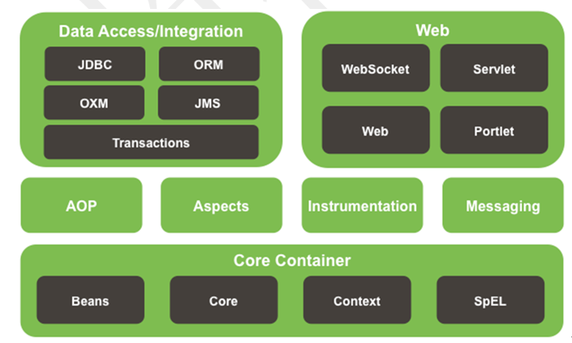
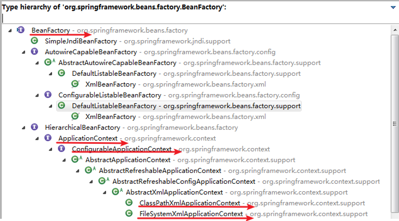

# spring框架

| Q                                      | A                                                            |
| -------------------------------------- | ------------------------------------------------------------ |
| 说说Spring的特点                       | ICO，DI，AOP以前是资源的请求，现在是资源的推送               |
| IOC是什么，DI是IOC的什么               | IOC是一种思想，而DI是一种实现，IOC也即控制反转               |
| 简述下IOC创建的过程；IOC在底层是什么？ | 底层的原理是反射，在创建IOC容器的时候，会读取配置获取到Bean，然后通过反射构建对象或者是实例 |
| 交给IOC容器的Bean有几类，有什么不同    | 交给IOC容器的Bean有两类，即普通Bean和FactoryBean。           |
|                                        |                                                              |
|                                        |                                                              |
|                                        |                                                              |
|                                        |                                                              |
|                                        |                                                              |


Spring框架具备了如下的特点：

* 轻量级：
* 依赖注入DI（dependency injection），IOC，**IOC是一种思想（以前是程序员自己控制对象，现在交付给容器，也就是框架），DI是IOC的实现**。例如Service依赖于dao层，我们可以使用spring框架将dao注入到service中去，这个过程就是依赖注入；$Inversion of Control$ 也就是反转控制。
* 面向切面编程，AOP 
* 容器，Spring是一个容器，因为它可以包含并且管理应用对象的生命周期



底层是IOC的部分，中间是AOP，底层是对数据库的访问，和对web的支持。建立一个spring项目的目录结构：如下图所示


## HelloWorld

正常的逻辑下，如果我们不使用Spring，我们创建一个JavaBean类，然后创建该类的实例，然后调用方法

~~~java
// JavaBean类
package com.isea.learn;

public class HelloWorld {
    private String name;

    public String getName() {
        return name;
    }

    public void setName(String name) {
        this.name = name;
    }

    public void hello(){
        System.out.println("hello " + name);
    }
}

// 主方法类
package com.isea.learn;

public class Main {
    public static void main(String[] args) {
        HelloWorld helloWorld = new HelloWorld();
        helloWorld.setName("z3");

        helloWorld.hello();
    }
}
~~~

**如果我们使用Spring来完成，框架帮助我们创建对象放置于IOC容器中，我们只是需要创建IOC容器，然后从容器中获取对象即可，至于对象的属性的配置，从`xml` 配置文件中配置即可，然后就可以愉快的使用。**

~~~java
import org.springframework.context.support.ClassPathXmlApplicationContext;

public class Main {
    public static void main(String[] args) {
        // 获取一个容器对象
        ClassPathXmlApplicationContext ctx = new ClassPathXmlApplicationContext("applicationContext.xml");
        HelloWorld helloWorld =(HelloWorld)ctx.getBean("helloWorld");
        helloWorld.hello();
    }
}
~~~

对象的属性需要从配置文件中获取，如下：

~~~xml
<!--配置bean，
class:值为类的路径，这里告知全类名可以推断出是通过反射的方式进行对象的创建，要求bean中有无参的构造器

id:用来标识创建好的对象，如果我们需要使用这个对象，就用id的值来获取到，如我们在main方法中getBean("id值") 也即为对象的唯一标识。

-->
<bean id="helloWorld" class="com.isea.learn.HelloWorld">
    <!--这里的name属性值就是JavaBean中的set方法后面设置的名字，value就是javaBean中的属性对应的值-->
     <property name="name" value="Spring"></property>
</bean>
~~~

**重点：**

~~~java
ClassPathXmlApplicationContext ctx = new ClassPathXmlApplicationContext("applicationContext.xml");
~~~

* ***IOC***被创建的同时，就调用了JavaBean的构造方法，创建了对象，并调用了set方法对属性进行赋值。

* JavaBean需要有无参的构造方法

* xml中定义的进行bean配置的方式实际上是运用了反射（容器对象解析了xml文件之后，可以根据id来获取到后面的class对象，然后依照class对象，完成构建对象的过程）

  ~~~java
  // 首先解析xml，得到com.isea.virgin.Person
  Class clazz = Class.forName("com.isea.virgin.Person")
  Person person = clazz.newInstacne()
  // 这就是基本的得到对象的基本的原理	
  ~~~

* 在service层按照xml文件中的```id``` 属性获取容器中获取到的对象

IDEA的强大之处在于，帮助我们更好的理解和定位我们的在配置文件中声明交给Spring的bean和我们在实体类中定义的类之间的关系，如下： 


### IOC & DI

***Inversion of control***   传统的资源查找方式是，由组件向容器发送请求资源，然后容器将资源返回给组件。而IOC的思想是**容器主动将资源推送给需要的组件**。以前是上菜市场买菜，现在是直接在门口取菜。组件需要做的事情就是：**选择一种合适的方式来接收资源**。

***DI：dependency injection*** : 实际上是IOC的另外的一种表述方式）接收来自容器的资源注入。

**例子：** 获取B对象，并使B对象的a属性指向A对象。

~~~java
class A{}
class B{
    private A a;
    public void setA(A a){
        this.a = a;
    }
}

// 常规的方法
A a = getA();
B b = getB();
b.setA(a);

// IOC 的方式
B b = getB();
~~~

## IOC 的发展

假如我们现在生成HTML和PDF两种不同形式的报表：

### 分离接口和实现类

在服务类中需要知道接口，和接口的实现类，此种方式的耦合度是最高的。如图表现的形式：


类比一下，远古时代如果需要一把斧头，人类要知道斧头的形状，还需要知道如何手工的打造一把斧头。

### 采用工厂设计模式

在service的角度，只需要知道接口类型，和工厂类型，降低了耦合度


直接去铁匠铺告诉需要一把什么样的斧头，然后就可以直接获取到。

### IOC 控制反转

这里容器直接将资源注入给service。


## Spring容器(也即IOC容器)

Spring中有IOC思想，IOC思想必须基于 IOC容器来完成，而IOC容器在最底层实质上就是一个对象工厂

Spring提供了两种类型的IOC容器的实现：

* **BeanFactory **IOC的基本实现，是spring框架的基础设施，面向spring本身
* **ApplicationContext，**是BeanFactory的子接口，面向开发者 ，几乎所有场合我们都使用ApplicationContext

**IOC容器在底层实际上就是一个对象工厂。**下面给出一张图来理解IOC容器在底层就是一个对象工厂这一个本质：



***configurableApplicationContext*** 中定义了***refresh()、close()***  方法，让ApplicationContext具备了启动刷新关闭上下文的能力。

关于如何在XML文件中配置bean，直接参考文档即可。

### FactoryBean（工厂bean）

我们将对象交给了容器管理（或者说是spring）之后，bean可以分为两类，一类是普通的bean，另一种是工厂bean，即FactoryBean。工厂bean跟普通bean不同，其返回的对象不是指定类的一个实例，其返回的是该工厂bean的getObject方法所返回的对象。目的是：**支持开发人员参与到bean对象的创建过程中。**

| bean的类型 | 说明                                                         |
| ---------- | ------------------------------------------------------------ |
| 普通bean   | 对象的创建过程，全部是容器完成，程序员参与不了               |
| 工厂bean   | 对象的创建过程是由程序员做的，对象创建完成之后，将对象交给容器管理 |

工厂bean必须实现`org.springframework.beans.factory.FactoryBean`接口。在使用xml文件配置工程bean的时候，注意返回的不是工厂bean的对象，而是工厂bean的***getObject***方法返回的对象。

### bean的作用域

在Spring中，可以在<bean>元素的scope属性里设置bean的作用域，以决定这个bean是单实例的还是多实例的。默认情况下，Spring只为每个在IOC容器里声明的bean创建唯一一个实例，整个IOC容器范围内都能共享该实例：所有后续的getBean()调用和bean引用都将返回这个唯一的bean实例。


当bean的作用域为单例时，Spring会在IOC容器对象创建时就创建bean的对象实例。而当bean的作用域为prototype时，IOC容器在获取bean的实例时创建bean的实例对象。

### Bean的生命周期

Spring IOC容器可以管理bean的生命周期，Spring允许在bean生命周期内特定的时间点执行指定的任务。Spring IOC容器对bean的生命周期进行管理的过程如下：

* 通过构造器或工厂方法创建bean实例

* 为bean的属性设置值和对其他bean的引用

* 调用bean的初始化方法

* bean可以使用了

* 当容器关闭时，调用bean的销毁方法

#### 配置数据连接池

首先需要导入mysql数据库驱动和druid连接池的依赖（jar包），然后基于Spring编写配置文件：


或者是使用下面的结合properties配置文件+xml的方式：


### 自动装配

根据指定的装配规则，不需要明确指定，Spring自动将匹配的属性值注入bean中。注意：自动装配只能装配通过**ref**引用的属性。通过xml的方式实现的自动，如下，（但是这种方式一般在项目中不会使用,一般会使用注解的方式）


### 注解的方式来配置bean

| 注解           | 作用                                                         |
| -------------- | ------------------------------------------------------------ |
| @Component     | 普通组件，标识一个受Spring IOC容器管理的组件                 |
| @Repository    | 持久化层组件，标识一个受Spring IOC容器管理的**持久化层**组件 |
| @Service       | 业务逻辑层组件，标识一个受Spring IOC容器管理的**业务逻辑层**组件 |
| @Controller    | 表述层控制器组件：标识一个受Spring IOC容器管理的**表述层控制器**组件 |
| @Configuration | 从Spring3.0，@Configuration用于定义配置类，可替换xml配置文件，被注解的类内部含有一个或多个被@Bean注解的方法，这些方法将会被AnnotationConfigApplicationContext或AnnotationConfigWebApplicationContext类进行扫描，并用于构建bean，初始化Spring容器。 |

 组件命名规则

* 默认情况：使用组件的简单类名首字母小写后得到的字符串作为bean的id

* 使用组件注解的value属性指定bean的id

注意：事实上Spring并没有能力识别一个组件到底是不是它所标记的类型，即使将@Respository注解用在一个表述层控制器组件上面也不会产生任何错误，所以**@Respository、@Service、@Controller这几个注解仅仅是为了让开发人员自己明确当前的组件扮演的角色。**

组件被上述注解标识后还需要通过Spring进行扫描才能够侦测到。**base-package**属性指定一个需要扫描的基类包，Spring容器将会扫描这个基类包及其子包中的所有类，当需要扫描多个包时可以使用逗号分隔，此外，还可以进行排除和包含。

```xml
<context component-scan base-package = "com.isea.virgin.spring" >
```

进行包扫描的前提是：必须在原有JAR包组合的基础上再导入一个：`spring-aop-4.0.0.RELEASE.jar`

#### 注解的自动装配

* 需求是，Controller组件中往往需要用到Service组件的实例，Service组件中往往需要用到Repository组件的实例。Spring可以通过注解的方式帮我们实现属性的装配。

* 实现依据，在指定要扫描的包时，`<context:component-scan>`元素会自动注册一个bean的后置处理器：`AutowiredAnnotationBeanPostProcessor`的实例。**该后置处理器可以自动装配标记了@Autowired、@Resource或@Inject注解的属性**。

* @Autowired注解：①根据类型实现自动装配。 

* @Resource：@Resource注解要求提供一个bean名称的属性，若该属性为空，则自动采用标注处的变量或方法名作为bean的名称。

* @Inject：@Inject和@Autowired注解一样也是按类型注入匹配的bean，但没有reqired属性。

## AOP

### 动态代理

代理设计模式的原理：**使用一个代理对象将原本对象包装起来**，然后用该代理对象”取代”原始对象。任何对原始对象的调用都要通过代理。代理对象决定是否以及何时将方法调用转到原始对象上。


代码示例，参考[](virgin)项目。

### AOP

* AOP(Aspect-Oriented Programming，**面向切面编程**)：是一种新的方法论，是对传统 OOP(Object-Oriented Programming，面向对象编程)的补充。

* AOP编程操作的主要对象是切面(aspect)，而切面用于**模块化横切关注点（公共功能）**。

* 在应用AOP编程时，仍然需要定义公共功能，但可以明确的定义这个功能应用在哪里，以什么方式应用，并且不必修改受影响的类。这样一来横切关注点就被模块化到特殊的类里——这样的类我们通常称之为“切面”。 

AOP的好处： 每个事物逻辑位于一个位置，代码不分散，便于维护和升级；业务模块更简洁，只包含核心业务代码；AOP图解如下：


#### AOP 术语

| 名词                  | 含义                                                         |
| --------------------- | ------------------------------------------------------------ |
| **横切关注点/方法**   | 从每个方法中抽取出来的同一类非核心业务。                     |
| **切面(Aspect)/类**   | 封装横切关注点信息的类，每个关注点体现为一个通知方法。       |
| 通知(Advice)          | 切面必须要完成的各个具体工作                                 |
| 目标(Target)          | 被通知的对象                                                 |
| 代理(Proxy)           | 向目标对象应用通知之后创建的代理对象                         |
| **连接点(Joinpoint)** | 横切关注点在程序代码中的具体体现，对应程序执行的某个特定位置。<br>例如：类某个方法调用前、调用后、方法捕获到异常后等。 |
| 切入点(pointcut)      | 定位连接点的方式。每个类的方法中都包含多个连接点，所以连接点是类中客<br>观存在的事物。如果把连接点看作数据库中的记录，那么切入点就是查询条件<br>AOP可以通过切入点定位到特定的连接点。<br>切点通过`org.springframework.aop.Pointcut` 接口进行描述，<br>它使用类和方法作为连接点的查询条件。 |

在应用程序中可以使用横纵两个坐标来定位一个具体的**连接点**：


无论连接点是正常返回还是抛出异常，后置通知都会执行。如果只想在连接点返回的时候(**正常执行完毕**)记录日志，应使用返回通知代替后置通知。

#### 环绕通知

环绕通知是所有通知类型中功能最为强大的，能够全面地控制连接点，甚至可以控制是否执行连接点。对于环绕通知来说，连接点的参数类型必须是ProceedingJoinPoint。它是 JoinPoint的子接口，允许控制何时执行，是否执行连接点。**在环绕通知中需要明确调用ProceedingJoinPoint的proceed()方法来执行被代理的方法。**如果忘记这样做就会导致通知被执行了，但目标方法没有被执行。注意：环绕通知的方法**需要返回目标方法执行之后的结果**，即调用 joinPoint.proceed();的返回值，否则会出现空指针异常。

**调用一个方法的时候，发现该方法上是切入点，先走前置通知，在走当前的方法，再走当前方法的返回通知，发生了异常，走异常通知，最后走后置通知**原理是什么？

# Swagger

中文是昂首阔步、昂首阔步者 的意思。

| Q    | A    |
| ---- | ---- |
|      |      |


