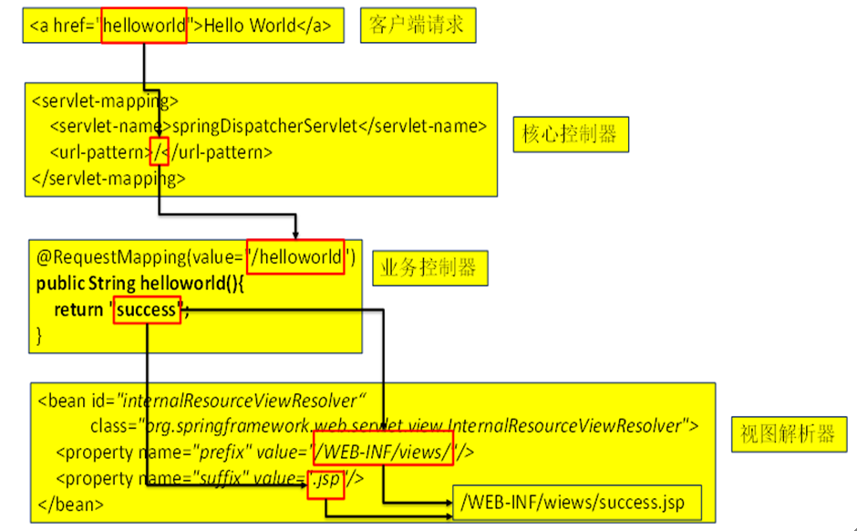
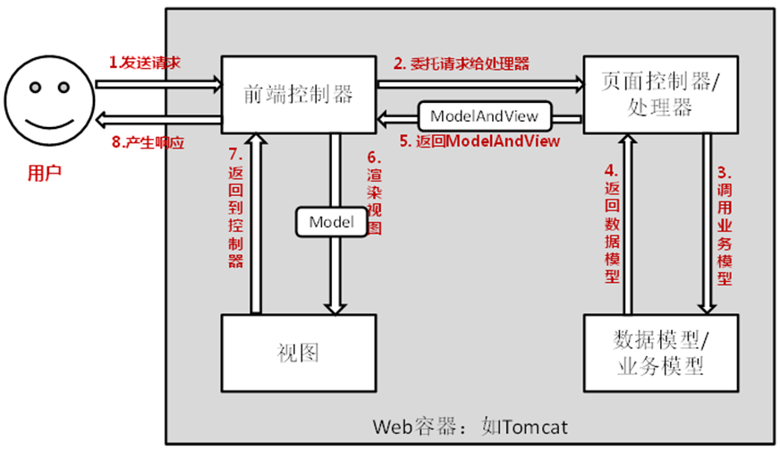
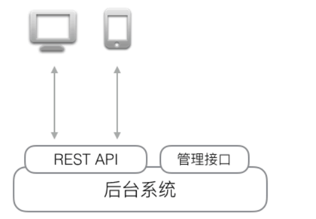

# Spring MVC

## 是什么

一种轻量级的、基于MVC的Web层应用框架。偏前端而不是基于业务逻辑层。

## 怎么用

### 常用组件

| 组件名                       | 作用                                                         |
| ---------------------------- | ------------------------------------------------------------ |
| **DispatcherServlet**        | 前端控制器                                                   |
| **Controller**               | 处理器/页面控制器，做的是MVC中的C的事情，<br>但控制逻辑转移到前端控制器了，用于对请求进行处理 |
| **HandlerMapping**           | 请求映射到处理器，找谁来处理，如果映射成功返回一个<br>HandlerExecutionChain对象（包含一个Handler处理器(页面控制器)对象、<br>多个**HandlerInterceptor**拦截器对象） |
| **ViewResolver**             | 视图解析器，找谁来处理返回的页面。把逻辑视图解析为具体的View,<br>进行这种策略模式，很容易更换其他视图技术； |
| **LocalResolver**            | 本地化、国际化                                               |
| **MultipartResolver**        | 件上传解析器                                                 |
| **HandlerExceptionResolver** | 异常处理器                                                   |

### 理解Spring MVC的工作原理



* 先经过核心控制器（**DispatcherServlet**），然后在到Controller层进行URL的匹配
* 然后在到视图解析器对视图进行解析

更多的Controller层需要请求Service层，Service要请求Dao层，然后再将数据返回都Controller层，最后在填充视图。

基本步骤如下：

* 客户端请求提交到**DispatcherServlet**

* 由DispatcherServlet控制器查询一个或多个**HandlerMapping**，找到处理请求的**Controller**

* DispatcherServlet将请求提交到Controller（也称为Handler）

* Controller调用业务逻辑处理后，返回**ModelAndView**

* DispatcherServlet查询一个或多个**ViewResoler**视图解析器，找到ModelAndView指定的视图

* 视图负责将结果显示到客户端

#### `@RequestMapping`注解

SpringMVC使用@RequestMapping注解为控制器指定可以处理哪些URL 请求，**标记在类上**：提供初步的请求映射信息，相对于  WEB 应用的根目录；**标记在方法上**：提供进一步的细分映射信息。相对于标记在类上的 URL。

`@RequestMapping `的 value【重点】、method【重点】、params【了解】 及 heads【了解】 分别表示请求 URL、请求方法、请求参数及请求头的映射条件，他们之间是与的关系，联合使用多个条件可让请求映射更加精确化。**通过 @PathVariable** **可以将 URL** **中占位符参数绑定到控制器处理方法的形参中**：URL 中的 {**xxx**} 占位符可以通过 @PathVariable("**xxx**") 绑定到操作方法的入参中。例如：

```java
@RequestMapping(value="/testPathVariable/{id}")
public String testPathVariable(@PathVariable("id") Integer id){
System.out.println("testPathVariable...id="+id);
	return "success";
}
```

#### `@RequestParam`注解

在处理方法入参处使用 @RequestParam 可以把请求参数传递给请求方法；如下

~~~java
/**
 * @RequestParam 注解用于映射请求参数
 *         value 用于映射请求参数名称
 *         required 用于设置请求参数是否必须的
 *         defaultValue 设置默认值，当没有传递参数时使用该值
 */
@RequestMapping(value="/testRequestParam")
public String testRequestParam(
@RequestParam(value="username") String username,
@RequestParam(value="age",required=false,defaultValue="0") int age){
System.out.println("testRequestParam - username="+username +",age="+age);
	return "success";
}

~~~

#### POJO请求参数

下面的注释很重要！！！

~~~java
/**
 * Spring MVC 会按请求参数名和 POJO属性名进行自动匹配， 自动为该对象填充属性值。
 * 支持级联属性
 *                 如：dept.deptId、dept.address.tel 等
 */
@RequestMapping("/testPOJO")
public String testPojo(User user) {
System.out.println("testPojo: " + user);
	return "success";
}

~~~


## REST：表现层状态转换

Web API？

如果我们想要获取某个电商网站的某个商品，输入`http://localhost:3000/products/123`，就可以看到id为123的商品页面，但这个结果是HTML页面，它同时混合包含了Product的数据和Product的展示两个部分。对于用户来说，阅读起来没有问题，但是，如果机器读取，就很难从HTML中解析出Product的数据。

如果一个URL返回的不是HTML，而是机器能直接解析的数据，这个URL就可以看成是一个Web API。比如，读取`http://localhost:3000/api/products/123`，如果能直接返回Product的数据，那么机器就可以直接读。REST就是一种设计API的模式。最常用的数据格式是JSON。由于JSON能直接被JavaScript读取，所以，以JSON格式编写的REST风格的API具有简单、易读、易用的特点。

编写API有什么好处呢？由于API就是把Web App的功能全部封装了，所以，通过API操作数据，可以极大地把前端和后端的代码隔离，使得后端代码易于测试，前端代码编写更简单。此外，如果我们把前端页面看作是一种用于展示的客户端，那么API就是为客户端提供数据、操作数据的接口。这种设计可以获得极高的扩展性。例如，当用户需要在手机上购买商品时，只需要开发针对iOS和Android的两个客户端，通过客户端访问API，就可以完成通过浏览器页面提供的功能，而后端代码基本无需改动。当一个Web应用以API的形式对外提供功能时，整个应用的结构就扩展为：



编写**REST API**，实际上就是编写处理HTTP请求的async函数，不过，REST请求和普通的HTTP请求有几个特殊的地方：

:one: REST请求仍然是标准的HTTP请求，但是，除了GET请求外，POST、PUT等请求的body是JSON数据格式，请求的`Content-Type`为`application/json`；

:two: REST响应返回的结果是JSON数据格式，因此，响应的`Content-Type`也是`application/json`。

REST规范定义了资源的通用访问格式，虽然它不是一个强制要求，但遵守该规范可以让人易于理解。例如，商品Product就是一种资源。**获取所有Product的URL**如下：

```shell
GET /api/products
```

**而获取某个指定的Product**，例如，id为`123`的Product，其URL如下：

```
GET /api/products/123
```

**新建一个Product使用POST请求**，JSON数据包含在body中，URL如下：

```
POST /api/products
```

**更新一个Product使用PUT请求**，例如，更新id为`123`的Product，其URL如下：

```
PUT /api/products/123
```

**删除一个Product使用DELETE请求**，例如，删除id为`123`的Product，其URL如下：

```
DELETE /api/products/123
```

**资源还可以按层次组织**。例如，获取某个Product的所有评论，使用：

```
GET /api/products/123/reviews
```

当我们只需要**获取部分数据时，可通过参数限制返回的结果集**，例如，返回第2页评论，每页10项，按时间排序：

```
GET /api/products/123/reviews?page=2&size=10&sort=time
```

#### 重定向

关于重定向：一般情况下，控制器方法返回字符串类型的值会被当成逻辑视图名处理，如果返回的字符串中带 **forward:** **或** **redirect:** 前缀时，SpringMVC 会对他们进行特殊处理：将 forward: 和 redirect: 当成指示符，其后的字符串作为 URL 来处理。redirect:success.jsp：会完成一个到 success.jsp 的重定向的操作；forward:success.jsp：会完成一个到 success.jsp 的转发操作


