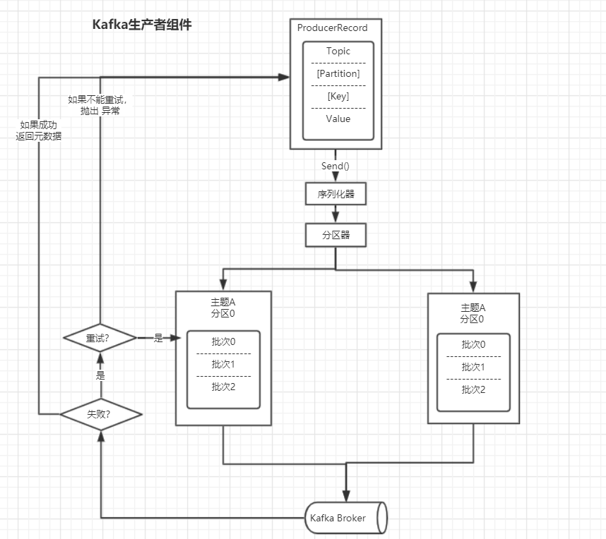
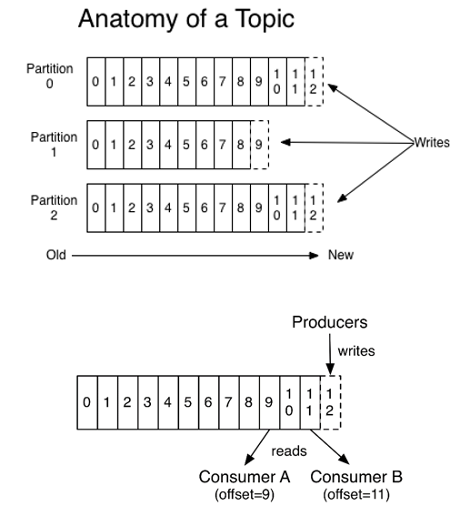
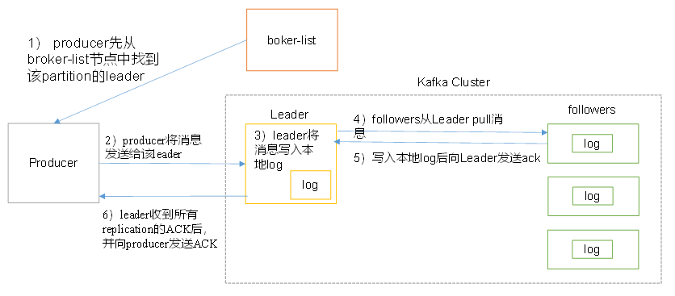
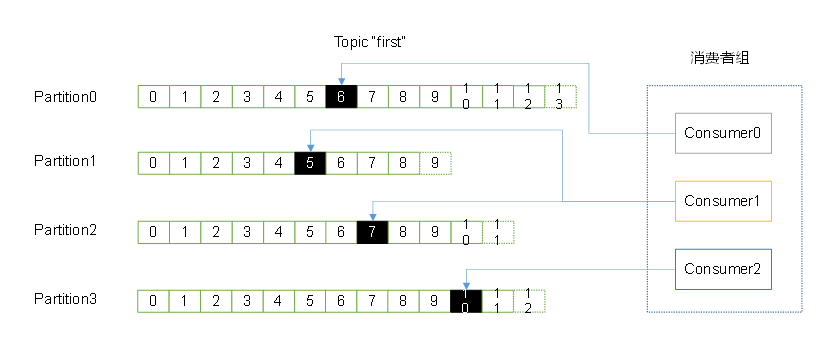
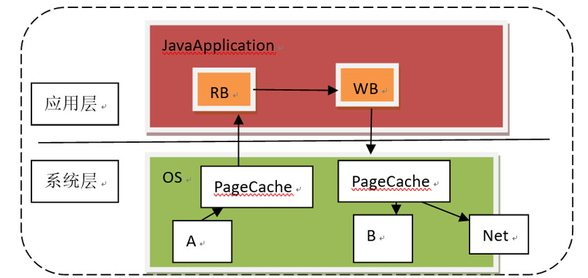
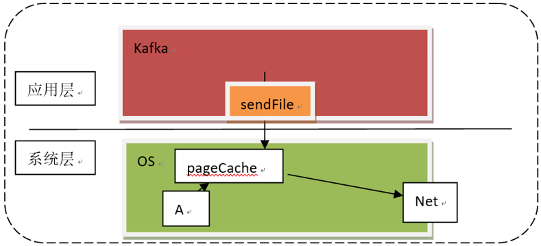
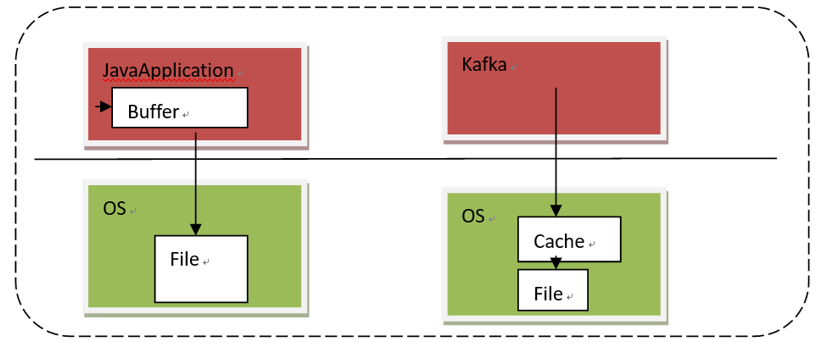

# `kafka`笔记

[从单节点到分布式的演进，到Kafka](<https://blog.csdn.net/qq_31807385/article/details/84975720>)

Java连接数据库资源，为什么要释放资源，不释放行么？因为在创建连接对象的时候会消耗非常大，如果你暂存资源的话性能就会收到极大的损害，所以我们用完了要马上释放那个资源，让别人可以用

**RMI（Remote Method Invoke）： RPC** 该技术遵循了一个协议，就是RPC协议。

以上的内容和连接的内容有关

为什么会出现`Kafka`？ 

在消息队列中有两种模式：

* 点对点模式，一对一，消费者主动拉取数据，消息收到后，消息队列中的数据清除
* 发布订阅模式，一对多，数据产生之后，推送给所有的消费者，消息队列中保留着数据。

**在流式计算中，`kafka`一般用来做数据缓存。**

[`Kafka`架构和原理](<https://blog.csdn.net/qq_31807385/article/details/84977511>)

## Kafka权威指南

Kafka的数据单元被称作是消息，消息由字节数组组成，Kafka有一个可选的数据单元，叫做键，也是一个字节数组，当消息要写入不同的分区的时候，需要使用到键。

为了提高效率，消息被分批次写入Kafka，这就也就是非实时的。

broker接收来自生产者的消息，为消息设置偏移量，并提交到磁盘保存

偏移量是一种元数据，他是不断递增的整数值，在创建消息的时候，Kafka会将其添加到消息里面。在给定的分区中每个消息的偏移量都是唯一的。

消费者将每个分区最后读取到的消息偏移量都保存在Zookeeper或者是Kafka上，如果消费者关闭或者重启，她的读读取状态不会丢失。

~~~properties
log.dirs #Kafka将所有的消息都保存在了磁盘上，保存的位置通过其指定
~~~

## Producer

Kafka生产者组件

刚开始，G1群组里有C1，C2等消费者，如果新增一个消费者群组G2，两个消费者组订阅了相同的主题T1，那么G2会接收T1的所有的消息。

### Consumer消费者

**消息轮询是消费者API的核心**，通过一个简单的轮询向服务器请求出具，一旦消费者订阅了主题，轮询就会处理所有的细节，包扩群组协调，分区再均衡，发送心跳和获取数据。总的来说G2还是会消费所有的信息，不管有么有其他的群组的存在。

### Kafka Streams

流式数据：没有边界的数据。

事件事件：事件时间指的是所追踪事件发生时间和记录的创建时间。0.10.0 之后生产者会自动在记录中添加记录的创建时间，那么如果Kafka的记录是基于事件发生之后数据库记录创建的怎么办？需要自己设置时间戳字段了。

## `kafka` 的命令行命令

* 启动`kafka`

  ~~~shell
  # 在启动kafka之前，需要先启动zookeeper，对于本机的测试来说，需要启动zookeeper集群（三台），只需要启动一个kafka即可。
  [isea@hadoop101 kafka]$ bin/kafka-server-start.sh config/server.properties &
  ~~~

* 查看当前服务器的所有的主题

  ~~~shell
  [isea@hadoop101 kafka]$ bin/kafka-topics.sh --zookeeper hadoop101:2181 --list
  ~~~

* 创建``zhbr`` 主题

  ~~~shell
  bin/kafka-topics.sh --zookeeper hadoop101:2181 --create --replication-factor 3 --partitions 1 --topic zhbr # 该主题有一个分区，三个副本
  
  # 查看主题的详情：
  bin/kafka-topics.sh --zookeeper hadoop101:2181 --describe --topic zhbr
  ~~~

  副本数量3，分区数量1，主题的名字zhbr

* 删除主题``zhbr``

  ~~~shell
  bin/kafka-topics.sh --zookeeper hadoop101:2181 --delete --topic zhbr
  ~~~

  server.properties 中的设置 ``delete.topic.enable=true`` 表明这是实际的删除。 

* 在Hadoop101中生产数据，在Hadoop102 中消费数据，连接zookeeper获取offset，也可以直接从bootstarp中获取offset数据。

  ~~~shell
  # Hadoop101生产：
  [isea@hadoop101 kafka]$bin/kafka-console-producer.sh --broker-list hadoop101:9092 --topic first
  
  # Hadoop102消费：
  [isea@hadoop102 kafka]$ bin/kafka-console-consumer.sh --zookeeper hadoop101:2181 --from-beginning --topic first
  
  [isea@hadoop102 kafka]$ bin/kafka-console-consumer.sh --bootstrap-server hadoop101:9092 --topic first
  
  
  # 数据的消费 --from-beginning会将主题中以往的数据都读出来
  bin/kafka-console-consumer.sh --bootstrap-server hadoop101:9092 --from-beginning --topic first
  ~~~

* 查看主题的详情信息

  ~~~shell
  # 这里为什么要连接zookeeper呢？ 因为kafka依赖zookeeper，kafka在启动的时候会写入broker的id信息，分区信息，主题信息等，consumer还可以将消费的offset存到zookeeper中。
  [isea@hadoop101 kafka]$ bin/kafka-topics.sh --zookeeper hadoop101:2181 --describe --topic first
  Topic:first	PartitionCount:3	ReplicationFactor:3	Configs:
  	Topic: first	Partition: 0	Leader: 3	Replicas: 3,1,2	Isr: 3,2,1
  	Topic: first	Partition: 1	Leader: 1	Replicas: 1,2,3	Isr: 3,2,1
  	Topic: first	Partition: 2	Leader: 2	Replicas: 2,3,1	Isr: 3,2,1
  ~~~

`ISR (In Sync Replication)` 正在同步的副本，3,2，2 表示的是这三者都在同步副本。

[关于kafka的ISR，和数据存储的位置](<https://blog.csdn.net/qq_31807385/article/details/84948701>)

## 数据生产

### 数据写入的方式

producer采用推（push）模式将消息发布到broker，每条消息都被追加（append）到分区（patition）中，属于顺序写磁盘（顺序写磁盘效率比随机写内存要高，保障kafka吞吐率）。

### partition

消息发送时都被发送到一个topic，其本质就是一个目录，而topic是由一些Partition Logs(分区日志)组成，其组织结构如下图所示：

每个Partition中的消息都是有序的，生产的消息被不断追加到Partition log上，其中的每一个消息都被赋予了一个唯一的offset值。

#### partition的原因

1. 负载能力的提升，如果没有分区，大量的数据涌向同一台机器，压力是比较大的
2. 可以提高并发能力，因为可以以partition为单位进行读写数据了

#### partition 的原则

1. 如果指定了partition的话，直接使用

2. 没有指定partition，但是指定了key，可以通过key的value值hash出一个partition

3. partition和key都没有指定的话，使用轮询的方式选择出一个partition，下面是默认的partition类：

   ~~~java
   public int partition(String topic, Object key, byte[] keyBytes, Object value, byte[] valueBytes, Cluster cluster) {
           List<PartitionInfo> partitions = cluster.partitionsForTopic(topic);
           int numPartitions = partitions.size();
           if (keyBytes == null) {
               int nextValue = nextValue(topic);
               List<PartitionInfo> availablePartitions = cluster.availablePartitionsForTopic(topic);
               if (availablePartitions.size() > 0) {
                   int part = Utils.toPositive(nextValue) % availablePartitions.size();
                   return availablePartitions.get(part).partition();
               } else {
                   // no partitions are available, give a non-available partition
                   return Utils.toPositive(nextValue) % numPartitions;
               }
           } else {
               // hash the keyBytes to choose a partition
               return Utils.toPositive(Utils.murmur2(keyBytes)) % numPartitions;
           }
       }
   ~~~

### 副本replication

保证数据的安全。没有replication的情况下，一旦broker宕机，其上所有patition 的数据都不可被消费，同时producer也不能再将数据存于其上的patition。引入replication之后，同一个partition可能会有多个replication，而这时需要在这些replication之间选出一个leader，producer和consumer只与这个leader交互，其它replication作为follower从leader 中复制数据。

## 数据写入流程

### 流程：

### kafka的ack机制

（request.requred.acks）：

* 0：producer不等待broker的ack，broker一接收到还没有写入磁盘就已经返回，当broker故障时有可能丢失数据；
* 1：producer等待broker的ack，partition的leader落盘成功后返回ack，如果在follower同步成功之前leader故障，那么将会丢失数据；
* -1：producer等待broker的ack，partition的leader和follower全部落盘成功后才返回ack，数据一般不会丢失，延迟时间长但是可靠性高。

## 数据保存方式

物理上把topic分成一个或多个patition（对应 server.properties 中的num.partitions=3配置），每个patition物理上对应一个文件夹（该文件夹存储该patition的所有消息和索引文件），在log文件夹里面：

~~~shell
[isea@hadoop101 kafka]$ cd logs/
[isea@hadoop101 logs]$ ll
总用量 18152
drwxrwxr-x. 2 isea isea   4096 7月   7 22:07 calllog-0
drwxrwxr-x. 2 isea isea   4096 7月   7 22:07 calllog-1
drwxrwxr-x. 2 isea isea   4096 7月   7 22:07 calllog-2
~~~

kafka读取消息的时间复杂度是O（1），无论kafka中的数据有没有被消费，kafka都会保留所有消息。有两种策略可以删除旧数据：

1. 基于时间：log.retention.hours=168
2. 基于大小：log.retention.bytes=1073741824

## 数据消费

kafka提供了两套consumerAPI：

1. 高级ConsumerAPI
2. 低级Consumer API

### 高级API

#### 高级API优点

1. 高级API 写起来简单
2. 不需要自行去管理offset，系统通过zookeeper自行管理。
3. 不需要管理分区，副本等情况，系统自动管理。

消费者断线会自动根据上一次记录在zookeeper中的offset去接着获取数据；可以使用group来区分对同一个topic 的不同程序访问分离开来（不同的group记录不同的offset，这样不同程序读取同一个topic才不会因为offset互相影响）

#### 高级API缺点

1. 不能自行控制offset（对于某些特殊需求来说）
2. 不能细化控制如分区、副本、zk等

### 低级API

#### 低级 API 优点

* 能够让开发者自己控制offset，想从哪里读取就从哪里读取。
* 自行控制连接分区，对分区自定义进行负载均衡
* 对zookeeper的依赖性降低（如：offset不一定非要靠zk存储，自行存储offset即可，比如存在文件或者内存中）

#### 低级 API 缺点

* 太过复杂，需要自行控制offset，连接哪个分区，找到分区leader 等

### 消费者组

消费者是以consumer group消费者组的方式工作，由一个或者多个消费者组成一个组，共同消费一个topic。

### 消费方式

consumer采用pull（拉）模式从broker中读取数据。

push（推）模式很难适应消费速率不同的消费者，因为消息发送速率是由broker决定的。它的目标是尽可能以最快速度传递消息，但是这样很容易造成consumer来不及处理消息，典型的表现就是拒绝服务以及网络拥塞。而pull模式则可以根据consumer的消费能力以适当的速率消费消息。

对于Kafka而言，pull模式更合适，它可简化broker的设计，consumer可自主控制消费消息的速率，同时consumer可以自己控制消费方式——即可批量消费也可逐条消费，同时还能选择不同的提交方式从而实现不同的传输语义。

pull模式不足之处是，如果kafka没有数据，消费者可能会陷入循环中，一直等待数据到达。为了避免这种情况，我们在我们的拉请求中有参数，允许消费者请求在等待数据到达的“长轮询”中进行阻塞（并且可选地等待到给定的字节数，以确保大的传输大小）

## Kafka API的使用

### Kafka生产者API

**准备：** 启动zk和kk集群，并打开一个消费者，如在Hadoop101上打开一个消费者。

~~~shell
[isea@hadoop101 kafka]$ bin/kafka-console-consumer.sh --zookeeper hadoop101:2181 --topic first
~~~

**测试：**

~~~java
// 自定义分区规则
package com.zhbr.producer.partition;

import org.apache.kafka.clients.producer.Partitioner;
import org.apache.kafka.common.Cluster;

import java.util.Map;

public class MyPartition implements Partitioner {

    @Override
    public int partition(String topic, Object key, byte[] keyBytes, Object value, byte[] valueBytes, Cluster cluster) {
        return 2; // 对于分区规则的测试
    }

    @Override
    public void close() {

    }

    @Override
    public void configure(Map<String, ?> configs) {
    }
}

// Kafka的生产者API 

package com.zhbr.producer;

import org.apache.kafka.clients.producer.*;

import java.util.Properties;

public class TestProducer {
    public static void main(String[] args) {
        // 创建配置对象
        Properties properties = new Properties();

        // 配置kafka集群
        properties.setProperty(ProducerConfig.BOOTSTRAP_SERVERS_CONFIG,"hadoop101:9092,hadoop102:9092,hadoop103:9092");

        // 序列化
        properties.setProperty(ProducerConfig.KEY_SERIALIZER_CLASS_CONFIG,"org.apache.kafka.common.serialization.StringSerializer");
        properties.setProperty(ProducerConfig.VALUE_SERIALIZER_CLASS_CONFIG,"org.apache.kafka.common.serialization.StringSerializer");

        // 配置ACK应答机制
        properties.setProperty(ProducerConfig.ACKS_CONFIG,"all");

        // 指定分区类 ，这里使用默认的分区
         properties.setProperty(ProducerConfig.PARTITIONER_CLASS_CONFIG, "com.zhbr.producer.partition.MyPartition");

        // 创建kafka生产者
        KafkaProducer<String, String> producer = new KafkaProducer<String, String>(properties);

        // 主题
        String topic = "first";

        // 待发送的数据
        String value = "where are you. i want to find you..";

        // 封装数据
        ProducerRecord<String, String> record = new ProducerRecord<>(topic, value);

        // 同步发送数据
        //producer.send(record);
        // 同步发送数据，只要添加了get方法就是同步操作，因为get是Future的方法。
        //producer.send(record).get(); 该方法需要捕获或者是声明异常

        // 使用异步的方法发送数据，并添加回调函数
        producer.send(record, new Callback() {
            @Override
            public void onCompletion(RecordMetadata metadata, Exception exception) {

                // value数据放置的分区
                System.out.println("数据存放的分区：" + metadata.partition());

                // value值对应存放的offset
                System.out.println("数据存放的offset：" + metadata.offset());
            }
        });

        producer.close();
    }
}
~~~

### Kafka消费者API

**准备：** 在控制台中创建生产者：

~~~~shell
[isea@hadoop101 kafka]$ bin/kafka-console-producer.sh --broker-list hadoop101:9092 --topic first
~~~~

#### 高级ConsumerAPI

~~~java
package com.zhbr.consumer;

import org.apache.kafka.clients.consumer.ConsumerConfig;
import org.apache.kafka.clients.consumer.ConsumerRecord;
import org.apache.kafka.clients.consumer.ConsumerRecords;
import org.apache.kafka.clients.consumer.KafkaConsumer;

import java.util.Arrays;
import java.util.Properties;

public class TestHighConsumer {
    public static void main(String[] args) {

        // 创建配置对象
        Properties properties = new Properties();

        // 指定kafka服务的地址，不需要将所有的broker都写上
        properties.setProperty(ConsumerConfig.BOOTSTRAP_SERVERS_CONFIG,"hadoop101:9092");

        // 指定key和value的序列化
        properties.setProperty(ConsumerConfig.KEY_DESERIALIZER_CLASS_CONFIG,"org.apache.kafka.common.serialization.StringDeserializer");
        properties.setProperty(ConsumerConfig.VALUE_DESERIALIZER_CLASS_CONFIG,"org.apache.kafka.common.serialization.StringDeserializer");

        // 设置消费者组
        properties.setProperty(ConsumerConfig.GROUP_ID_CONFIG,"zhbr");

        properties.put("zookeeper.session.timeout.ms", "500");
        properties.put("zookeeper.sync.time.ms", "250");
        properties.put("auto.commit.interval.ms", "1000");

        // 创建消费者
        KafkaConsumer<String, String> consumer = new KafkaConsumer<>(properties);

        // 订阅主题
        consumer.subscribe(Arrays.asList("first"));

        while(true){
            // consumer从kafka消息队列中拉取数据
            ConsumerRecords<String, String> records = consumer.poll(500);
            for (ConsumerRecord<String, String> record : records) {
                System.out.println(record.partition() + ","+ record.offset() + "," + record.key() + "," + record.value()); // 可以读取到数据存储的分区，offset等信息。
            }
        }
    }
}
~~~

#### 低级ConsumerAPI

~~~java
package com.zhbr.consumer;

import kafka.api.FetchRequest;
import kafka.api.FetchRequestBuilder;
import kafka.cluster.BrokerEndPoint;
import kafka.javaapi.*;
import kafka.javaapi.consumer.SimpleConsumer;
import kafka.javaapi.message.ByteBufferMessageSet;
import kafka.message.MessageAndOffset;

import java.io.UnsupportedEncodingException;
import java.nio.ByteBuffer;
import java.util.Arrays;
import java.util.List;

public class TestLowConsumer {
    public static void main(String[] args) throws UnsupportedEncodingException {

        /**
         * 使用低级API消费指定topic，指定partition，指定offset的数据：
         * 使用低级消费者API的步骤：
         *  ①：获取某个topic的partition的leader节点
         *  ②：根据获得的leader信息，消费指定partition下的指定offset的数据
         */

        // leader节点
        BrokerEndPoint leader = null;

        // 种子节点
        String host = "hadoop101";
        int port = 9092;

        // 目标主题
        String topic = "first";

        // 获取分区的leader节点
        SimpleConsumer metaConsumer = new SimpleConsumer(host, port, 500, 1024 * 1024, "metaData");

        // 获取元数据信息 , recommended 用来测试
        TopicMetadataRequest metadataRequest = new TopicMetadataRequest(Arrays.asList(topic,"recommended"));
        TopicMetadataResponse metadataResponse = metaConsumer.send(metadataRequest);

        // 获取所有的主题信息
        List<TopicMetadata> topicMetadata = metadataResponse.topicsMetadata();

        leadLabel:
        for (TopicMetadata topicMetadatum : topicMetadata) {
            if (topic.equals(topicMetadatum.topic())){
                // 获取关心的主题（first）下的所有的分区信息
                List<PartitionMetadata> partitionMetadata = topicMetadatum.partitionsMetadata();
                // 获取指定的partition
                for (PartitionMetadata partitionMetadatum : partitionMetadata) {
                    // 获取partitionID
                    int id = partitionMetadatum.partitionId();
                    if (2 == id){
                        // 获取指定partition的Leader
                        leader = partitionMetadatum.leader();
                        System.out.println(leader);
                        break leadLabel;
                    }
                }
            }
        }

        if (leader == null){
            System.out.println("分区信息有误...");
            return;
        }

        // 指定的partition对应的broker的leader信息
        SimpleConsumer consumer = new SimpleConsumer(leader.host(), leader.port(), 500, 1024 * 1024, "Leader");

        // 消费者抓取数据
        FetchRequest request = new FetchRequestBuilder().addFetch(topic, 2, 5, 1024 * 5).build();
        FetchResponse response = consumer.fetch(request);

        ByteBufferMessageSet messageSet = response.messageSet(topic,2);
        for (MessageAndOffset messageAndOffset : messageSet) {
            ByteBuffer byteBuffer = messageAndOffset.message().payload();
            byte[] bs = new byte[byteBuffer.limit()];
            byteBuffer.get(bs);//将数据放入到字节数据中去
            String value = new String(bs,"UTF-8");
            System.out.println(value);
        }
    }
}
~~~

## 为什么`Kafka`能够实现高吞吐？

### 顺写日志与零拷贝

Java应用程序复制文件的原理：

使用java实现对文件A的拷贝，为B，A ,B两个文件都是属于系统的，所以呢这里由应用层的`JavaApplication`来完成这个操作，在java中创建`BufferInputStream`将A文件读取过来，记为RB（缓冲）所以在java的应用中有 一个缓冲区，如下图：

实际上，我们的系统层在和别的层做交互的时候，为了提高效率，也会有一个缓冲区，因为系统层在和别的层级进行交互的时候涉及到两个层级的交互，效率是非常的慢的，这有些像CPU和内存的交互速度差异很大，cpu 和硬磁盘的交互也速度差异也很大，因此计算机的内存模型有四层（早期的时候CPU和硬盘直接交互的，后来，增加了内存，缓存等层级） 计算机的内存模型如下

 

 

上面我们提到的OS的缓存我们称之为`PageCache`，文件A的内容先读到`PageCache`中，然后到达RB，此时java程序拿到了流，要进行写操作，所以此时有一个WB（`writebuffer`）然后..才到B文件，这就完成了文件的拷贝工作，我们假设这里不是文件的拷贝而是文件的传输，在 `PageCache`之后，还有一个`NetCache（`网卡的缓存）所以这里要拷贝四次，假如有10个消费者要读取数据，就4 * 10 = 40次，这不可能快的起来

`kafka`，对这个文件的缓存做了极大的改善，如下：`kafka`只是向OS发出了一个指令，告知OS这个文件要传输到哪里去，并不对数据进行拷贝。只是将A中的数据拷贝到`PageCache`中去，如下图

这叫做`kafka`的顺写日志，由于`kafka`没有对数据 进行复制，这涉及到②零复制，`kafka`发送一个操作系统级别的指令，`sendFile`，（和`redis`中的fork指令一样，就是在`redis`在创建`rdb`的时候，`redis`会创建一个分支进程，这个进程会将当前的缓存数据保存到一个文件中，这个过程靠的就是fork这个底层的指令 ）很多的框架为了提到效率和我们的OS 打交道，这样的话性能是很高的，比如`juc`的`copyOnWriteAarrayList`所以在`kafka`中，生产者生产完数据之后，不是OS产生数据，在到Java，在到OS，`kafka`会直接直接顺写到磁盘，即生产完数据之后，直接发指令到OS将数据写到磁盘中去。

### 分段日志：

分段日志 segment（其实在`juc`中也类似的应用，叫做`currentHashMap`使用的就是分段锁，分段锁就是把每一个小格子加了一把锁，来提到并发访问的能力）在`kafka`形成日志的时候，实际上也是在以分区的形式保存着数据信息，在分区中的信息如下：

 ~~~shell
├── first-0 
│ ├── 00000000000000000000.index 
│ ├── 00000000000000000000.log 
│ ├── 00000000000000000000.timeindex 
│ └── leader-epoch-checkpoint
├── first-1 
│ ├── 00000000000000000000.index
│ ├── 00000000000000000000.log
│ ├── 00000000000000000000.timeindex 
│ └── leader-epoch-checkpoint
├── first-2 
│ ├── 00000000000000000000.index
│ ├── 00000000000000000000.log
│ ├── 00000000000000000000.timeindex
│ └── leader-epoch-checkpoint
# 00000000000000000000.log里面存放着数据（共20个零），如： 
[isea@hadoop108 first-2]$ strings 00000000000000000000.log  
kafka 
 ~~~

在分区中，这个00000000000000000000.log会随着数据的增加，而产生新的文件，比如，文件记录10条数据会产生一个新文件，

 ~~~shell
00000000000000000000.log  
00000000000000000010.log 
00000000000000000020.log 
 ~~~

假如我现在要找第12条数据，那么消费者就不需要从头开始遍历，而是直接定位在（10<12<20）00000000000000000010.log里面找。另外，每一个文件还有一个index文件：这个文件专门来记录索引值的，索引值能帮助我们快速的定位到我们数据的位置

 ~~~shell
00000000000000000000.log  
00000000000000000000.index  

00000000000000000010.log 
00000000000000000010.index   

00000000000000000020.log 
00000000000000000020.index 
 ~~~

假设这里面我们寻找第12条数据，首先按照文件的名字计算10<12<20,那么在`00000000000000000010.log`中，大范围确定了，但是具体在哪里呢？ 假设`00000000000000000010.log`中数据是这样存储的， 

~~~shell
1 iseayou  
2 isea 
3 ilvoeyou 
~~~

实际的数据是这样的：

~~~shell
1iseayou2isea3ilvoeyou
~~~

那么这个时候，我们怎么知道数据在哪里呢？所以我们使用`00000000000000000010.index `这个文件中存放着偏移量和所对应的字节的位置，是一份键值对的形式这里是

~~~shell
1 0 
2 9 
3 14 
~~~

找2，那么直接从9的位置开始读，所以就会非常的快，所以追加到partition log中的每一个消息都有一个消息编号来表示这是第多少条消息，还有都会有一个唯一的offset的值，就是这里的0，9 ，14，在深究一下，还有一个问题，从9开始读，读多长或者说是读到哪里停止呢？这个时候涉及到`kafka`对于数据存储，`kafka`是按照k,v存储数据的，消息有固定的格式，这个格式中可以根据key，v的长度信息来计算出value的长度，从而做消费数据的时候，读到读完该条消息就停止了。我们发现kafka将数据分成了好几个文件，形成如下的形式：

~~~shell
00000000000000000000.log  
00000000000000000010.log
00000000000000000020.log 
~~~

而不是将一个数据作为一个整体，这就是分段日志。

### 预读和预写

read ahead， write behind，预读就是在读取某一条数据的时候，并不是单纯的将数据读完，因为（读数据，也可能读周边的数据，也即局部性原理）于是在读本条数据的同时就顺便把周边的数据也读出来放到缓存中；后写：java生成文件是先放到缓存中，然后在到OS系统的文件中，而`kafka`会直接将数据写到OS的缓冲中，再由OS自己来决定什么时候把数据变成文件。两者都是讲数据放到文件中，区别在于两个层级的交互：java程序中，数据先到buffer，然后在跨层级写到OS的文件中（这个过程是很慢的额）而`kafka`是将数据直接传输到OS的缓存，然后OS做同一个层级的写交互，是非常快的。

 

 

