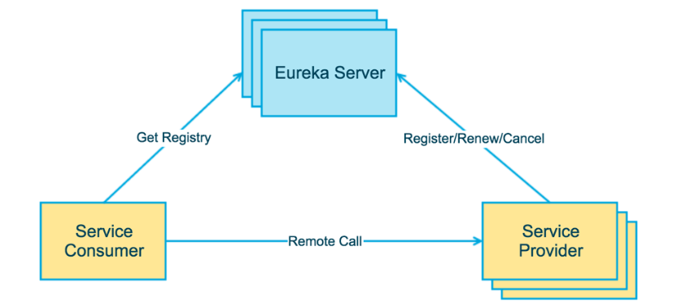
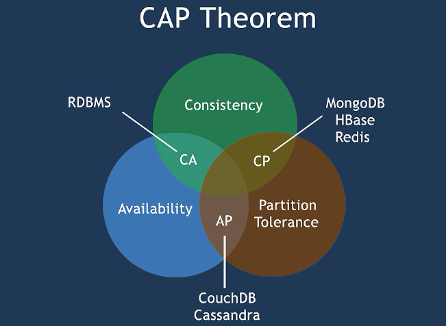
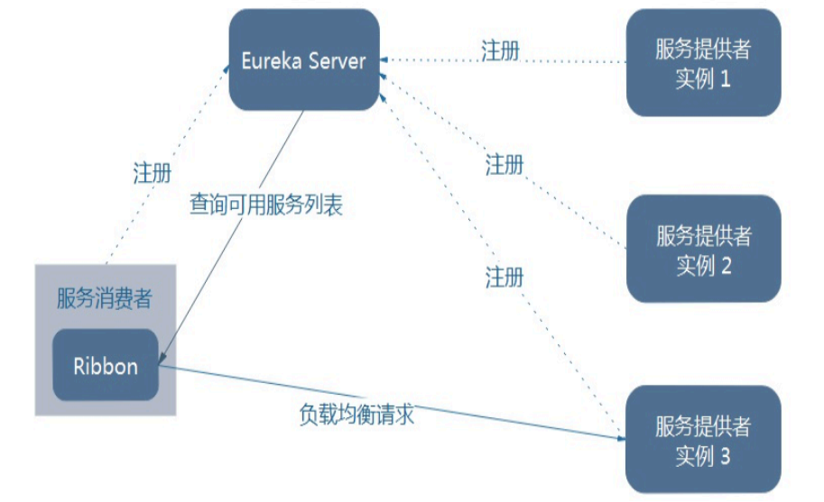
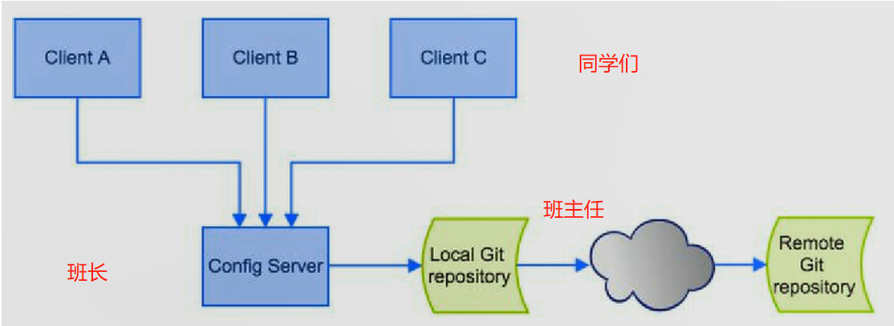
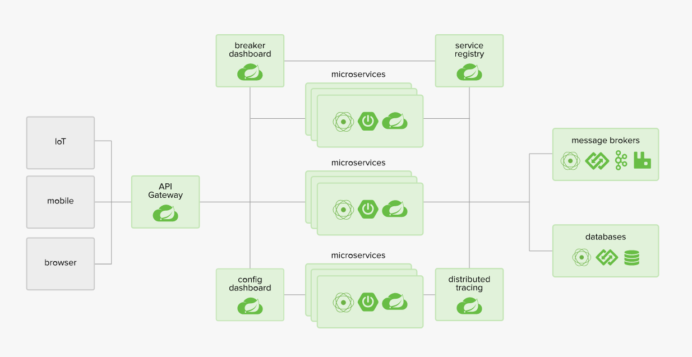

# spring cloud

前奏知识：`SpringMVC`，Spring ,`Mybatis`; 

Spring Cloud是一系列框架的有序集合。它利用Spring Boot的开发便利性巧妙地简化了分布式系统基础设施的开发，如服务发现注册、配置中心、消息总线、负载均衡、断路器、数据监控等，都可以用Spring Boot的开发风格做到一键 启动和部署。Spring将目前各家公司开发的比较成熟、经得起实际考验的服务框架组合起来，通过Spring Boot风格进行再封装成为Spring Cloud，最终给开发者留出了一套简单易懂、易部署和易维护的分布式系统开发工具包。微服务是可以独立部署、水平扩展、独立访问（或者有独立的数据库）的服务单元，spring cloud就是这些微服务的大管家。

## 面试题

什么是微服务？通常而言，微服务是一种架构风格，或者是架构模式，提倡将单一的应用划分成一组小的服务，每个服务独立在自己的进程之后，服务之间相互调用和通信，通信基于RESTful的API。服务之间可以用不同的语言，不同的服务使用不同的库。

微服务之间是如何沟通的？基于RESTful风格的API进行沟通。

spring cloud 和 `dubbo`之间有什么区别？`dubbo`一个RPC框架，而spring cloud是微服务架构下的一站式解决方案。

spring boot 和spring cloud，谈谈你对他们的理解？Spring could 是微服务架构下的一站式解决方案，spring boot可以单独使用，但是spring cloud依赖于boot进行使用。boot关注快速的开发构建单个的微服务个体，而cloud关注整个微服务整体。

什么是服务熔断，什么是服务降级？

微服务的优点和缺点是什么？说下你在项目开发中碰到的坑？

你所知道的微服务技术栈有哪些？


## 微服务

All In One 可以看成是eclipse中只有一个大的工程，`Tmall: com.isea.service`(一个包): 商品/交易/积分/订单… 然后达成一个war包部署在Tomcat中（或者是多个Tomcat）所有的项目耦合在一起，如果一个模块存在bug，将会对其他的模块产生影响，而微服务现在将（其按照业务）拆分开来，形成独立的模块。

马丁福乐说：

> a definition of this new architectural term there is no precise definition of this architectural style

但是微服务具有下面的特点：

* 微服务是一种架构模式或者说是一种架构风格，它**提倡将单一应用程序划分成一组小的服务**
* 每个服务运行在自己**独立的进程**中；
* 服务之间使用简单的**RESTful** API通信；
* 独立编码，独立部署、发布，可以使用不同的语言来编写服务，并使用不同的数据存储。

`Dubbo`的通信机制是基于远程过程调用（RPC），而微服务是基于HTTP的RESTful API；一个是品牌机，一个是组装机。`Dubbo`的定位始终是一款RPC框架，而Spring cloud是微服务架构下的一站式解决方案。

**微服务的优点是：**

* 每个服务足够内聚，小，代码独立，聚焦于业务；
* 每个微服务可以有小团队完成，开发效率高；
* 服务解耦；可以使用不同的语言开发并使用不同的数存储；
* 微服务只是业务逻辑代码，不会和HTML，CSS或者是其他的界面混合。

**微服务的缺点**：

* 开发人员要处理分布式系统的复杂性，运维部署的成本大；

* 服务间的通信成本的上升；数据一致性；系统测试等。

## Eureka

Eureka是Netflix开源的一款提供服务注册和发现的产品，它提供了完整的Service Registry和Service Discovery实现。也是spring cloud体系中最重要最核心的组件之一。服务注册与发现对于微服务架构来说是非常重要的，有了服务发现与注册，只需要使用服务的标识符，就可以访问到服务，而不需要修改服务调用的配置文件了。功能类似于`dubbo`的注册中心，比如Zookeeper。

#### erueka的自我保护机制

默认情况下，如果EurekaServer在一定时间内没有接收到某个微服务实例的心跳，EurekaServer将会注销该实例（默认90秒）。**即便是已经宕机的实例，也会保留**

在自我保护模式中，Eureka Server会保护服务注册表中的信息，不再注销任何服务实例。当它收到的心跳数重新恢复到阈值以上时，该Eureka Server节点就会自动退出自我保护模式。它的设计哲学就是宁可保留错误的服务注册信息，也不盲目注销任何可能健康的服务实例。一句话讲解：好死不如赖活着

综上，自我保护模式是一种应对网络异常的安全保护措施。它的架构哲学是宁可同时保留所有微服务（健康的微服务和不健康的微服务都会保留），也不盲目注销任何健康的微服务。使用自我保护模式，可以让Eureka集群更加的健壮、稳定。

在Spring Cloud中，可以使用`eureka.server.enable-self-preservation = false `禁用自我保护模式。

### 服务中心

服务中心又称注册中心，管理各种服务功能包括服务的注册、发现、熔断、负载、降级等，有了服务中心调用关系会有什么变化，画几个简图来帮忙理解

### Eureka 原理

Eureka 采用了 C-S 的设计架构。Eureka Server 是服务注册中心。而系统中的其他微服务，作为Eureka 的客户端连接到 Eureka Server，并维持心跳连接。这样系统的维护人员可以通过 Eureka Server 来监控系统中各个微服务是否正常运行。Spring Cloud 的一些其他模块（比如`Zuul`）就可以通过 Eureka Server 来发现系统中的其他微服务，并执行相关的逻辑。

#### Eureka2个组件：

* Eureka服务器
* Eureka客户端。

Eureka客户端是一个java客户端，用来简化与服务器的交互、作为轮询负载均衡器，并提供服务的故障切换支持。

用一张图来认识以下：



​						[注意和dubbo的对比]

#### 3个角色

1、Eureka Server

- 提供服务注册和发现

2、Service Provider

- 服务提供方
- 将自身服务注册到Eureka，从而使服务消费方能够找到

3、Service Consumer

- 服务消费方
- 从Eureka获取注册服务列表，从而能够消费服务

[看miscroservice代码]()

RDBMS：遵循ACID的设计原则；ACID也就是原子性，一致性，隔离性，持久性；（数据库的脏读，幻读，不可重复读）

NoSQL，遵照CAP的设计原则；CAP 强一致性（Consistence），可用性（Available），分区容错性（Partition tolerance），在分布式系统中的**三进二**的原则。



所以在选择分布式系统的解决方案的时候，只能选择CP和AP，因为要满足P。就那double eleven 来说，对于某一个产品有多少人访问，是不关心的，更主要的是用户在那一时刻能够访问该网页。**Zookeeper的设计原则是CP，Erueka的设计原则是AP** ，zookeeper的A不能体现是当Leader挂掉的时候，Follower是选举Leader期间zookeeper的不可用。所以erueka在设计的时候，不存在主从的概念，来保证可用，反观zookeeper，并不是这样。

**Erueka可以很好的应用网络故障导致部分节点失去联系的情况，而不会像zookeeper那样使得整个注册服务瘫痪**

## Ribbon

客户端的负载均衡，在配置文件中列出Load Balancer（简称LB）后面所有的机器，Ribbon会自动的帮助你基于某种规则（如简单轮询，随机连接等）去连接这些机器。例如A在KFC点餐的时候，选择人少的那个窗口点餐，此时Ribbon就能做到帮助我们选择。**负载均衡的目的都是HA**。

##### 集中式LB

即在服务的消费方和提供方之间使用独立的LB设施(可以是硬件，如F5, 也可以是软件，如nginx), 由该设施负责把访问请求通过某种策略转发至服务的提供方；F5挺贵的。

##### 进程内LB

将LB逻辑集成到消费方，消费方从服务注册中心获知有哪些地址可用，然后自己再从这些地址中选择出一个合适的服务器。Ribbon就属于进程内LB，它只是一个类库，集成于消费方进程，消费方通过它来获取到服务提供方的地址。

#### Ribbon的架构



Ribbon在工作时分成两步：

* 第一步先选择 EurekaServer ,它优先选择在同一个区域内负载较少的server.

* 第二步再根据用户指定的策略，在从server取到的服务注册列表中选择一个地址。

其中Ribbon提供了多种策略：比如轮询、随机和根据响应时间加权。代码参考$microservicecloud$ 项目，每个微服务的实例都有不同的数据库，拥有各自独自的进程，基于REST通信。

### `Fegin`

[参考官网](https://github.com/OpenFeign/feign )

**Feign是一个声明式的Web服务客户端，使得编写Web服务客户端变得非常容易，只需要创建一个接口，然后在上面添加注解即可。**Feign旨在使编写Java Http客户端变得更容易。在没有使用`Mybatis`的时候：
`deptDao deptDaoImpl`(完成增删改查的工作)
`deptDao deptDaoMapper.xml`（完成增删改查的工作）

后端的返回给前端的就应该是JSON串，controller + 方法上的`responsebody`；或者是使用了整合了之后的`restcontroller，RestTemplate`提供了多种便捷访问远程Http服务的方法， 是一种简单便捷的访问restful服务模板类，是Spring提供的用于访问Rest服务的客户端模板工具集。

在使用Ribbon+RestTemplate时，利用RestTemplate对http请求的封装处理，形成了一套模版化的调用方法。在Feign的实现下，我们只需创建一个接口并使用注解的方式来配置它(以前是Dao接口上面标注Mapper注解,现在是一个微服务接口上面标注一个Feign注解即可)，即可完成对服务提供方的接口绑定，简化了使用Spring cloud Ribbon时，自动封装服务调用客户端的开发量。

**Feign集成了Ribbon**
利用Ribbon维护了MicroServiceCloud-Dept的服务列表信息，并且通过轮询实现了客户端的负载均衡。而与Ribbon不同的是，通过feign只需要定义服务绑定接口且以声明式的方法，优雅而简单的实现了服务调用


Spring Cloud Ribbon是基于Netflix Ribbon实现的一套客户端 负载均衡的工具。
简单的说，Ribbon是Netflix发布的开源项目，主要功能是提供客户端的软件负载均衡算法，将Netflix的中间层服务连接在一起。Ribbon客户端组件提供一系列完善的配置项如连接超时，重试等。简单的说，就是在配置文件中列出Load Balancer（简称LB）后面所有的机器，Ribbon会自动的帮助你基于某种规则（如简单轮询，随机连接等）去连接这些机器。我们也很容易使用Ribbon实现自定义的负载均衡算法。
高可用才是目的，负载均衡只是手段而已；

之前我们实现了使用微服务的名称来获得微服务的调用地址；现在使用`Fegin`来接口+注解 来获取需要调用的服务。

```java
@Mapper
public interface DeptDao{} // 通过这样的方式我们可以访问数据库

@FeignClient(value = "MICROSERVICECLOUD-DEPT")
public interface DeptClientService
```


今天学习微服务的小总结：
①：`api + provider8001 + consumer80 `，客户端请求80，80使用`RestTemplates`请求8001，在controller层写上服务的地址

②：erueka7001添加进来，作为`erueka`的server，修改provider8001将服务注册到`erueka`上，并构建了`erueka`集群

③：ribbon负载均衡：增加provider8002，provider8003，和provider8001一样都注册到`erueka`集群中，将consumer80暴露的地址改为微服务的名称，可以发现，用户在访问的时候，请求的到不用的微服务。

④：添加consumerfegin 在其controller层使用service接口，该service接口定义在api，并且是fegin接口，同样用户在访问的时候实现负载的能力。fegin 直接替代了 ribbon + restTemplate

## 分布式配置中心`config` 可以使用Apollo

### describe

马丁福乐，在自己的文章中论述：微服务有很多个，**可以有一个轻量级集中式管理来协调这些服务**，下面的这个场景其实很常见：在我们企业的开发中有很多的微服务（boot项目），每一个微服务都有一个配置文件且这些配置文件各自为营，如此多的配置文件，会给运维工程师带来巨大的压力。所以说需要一套集中式配置管理设施是必不可少的，`SpringCloud`提供了`ConfigServer`来解决这个问题。



A，B，C...都是微服务，`Config Sever`自己也是一个微服务，配置中心有服务端和客户端，和`erueka`一样。也就是说A，B，C微服务的配置自己不在携带，而是交给配置中心来管理，所有的配置文件都放在`Git`仓库，当我们修改了远程仓库之后，有配置中心获取最新的配置，所有的微服务从配置中心获得配置，进行下一步操作。

`config server`是班长，每一个同学是微服务，右边是班长。

### what

`Spring Cloud Config` 为微服务架构中的微服务提供集中化的外部配置支持，假设DBA，修改了库，通知运维，运维要通知Java工程师修改`yml`配置文件，如果此时Java工程师在睡觉，有了配置中心之后，运维直接修改`git`上的配置，配置中心自动获取配置，`config`客户端从配置中心获取新的配置信息。Cloud推荐使用`git`来进行配置中心的集中式管理。

配置发生变化的时候，服务不需要重启即可感知到相应的变化，并应用新的配置。所有的配置信息已REST接口的信息进行暴露。

### `Hystrix`

**分布式系统面临的问题**
复杂分布式体系结构中的应用程序有数十个依赖关系，每个依赖关系在某些时候将不可避免地失败。

##### 服务雪崩

多个微服务之间调用的时候，假设微服务A调用微服务B和微服务C，微服务B和微服务C又调用其它的微服务，这就是所谓的“**扇出**”。如果扇出的链路上某个微服务的调用响应时间过长或者不可用，对微服务A的调用就会占用越来越多的系统资源，进而引起系统崩溃，所谓的“雪崩效应”.

##### 服务熔断

**熔断机制是应对雪崩效应的一种微服务链路保护机制**。当扇出链路的某个微服务不可用或者响应时间太长时，会进行服务的降级，进而熔断该节点微服务的调用，快速返回"错误"的响应信息。当检测到该节点微服务调用响应正常后恢复调用链路。在`SpringCloud`框架里熔断机制通过`Hystrix`实现。`Hystrix`会监控微服务间调用的状况，当失败的调用到一定阈值，缺省是5秒内20次调用失败就会启动熔断机制。熔断机制的注解是`@HystrixCommand`。

“断路器”本身是一种开关装置，当某个服务单元发生故障之后，通过断路器的故障监控（类似熔断保险丝），**向调用方返回一个符合预期的、可处理的备选响应（FallBack），而不是长时间的等待或者抛出调用方无法处理的异常，这样就保证了服务调用方的线程不会被长时间、不必要地占用，从而避免了故障在分布式系统中的蔓延，乃至雪崩**。

##### 服务降级

**整体资源快不够了，忍痛将某些服务先关掉，待渡过难关，再开启回来。**服务降级处理是在客户端实现完成的，与服务端没有关系。此时服务端provider已经down了，但是我们做了服务降级处理，让客户端在服务端不可用时也会获得提示信息而不会挂起耗死服务器。

#### 调用监控

除了隔离依赖服务的调用以外，Hystrix还提供了准实时的调用监控（Hystrix Dashboard），Hystrix会持续地记录所有通过Hystrix发起的请求的执行信息，并以统计报表和图形的形式展示给用户，包括每秒执行多少请求多少成功，多少失败等。


### `Zuul`

外部的应用如何来访问内部各种各样的微服务呢？在微服务架构中，后端服务往往不直接开放给调用端，而是通过一个API网关根据请求的`url`，路由到相应的服务。当添加API网关后，在第三方调用端和服务提供方之间就创建了一面墙，这面墙直接与调用方通信进行权限控制，后将请求均衡分发给后台服务端。

`Zuul`包含了对请求的**路由和过滤**两个最主要的功能：其中路由功能负责将外部请求转发到具体的微服务实例上，是实现外部访问统一入口的基础而过滤器功能则负责对请求的处理过程进行干预，是实现请求校验、服务聚合等功能的基础。

`Zuul`和`Eureka`进行整合，将`Zuul`自身注册为`Eureka`服务治理下的应用，同时从Eureka中获得其他微服务的消息，也即以后的访问微服务都是通过`Zuul`跳转后获得。`Zuul`服务最终还是会注册进Eureka。



[zuul可以看做是小区的保安]


