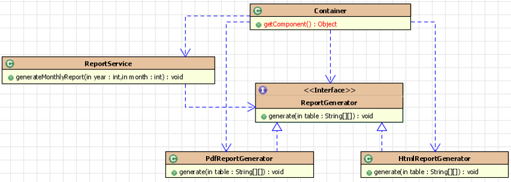
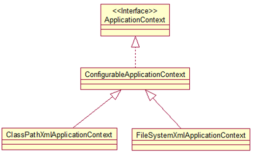

# spring框架

Spring框架具备了如下的特点：

* 轻量级：
* 依赖注入DI（dependency injection），IOC
* 面向切面编程，AOP
* 容器，Spring是一个容器，因为它可以包含并且管理应用对象的生命周期

建立一个spring项目的目录结构：如下图所示


## HelloWorld

正常的逻辑下，如果我们不使用Spring，我们创建一个JavaBean类，然后创建该类的实例，然后调用方法

~~~java
// JavaBean类
package com.isea.learn;

public class HelloWorld {
    private String name;

    public String getName() {
        return name;
    }

    public void setName(String name) {
        this.name = name;
    }

    public void hello(){
        System.out.println("hello " + name);
    }
}

// 主方法类
package com.isea.learn;

public class Main {
    public static void main(String[] args) {
        HelloWorld helloWorld = new HelloWorld();
        helloWorld.setName("z3");

        helloWorld.hello();
    }
}
~~~

**如果我们使用Spring来完成，框架帮助我们创建对象放置于IOC容器中，我们只是需要创建IOC容器，然后从容器中获取对象即可，至于对象的属性的配置，从```xml``` 配置文件中配置即可，然后就可以愉快的使用了。**

~~~java
package com.isea.learn;

public class HelloWorld {
    private String name;

    public String getName() {
        return name;
    }

    public void setName(String name) {
        this.name = name;
    }

    public void hello(){
        System.out.println("hello " + name);
    }
}


package com.isea.learn;

import org.springframework.context.support.ClassPathXmlApplicationContext;

public class Main {
    public static void main(String[] args) {
        ClassPathXmlApplicationContext ctx = new ClassPathXmlApplicationContext("applicationContext.xml");
        HelloWorld helloWorld =(HelloWorld)ctx.getBean("helloWorld");

        helloWorld.hello();
    }
}
~~~

对象的属性需要从配置文件中获取，如下：

~~~xml
<!--配置bean，
class:值为类的路径，这里告知全类名可以推断出是通过反射的方式进行对象的创建，要求bean中有无参的构造器

id:用来标识创建好的对象，如果我们需要使用这个对象，就用id的值来获取到，如我们在main方法中getBean("id值")

-->
<bean id="helloWorld" class="com.isea.learn.HelloWorld">
    <!--这里的name属性值就是JavaBean中的set方法后面设置的名字，value就是javaBean中的属性对应的值-->
     <property name="name" value="Spring"></property>
</bean>
~~~

**重点：**

~~~java
ClassPathXmlApplicationContext ctx = new ClassPathXmlApplicationContext("applicationContext.xml");
~~~

* ***IOC***被创建的同时，就调用了JavaBean的构造方法，创建了对象，并调用了set方法对属性进行赋值。

* JavaBean需要有无参的构造方法
* xml中定义的进行bean配置的方式实际上是运用了反射
* 在service层按照xml文件中的```id``` 属性获取容器中获取到的对象

### IOC & DI

***Inversion of control***   传统的资源查找方式是，由组件向容器发送请求资源，然后容器将资源返回给组件。而IOC的思想是**容器主动将资源推送给需要的组件**。以前是上菜市场买菜，现在是直接在门口取菜。组件需要做的事情就是：**选择一种合适的方式来接收资源**。

***DI：dependency injection*** : 实际上是IOC的另外的一种表述方式，即组件以一）接收来自容器的资源注入。

**例子：** 获取B对象，并使B对象的a属性指向A对象。

~~~java
class A{}
class B{
    private A a;
    public void setA(A a){
        this.a = a;
    }
}

// 常规的方法
A a = getA();
B b = getB();
b.setA(a);

// IOC 的方式
B b = getB();
~~~

## IOC 的发展

生成HTML和PDF两种不同形式的报表：

### 分离接口和实现类

在服务类中需要知道接口，和接口的实现类，此种方式的耦合度是最高的。如图表现的形式：


类比一下，远古时代如果需要一把斧头，人类要知道斧头的形状，还需要知道如何手工的打造一把斧头。

### 采用工厂设计模式

在service的角度，只需要知道接口类型，和工厂类型，降低了耦合度


直接去铁匠铺告诉需要一把什么样的斧头，然后就可以直接获取到。

### IOC 控制反转

这里容器直接将资源注入给service。



## spring容器

spring提供了两种类型的IOC容器的实现：

* BeanFactory IOC的基本实现，是spring框架的基础设施，面向spring本身
* ApplicationContext，是BeanFactory的子接口，面向开发者 ，几乎所有场合我们都使用ApplicationContext，

两者的配置文件一样的

### ApplicationContext

该接口有两个主要的实现类：

* ClassPathXmlApplicationContext：从类路径下加载配置文件
* FileSystemXmlApplicationContext：从文件系统中加载配置文件

类和接口直接的关系如下：



其中***configurableApplicationContext*** 中定义了***refresh()、close()***  方法，让ApplicationContext具备了启动刷新关闭上下文的能力。

### 从IOC容器中获取Bean

***getBean()*** 方法，其中可以传入**类路径** ，也可以传入**bean.class** ,传入bean.class 的弊端是若在```xml``` 文件中配置了多个bean，会报错，如下：

~~~xml
<bean id="helloworld2" class="com.isea.learn.HelloWorld">
    <property name="name" value="spring"></property>
</bean>
<bean id="helloworld1" class="com.isea.learn.HelloWorld">
    <property name="name" value="spring"></property>
</bean>
~~~

### 属性注入

最常用的注入方式即为通过**set**方法的方式进行注入，例如上面的代码，还可以通过**构造方法**的方式来构建：

~~~xml
<!--如果有多个构造函数，可以以参数的顺序和类型来区分 -->   
  <bean id="car1" class="com.isea.learn.Car">
        <constructor-arg value="Audi"></constructor-arg>
        <constructor-arg value="Gummy"></constructor-arg>
        <constructor-arg value="300000"></constructor-arg>
    </bean>
~~~

~~~java
package com.isea.learn;

public class Car {
    private String brand;
    private String address;
    private double price;

    public Car(String brand, String address, double price) {
        this.brand = brand;
        this.address = address;
        this.price = price;
    }

    public Car() {
    }

    @Override
    public String toString() {
        return "Car{" +
                "brand='" + brand + '\'' +
                ", address='" + address + '\'' +
                ", price=" + price +
                '}';
    }
}
//******************main方法代码***********************************

 Car car = ctx.getBean(Car.class);
 System.out.println(car);
~~~


#### 字面量：

可以用字符串表示的值，可以通过`<value>`子标签的使用或者是value使用属性注入,基本数据类型及其封装类，都可以通过字面量的方式进行注入

~~~xml
<bean id="car1" class="com.isea.learn.Car">
    <constructor-arg value="Audi" type="java.lang.String"></constructor-arg>
    <constructor-arg value="Gummy" type="java.lang.String"></constructor-arg>
    <constructor-arg type="double" >
        <value>250</value>
    </constructor-arg>
</bean>
~~~

#### 特殊字符

如字面量包含特殊字符，可以使用`<![CDATA[]]>`把字面值包裹起来。

~~~xml
    <bean id="car1" class="com.isea.learn.Car">
        <constructor-arg value="Audi" type="java.lang.String"></constructor-arg>
        <constructor-arg  type="java.lang.String">
            <value><![CDATA[<Gummy>]]></value>
        </constructor-arg>
        <constructor-arg type="double" >
            <value>250</value>
        </constructor-arg>
    </bean>
~~~

~~~java
ClassPathXmlApplicationContext ctx = new ClassPathXmlApplicationContext("applicationContext.xml");
Car car = ctx.getBean(Car.class);
System.out.println(car); // Car{brand='Audi', address='<Gummy>', price=250.0}
~~~

#### bean之间的引用

bean之间的引用需要使用`ref`属性或者是`<ref bean = ""></bean>`

增加Person类：类结构图如下：


**person类**

~~~java
package com.isea.learn;

public class Person {
    private String name;
    private int age;
    private Car car;

    public Person() {
    }

    public String getName() {
        return name;
    }

    public int getAge() {
        return age;
    }

    public Car getCar() {
        return car;
    }

    public void setName(String name) {
        this.name = name;
    }

    public void setAge(int age) {
        this.age = age;
    }

    public void setCar(Car car) {
        this.car = car;
    }

    @Override
    public String toString() {
        return "Person{" +
                "name='" + name + '\'' +
                ", age=" + age +
                ", car=" + car +
                '}';
    }
}
~~~

**配置文件**

~~~xml
<bean id="car1" class="com.isea.learn.Car">
    <constructor-arg value="Audi" type="java.lang.String"></constructor-arg>
    <constructor-arg  type="java.lang.String">
        <value><![CDATA[<Gummy>]]></value>
    </constructor-arg>
    <constructor-arg type="double" >
        <value>250</value>
    </constructor-arg>
</bean>

<bean id="person1" class="com.isea.learn.Person">
    <property name="name" value="Tom" ></property>
    <property name="age" value="22"></property>
    <property name="car" ref="car1"></property> <!--或者使用ref属性-->
</bean>

<!--或者使用ref标签-->

<bean id="person1" class="com.isea.learn.Person">
    <property name="name" value="Tom" ></property>
    <property name="age" value="22"></property>
    <property name="car">
        <ref bean="car1"></ref>
    </property>
</bean>

<!--或者建立内部的bean，将上面的property改写为如下，不能被外部类引用，只能内部使用-->
<bean id="person1" class="com.isea.learn.Person">
    <property name="name" value="Tom"></property>
    <property name="age" value="22"></property>
    <property name="car">
        <bean class="com.isea.learn.Car">
            <constructor-arg value="Ford"></constructor-arg>
            <constructor-arg value="ChangAn"></constructor-arg>
            <constructor-arg value="3000"></constructor-arg>
        </bean>
    </property>
</bean>
~~~

**主类**

~~~java
ClassPathXmlApplicationContext ctx = new ClassPathXmlApplicationContext("applicationContext.xml");
Object person1 = ctx.getBean("person1");
System.out.println(person1); 
// Person{name='Tom', age=22, car=Car{brand='Audi', address='<Gummy>', price=250.0}}
~~~


## AOP


