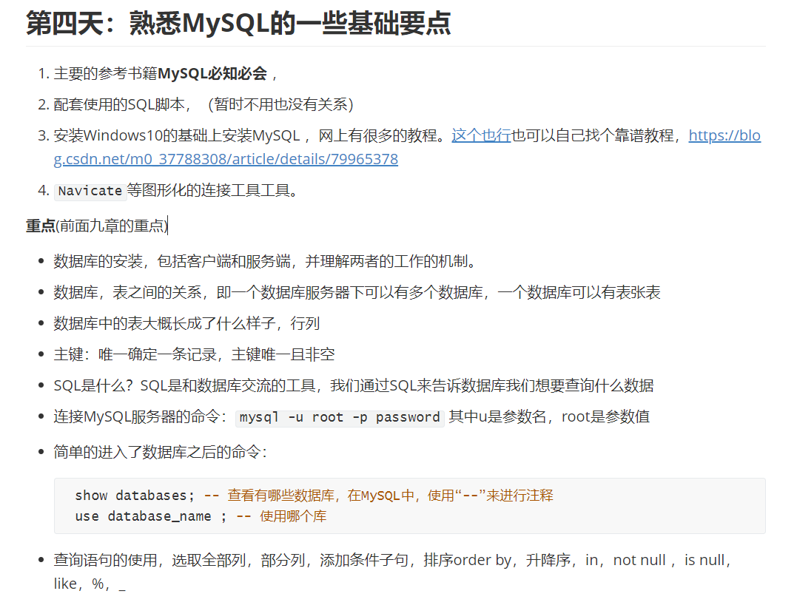

# 教学笔录

## 第一天：冒泡排序

**要求**：写一个冒泡排序，代码规范整洁，力求写出漂亮的代码，使用`java`，下面给出参考代码：

**完成之后**，以后的五天 ，每天都要写一遍代码，争取直接手写出来，不是抄写。五天之后试着用手写试试。

~~~java
package com.jb.application;
// 冒泡排序的实现
public class BubbleSort {

    public static void bubbleSort(int[] arr) {
        if (arr == null || arr.length == 1) {
            return;
        }

        for (int end = arr.length - 1; end > 0; end--) {
            for (int j = 0; j < end; j++) {
                if (arr[j] > arr[j + 1]) {
                    swap(arr, j, j + 1);
                }
            }
        }
    }

    private static void swap(int[] arr, int i, int j) {
        int tmp = arr[i];
        arr[i] = arr[j];
        arr[j] = tmp;
    }

    private static void printArr(int[] arr){
        for (int i = 0; i < arr.length; i++) {
            System.out.print(arr[i] + "\t");
        }
    }

    public static void main(String[] args) {
        int [] arr = {8,5,3,9,1,0,2,4,7,6};
        printArr(arr);
        bubbleSort(arr);
        System.out.println();
        System.out.println("------排序之后-------");
        printArr(arr);
    }
}
~~~

**问题：** 学员问的问题，为什么在方法里面的变量中加上public，private等关键词的时候会报错？

**回答：** 权限修饰修饰类，修饰方法，修饰类的成员变量，不用来修饰方法内部的局部变量，（下去的时候在看看）

## 第二天：

**要求**：写一个插入排序，代码规范整洁，力求写出漂亮的代码，使用`java`，下面给出参考代码：

~~~java
package com.jb.application;

/**
 *  插入排序实现 1,23,4,8,9
 *  选择排序的思路：默认当前i位置之前的元素都已经排好了序了，当前的i位置和i之前位置（到index = 0）的元素进行比较，
 *  外层循环控制次数，
 */

public class InsertSort {
    private static void insertSort(int[] arr) {
        if (arr.length == 1 || arr == null) {
            return;
        }
        for (int i = 0; i < arr.length - 1; i++) {
            for (int j = i + 1; j > 0; j--) {
                if (arr[j] < arr[j - 1]) {
                    swap(arr, j, j - 1);
                }
            }
        }
    }

    private static void swap(int[] arr, int j, int i) {
        int tmp = arr[i];
        arr[i] = arr[j];
        arr[j] = tmp;
    }

    private static void printArr(int[] arr) {
        for (int i : arr) {
            System.out.print(i + "\t");
        }
        System.out.println();
    }

    public static void main(String[] args) {
        int[] arr = {1, 88, 9, 5, 100, 2, 5, 34};
        printArr(arr);
        insertSort(arr);
        printArr(arr);
    }
}
~~~

**发生的错误：** 数组下标越界异常，

**应当注意的细节：** 包名的命令方式，com.isea.sort 

## 第三天：申请GitHub账号

## 第四天：Linux基础命令

参考书籍：鸟叔的私房菜

## 第五第六天： 基础SQL

参考书籍MySQL必知必会：

## 第七天：归并排序

~~~java
public class MergeSort {
    public static void mergeSort(int[] arr) {
        if (arr.length  == 1 || arr == null){
            return;
        }

        sortProcess(arr,0 , arr.length - 1);
    }

    // 核心
    private static void sortProcess(int[] arr, int L, int R) {
        if (L == R){
            return;
        }
        int middle = L + (R - L ) / 2;
        sortProcess(arr,L,middle);
        sortProcess(arr,middle + 1 , R);
        merge(arr,L , middle , R);
    }

    private static void merge(int[] arr, int L, int middle, int R) {

        int[] help = new int[R - L + 1];
        int p1 = L;
        int p2 = middle + 1;
        int i = 0;
        while(p1 <= middle && p2 <= R){
            help[i ++] = arr[p1] < arr[p2] ? arr[p1 ++] : arr[p2 ++];
        }

        while(p1 <= middle){
            help[i ++] = arr[p1 ++];
        }

        while(p2 <= R){
            help[i ++] = arr[p2 ++];
        }

        for (int j = 0; j < help.length; j++) {
            arr[L + j] = help[j];
        }
    }

    private static void printArr(int[] arr){
        for (int i = 0; i < arr.length; i++) {
            System.out.print(arr[i] + "\t");
        }
        System.out.println();
    }

    public static void main(String[] args) {
        int[] arr = {9,4,88,44,3,2};
        printArr(arr);
        mergeSort(arr);
        printArr(arr);
    }

}
~~~

## 第八天：快速排序

~~~java
import java.util.Random;

public class QuickSort {

    // 随机快排
    public static void quickSort(int[] arr) {
        if (arr.length < 2 || arr == null) {
            return;
        }
        sortProcess(arr, 0, arr.length - 1);
    }

    private static void sortProcess(int[] arr, int L, int R) {
        if (L < R) {
            swap(arr, (L + new Random().nextInt(R - L + 1)), R);
            int[] p = partition(arr, L, R);
            sortProcess(arr, L, p[0] - 1);
            sortProcess(arr, p[1] + 1, R);
        }
    }

    private static int[] partition(int[] arr, int L, int R) {

        int less = L - 1;
        int more = R;
        while (L < more) {
            if (arr[L] < arr[R]) {
                swap(arr, ++less, L++);
            } else if (arr[L] > arr[R]) {
                swap(arr, --more, L);
            } else {
                L++;
            }
        }
        swap(arr, R, more);
        return new int[]{less + 1, more - 1};
    }

    private static void swap(int[] arr, int i, int j) {

        int tmp = arr[i];
        arr[i] = arr[j];
        arr[j] = tmp;
    }

    private static void printArr(int[] arr) {
        for (int i = 0; i < arr.length; i++) {
            System.out.print(arr[i] + "\t");
        }
        System.out.println();
    }

    public static void main(String[] args) {
        int[] arr = {9, 4, 88, 44, 3, 2};
        printArr(arr);
        quickSort(arr);
        printArr(arr);
    }
}
~~~

## 第九天：饿汉式单例，懒汉式单例，线程安全的单例

~~~java
// 饿汉式，可以使用，但是有内存浪费的可能，线程是安全的
class Singleton{
    private final static Singleton instance = new Singleton();
    private Singleton(){}
    public static Singleton getInstance(){
        return instance;
    }
}

// 懒加载，但是线程不安全
class Singleton{
   private static Singleton instance;
   private Singleton(){}
   public static Singleton getInstance(){
       if (instance == null){
           instance = new Singleton();
       }
       return instance;
   }
}

// 懒加载+双重检查+线程安全
class Singleton{
   private static volatile Singleton  instance;
   private Singleton(){}
   public static Singleton getInstance(){
       if (instance == null){
           synchronized (Singleton.class){
               if (instance == null){
                   instance = new Singleton();
               }
           }
       }
       return instance;
   }
}
~~~

